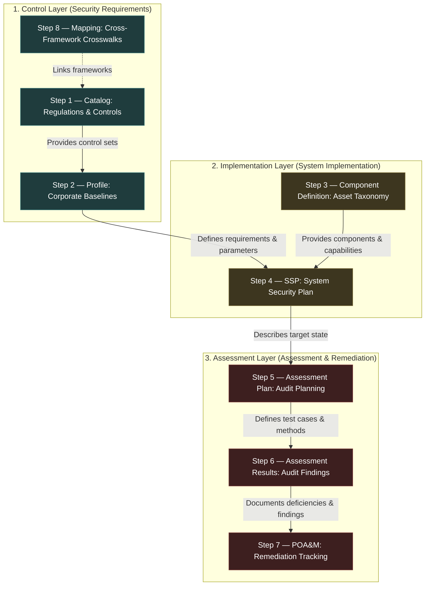
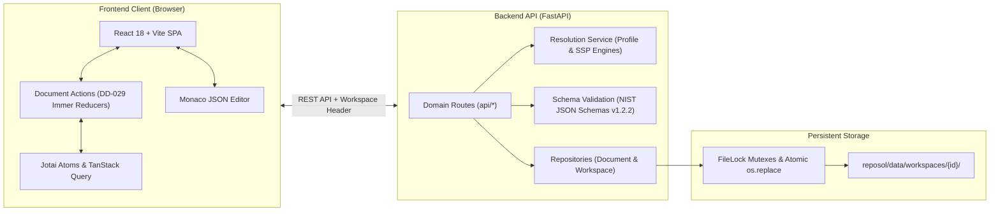

# Project: Reposol — NIST OSCAL Security Management Platform

## Architecture & Multi-Layer System Model

Reposol is a full-stack, schema-compliant web platform for authoring, tailoring, implementing, assessing, and remediating security documentation based on the **NIST OSCAL (Open Security Controls Assessment Language) v1.2.2** specification across the complete compliance lifecycle.

### The Three Layers of the OSCAL Architecture



### Full-Stack System Topology



---

## Complete OSCAL Lifecycle Stages (Steps 0–8)

### Step 0: Cross-System Requirements & Global Architecture
- **Scope:** Universal capabilities applying across all document types and lifecycle stages.
- **Key Capabilities:**
  - **Single Active Draft Lifecycle:** Single working draft per document (`<uuid>_draft.json`), seamless View/Edit mode toggling, explicit publishing ([DD-004](documentation/design_decisions/DD-004_editor_ux_patterns.md), [US 0.8](documentation/user_stories/step0_global_requirements.md#us-08-single-active-draft-lifecycle--header-version-dropdown)).
  - **Dual-Mode Visual / JSON Editor:** Monaco-powered virtualized editor with bi-directional cursor/scroll highlight synchronization across all 8 stages ([US 0.10](documentation/user_stories/step0_global_requirements.md#us-010-visual--json-source-scroll--highlight-synchronization), [US 0.11](documentation/user_stories/step0_global_requirements.md#us-011-virtualized-json-editor-for-high-performance-mode-switching-on-large-documents)).
  - **Anonymous Workspace Isolation:** Automatic session workspace generation, path traversal protection, containerized deployment readiness, and master template protection ([DD-015](documentation/design_decisions/DD-015_anonymous_workspace_isolation_and_containerized_deployment.md), [US 0.25](documentation/user_stories/step0_global_requirements.md#us-025-session-isolated-anonymous-workspaces--containerized-deployment)).
  - **Multi-Format Import & Export:** Lossless conversion between JSON, XML, and YAML using official NIST schema validation ([US 0.3](documentation/user_stories/step0_global_requirements.md#us-03-oscal-document-import-any-format--registry-sources), [US 0.4](documentation/user_stories/step0_global_requirements.md#us-04-oscal-export-to-different-formats)).
  - **Atomic Storage & Backend Layer Separation:** Temporary file writes (`.tmp` + `os.replace`), inter-process file locks, decoupled `routes -> services -> repositories` ([US 0.31](documentation/user_stories/step0_global_requirements.md#us-031-atomic-storage-persistence-file-locking--backend-layer-separation), [DD-001](documentation/design_decisions/DD-001_architecture_and_code_organization.md), [DD-027](documentation/design_decisions/DD-027_backend_api_modularization.md)).
  - **Master-Detail Knowledge Base Portal:** In-app operational guides, cross-stage mutation comparisons, and NIST directives at `/knowledge-base` ([DD-033](documentation/design_decisions/DD-033_oscal_knowledge_base_and_tailoring_semantics.md), [US 0.32](documentation/user_stories/step0_global_requirements.md#us-032-interactive-master-detail-oscal-knowledge-base-portal)).

### Step 1: Catalog Builder (Security Control Authoring)
- **Scope:** Authoring, managing, and structuring foundational control catalogs (e.g., NIST SP 800-53, ISO 27001).
- **Key Capabilities:**
  - Infinitely nested groups and control hierarchies with drag-and-drop reordering ([US 1.2](documentation/user_stories/step1_catalog_builder.md#us-12-setting-up-a-group-hierarchy--group-details), [US 1.14](documentation/user_stories/step1_catalog_builder.md#us-114-drag-and-drop-reordering-of-groups--controls-in-the-sidebar)).
  - Multi-level parameter management at Catalog, Group, and Control scopes ([DD-010](documentation/design_decisions/DD-010_parameter_scoping_and_inheritance.md), [US 1.15](documentation/user_stories/step1_catalog_builder.md#us-115-multi-level-parameter-management-and-referencing-catalog-group-and-control-level)).
  - Parameter constraint builder with live regex validation checks ([US 1.17](documentation/user_stories/step1_catalog_builder.md#us-117-interactive-parameter-constraint-builder--live-regex-validation-in-the-catalog)).
  - Control withdrawal and deprecation workflow with replacement forwarding links ([US 1.19](documentation/user_stories/step1_catalog_builder.md#us-119-control-withdrawal--deprecation-workflow)).
  - Caret-relative inline parameter placeholder insertion via `ProseWithParams` ([DD-013](documentation/design_decisions/DD-013_universal_prose_with_params_integration.md), [US 1.13](documentation/user_stories/step1_catalog_builder.md#us-113-interactive-parameter-inserts-in-prose-inserts)).

### Step 2: Profile Tailoring (Baseline Tailoring Engine)
- **Scope:** Non-destructive tailoring, overlaying, filtering, and compilation of organizational baselines from one or more catalogs/profiles.
- **Key Capabilities:**
  - Non-destructive 3-phase tailoring: `1. Import` (inclusions/exclusions) ➔ `2. Merge` (restructuring) ➔ `3. Modify` (`alters` & `set-parameters`).
  - Merge directives: `as-is` (preserve catalog structure), `flat` (consolidate into flat list), and `custom` (arbitrary custom group hierarchies with drag-and-drop control pool assignment) ([DD-034](documentation/design_decisions/DD-034_profile_merge_modes.md), [DD-035](documentation/design_decisions/DD-035_custom_group_hierarchy_and_control_pool_assignment.md), [US 2.7](documentation/user_stories/step2_profile_tailoring.md#us-27-custom-group-hierarchy-dual-surface-control-assignment-and-merge-phase-restructuring)).
  - Parameter overrides with single/multi-choice selection UI ([DD-012](documentation/design_decisions/DD-012_parameter_value_assignment_and_override_strategy.md), [US 2.17](documentation/user_stories/step2_profile_tailoring.md#us-217-profile-parameter-overrides-modifyset-parameters--dropdown-value-selection)).
  - Real-time resolution preview via `POST /api/resolve/profile/preview` with conflict and orphaned-alter detection ([DD-028](documentation/design_decisions/DD-028_backend_resolution_engine.md), [US 2.32](documentation/user_stories/step2_profile_tailoring.md#us-232-live-resolution-preview--modify-conflict-detection)).
  - Cascading profile imports (profile from profiles) with cycle detection ([US 2.30](documentation/user_stories/step2_profile_tailoring.md#us-230-cascading-profile-imports-profile-from-profiles)).

### Step 3: Component Inventory (Asset & Capability Taxonomy)
- **Scope:** Reusable inventory of IT assets (software, services, hardware, policies, physical assets) and their standardized compliance capabilities.
- **Key Capabilities:**
  - 15 standard OSCAL defined-component types (`software`, `hardware`, `service`, `policy`, `validation`, etc.) with strict metaschema `status` restriction ([US 3.2](documentation/user_stories/step3_component_inventory.md#us-32-component-declaration--standard-oscal-type-classification)).
  - Service protocols and port range definitions with transport validation ([US 3.7](documentation/user_stories/step3_component_inventory.md#us-37-service-protocols--port-range-declarations)).
  - Multi-framework control implementations and statement-level implementation narratives ([US 3.9](documentation/user_stories/step3_component_inventory.md#us-39-control-implementation-sets--source-framework-binding), [US 3.11](documentation/user_stories/step3_component_inventory.md#us-311-structured-statement-level-implementation-narratives)).
  - Capability aggregation and downstream SSP import handshake (`by-components[]` instantiation) ([US 3.13](documentation/user_stories/step3_component_inventory.md#us-313-capability-packaging--component-aggregation), [US 3.20](documentation/user_stories/step3_component_inventory.md#us-320-downstream-ssp-import-handshake--preservation-disc-01--disc-02-resolution)).

### Step 4: System Security Plan (SSP Builder)
- **Scope:** Formal system boundary specification, categorization, component allocation, and control implementation responses.
- **Key Capabilities:**
  - System characteristics: FIPS-199 impact categorization, information types, and authorization boundaries ([US 4.3](documentation/user_stories/step4_ssp_builder.md#us-43-system-identification-naming--authorization-dates), [US 4.5](documentation/user_stories/step4_ssp_builder.md#us-45-security-impact-level--fips-199-high-water-mark-auto-calculation), [US 4.7](documentation/user_stories/step4_ssp_builder.md#us-47-authorization-boundary-definition--base64-diagram-embedding)).
  - 4-Tier parameter resolution cascade: Catalog defaults ➔ Profile overrides ➔ Component defaults ➔ SSP values ([DD-036](documentation/design_decisions/DD-036_ssp_security_inheritance_and_baseline_resolution.md), [US 4.19](documentation/user_stories/step4_ssp_builder.md#us-419-4-tier-parameter-cascade-resolution--visualizer)).
  - Security control implementation across multiple active components (`implemented-requirements[].by-components[]`) ([US 4.15](documentation/user_stories/step4_ssp_builder.md#us-415-implemented-requirements--by-components-architecture)).
  - Security inheritance modeling (`provided`, `used`, `shared` controls) with downstream responsibility delegation ([DD-036](documentation/design_decisions/DD-036_ssp_security_inheritance_and_baseline_resolution.md), [US 4.20](documentation/user_stories/step4_ssp_builder.md#us-420-security-inheritance-inherited-satisfied--export-providers)).

### Step 5: Assessment Plan Builder (Audit Planning)
- **Scope:** Rigorous planning of system security assessments targeting authorized SSPs.
- **Key Capabilities:**
  - 6-Tab modular builder architecture (Overview & Scope, Assessment Activities, Task Scheduling, Assessment Subjects & Assets, Rules of Engagement, Back-Matter) ([DD-037](documentation/design_decisions/DD-037_assessment_plan_architecture_and_scoping_model.md), [US 5.1](documentation/user_stories/step5_assessment_plan.md#us-51-minimal-ap-document-creation--initial-root-scaffold)).
  - 3D scoping matrix: Reviewed controls × assessment subjects × assessment assets ([US 5.2](documentation/user_stories/step5_assessment_plan.md#us-52-target-ssp-import--live-system-context-resolution), [US 5.3](documentation/user_stories/step5_assessment_plan.md#us-53-reviewed-controls--control-selections-tailoring-disc-05-resolution), [US 5.6](documentation/user_stories/step5_assessment_plan.md#us-56-assessment-subjects--scope-boundaries-disc-06-resolution)).
  - Procedural activities with standardized methods (`EXAMINE`, `INTERVIEW`, `TEST`) ([US 5.9](documentation/user_stories/step5_assessment_plan.md#us-59-local-assessment-objectives--standard-evaluation-methods), [US 5.10](documentation/user_stories/step5_assessment_plan.md#us-510-procedural-assessment-activities--step-sequences)).
  - Task scheduling with timing variants, recurrence, and dependency DAG cycle validation ([US 5.11](documentation/user_stories/step5_assessment_plan.md#us-511-task-scheduling-types--timing-variants-anyof-branches), [US 5.12](documentation/user_stories/step5_assessment_plan.md#us-512-task-dependency-directed-acyclic-graph-dag--cycle-detection)).
  - 7 canonical rules-of-engagement terms parts and Base64 evidence attachments ([DD-007](documentation/design_decisions/DD-007_base64_embedded_attachments_strategy.md), [US 5.13](documentation/user_stories/step5_assessment_plan.md#us-513-terms--conditions-7-canonical-parts-enforcement), [US 5.17](documentation/user_stories/step5_assessment_plan.md#us-517-back-matter-base64-resource-attachments--scanners)).

### Step 6: Assessment Results Builder & Reporter (Findings Ledger & SAR)
- **Scope:** Recording, managing, and reporting audit findings, observations, evidence, and risks arising from executed Assessment Plans.
- **UI Architecture:**
  ```
  ┌────────────────────────────────────────────────────────────────────────────────────────┐
  │ Top Bar: Title, Target AP Import Selector, [👁️ View | ✏️ Edit] Mode Toggle, Save/Validate │
  ├────────────────────────────────────────────────────────────────────────────────────────┤
  │ Navigation Tabs & Modular Panels:                                                      │
  │ 1. Overview & Metadata: Title, Version, Parties, Import AP Selector & Summary, Metrics │
  │ 2. Assessment Findings: Control / Objective Targets, Status, Related Obs & Risks       │
  │ 3. Observations & Evidence: Methods (EXAMINE, INTERVIEW, TEST), Evidence, Subjects     │
  │ 4. Identified Risks: Statement, Status, CVSS/FedRAMP Characterization, Threat IDs,     │
  │    Remediations, Risk Log Entries                                                      │
  │ 5. Assessment Log & Attestations: Timeline, Execution Log Entries, Attestations        │
  │ 6. Result Sets Sidebar: Result Set Navigation (<button> elements), Scoping & Controls  │
  └────────────────────────────────────────────────────────────────────────────────────────┘
  ```
- **Key Capabilities & Triad Correlation Model ([DD-038](documentation/design_decisions/DD-038_assessment_results_scoping_and_correlation.md)):**
  - Observation ↔ Finding ↔ Risk triad linking: Observations record atomic test evidence, findings roll observations into control satisfaction statuses (`satisfied` | `not-satisfied`), and risks quantify vulnerabilities ([US 6.5](documentation/user_stories/step6_assessment_results.md#us-65-observations--empirical-evidence-collection), [US 6.6](documentation/user_stories/step6_assessment_results.md#us-66-finding-determination--target-semantics), [US 6.7](documentation/user_stories/step6_assessment_results.md#us-67-observation-finding-risk-triad-referential-linking)).
  - CVSS v3.1 vector calculation and FedRAMP risk scoring ([DD-018](documentation/design_decisions/DD-018_risk_scoring_characterization_ui.md), [US 6.10](documentation/user_stories/step6_assessment_results.md#us-610-risk-characterization--multi-system-scoring-cvss-v31), [US 6.11](documentation/user_stories/step6_assessment_results.md#us-611-risk-remediation-responses--action-planning)).
  - Semantic integrity validation `_validate_ar_integrity` verifying root fields, `import-ap` links, UUID uniqueness, and target semantics.
  - Immutable assessment attestations and audit execution logging ([US 6.12](documentation/user_stories/step6_assessment_results.md#us-612-assessment-log-timeline--operational-event-tracking), [US 6.13](documentation/user_stories/step6_assessment_results.md#us-613-formal-assessor-attestations--sign-off-parts)).

#### Step 6 Feature Inventory & Implementation Mapping
| # | Feature | Description | Status | Source |
|---|---------|-------------|--------|--------|
| 1 | DD-038 Architecture | Dedicated AR Architecture, Scoping Model, Triad Correlation, AP Import Resolution | DONE | Phase 0 Spec Miner |
| 2 | Step 6 User Stories | Complete user stories US 6.1–US 6.17 in `step6_assessment_results.md` | DONE | Phase 0 Spec Miner |
| 3 | Backend AR Semantic Integrity | Implementation of `_validate_ar_integrity` in `validation.py` | DONE | Phase 0 Backend Explorer |
| 4 | Document Service Listing Pruning | Preserving `import-ap` in document summaries in `document_service.py` | DONE | Phase 0 Backend Explorer |
| 5 | Backend Integration & Unit Tests | `test_assessment_results_crud.py` and `test_validation.py` test suite | DONE | Phase 0 Backend Explorer |
| 6 | TypeScript Definitions | Strict AR types in `oscal.d.ts` | DONE | Phase 0 Frontend Explorer |
| 7 | Granular Document Actions (DD-029) | Pure Immer reducers in `assessment-results-actions.ts` | DONE | Phase 0 Frontend Explorer |
| 8 | Document Actions Unit Tests | Comprehensive Vitest suite in `assessment-results-actions.test.ts` | DONE | Phase 0 Frontend Explorer |
| 9 | Modular Overview & Metadata Tab | `OverviewMetadataTab.tsx` with AP banner, metrics, back-matter | DONE | Phase 0 Frontend Explorer |
| 10 | Modular Assessment Findings Tab | `AssessmentFindingsTab.tsx` with findings CRUD and triad selectors | DONE | Phase 0 Frontend Explorer |
| 11 | Modular Observations Tab | `ObservationsEvidenceTab.tsx` with methods, evidence, subjects | DONE | Phase 0 Frontend Explorer |
| 12 | Modular Identified Risks Tab | `IdentifiedRisksTab.tsx` with CVSS, remediations, risk log | DONE | Phase 0 Frontend Explorer |
| 13 | Modular Assessment Log Tab | `AssessmentLogTab.tsx` with execution timeline & attestations | DONE | Phase 0 Frontend Explorer |
| 14 | Result Sets Sidebar UI | `ResultSetsSidebar.tsx` using accessible buttons and date scopes | DONE | Phase 0 Frontend Explorer |
| 15 | Active Document Action Dispatch | Elimination of stubbed handlers across all AR components | DONE | Phase 0 Frontend Explorer |
| 16 | Playwright E2E Test Suite Pass | 100% pass for `step6-assessment-results.spec.ts` | DONE | Phase 0 Frontend Explorer |
| 17 | Full Verification Gate | 100% backend pytest, 100% frontend vitest, clean Vite build | DONE | Orchestrator Gate |

### Step 7: POA&M Tracker (Plan of Action & Milestones)
- **Scope:** Continuous tracking, milestone planning, and remediation of identified security vulnerabilities.
- **Key Capabilities:**
  - Automated importing of `not-satisfied` findings from Assessment Results into actionable POA&M items ([US 7.3](documentation/user_stories/step7_poam.md#us-73-ingestion-of-unsatisfied-findings-from-assessment-results-bridge-pipeline)).
  - Milestone scheduling, status tracking, and completion verification ([US 7.4](documentation/user_stories/step7_poam.md#us-74-core-poam-items-management--remediation-milestones)).
  - Risk acceptance workflows with documented justifications and expiration dates ([US 7.9](documentation/user_stories/step7_poam.md#us-79-risk-deviations-dispositions--false-positive-handling)).
  - Remediation progress analytics and risk exposure burn-down dashboards ([DD-022](documentation/design_decisions/DD-022_dashboard_analytics_component_library.md), [US 7.16](documentation/user_stories/step7_poam.md#us-716-poam-remediation-dashboard--burndown-metrics)).

### Step 8: Control Mapping (Cross-Framework Crosswalks)
- **Scope:** Bidirectional cross-framework mapping, gap analysis, and harmonization across regulatory standards.
- **Key Capabilities:**
  - 6 Canonical OSCAL mapping relationship types (`identical`, `similar`, `subset-of`, `superset-of`, `intersects`, `not-related`) ([US 8.6](documentation/user_stories/step8_control_mapping.md#us-86-core-map-creation--mathematical-set-theoretic-relationships)).
  - Confidence scoring (0–100%) and mapping rationale prose ([US 8.3](documentation/user_stories/step8_control_mapping.md#us-83-quantitative-confidence-scoring--coverage-metrics)).
  - Visual mapping crosswalks: Interactive Sankey diagrams, bipartite graphs, and matrix views ([DD-019](documentation/design_decisions/DD-019_mapping_visualization_strategy.md), [US 8.12](documentation/user_stories/step8_control_mapping.md#us-812-dual-surface-visualization-interactive-crosswalk-matrix-grid), [US 8.13](documentation/user_stories/step8_control_mapping.md#us-813-dual-surface-visualization-3-column-sankey-flow-diagram)).
  - Automated compliance gap analysis identifying uncovered controls in target frameworks ([US 8.11](documentation/user_stories/step8_control_mapping.md#us-811-automated-gap-analysis--coverage-calculation-engine)).

---

## Platform Milestones

| Milestone | Scope | Key Deliverables | Status |
|---|---|---|---|
| **M0_CORE** | Core Infrastructure & Architecture | FastAPI backend, React 18 + Vite SPA, schema validation, atomic file storage with `FileLock`, workspace isolation, Monaco editor integration | **DONE** |
| **M1_CATALOG** | Step 1 — Catalog Builder | Groups, controls, enhancements, multi-level parameters (DD-010), constraints with live regex tests, control withdrawal workflow (US 1.19) | **DONE** |
| **M2_PROFILE** | Step 2 — Profile Tailoring | Baseline tailoring, inclusion/exclusion, `modify.set-parameters` (DD-012), `modify.alters`, `as-is`/`flat`/`custom` merge directives (DD-034, DD-035), live preview | **DONE** |
| **M3_COMPDEF** | Step 3 — Component Inventory | 15 standard defined-component types, service protocols, port ranges, multi-framework control implementations, capability packaging | **DONE** |
| **M4_SSP** | Step 4 — System Security Plan | System boundaries, FIPS-199 impact categorization, component allocation (`by-components[]`), 4-tier parameter cascade, security inheritance (DD-036) | **DONE** |
| **M5_PLAN** | Step 5 — Assessment Plan | 6-tab builder architecture (DD-037), 3D scoping matrix, procedural activities, methods (`EXAMINE`, `INTERVIEW`, `TEST`), task scheduling DAG | **DONE** |
| **M6_RESULTS** | Step 6 — Assessment Results | Findings ledger, triad correlation (DD-038), observations, evidence, CVSS risk characterization, attestations, result sets sidebar | **DONE** |
| **M7_POAM** | Step 7 — POA&M Tracker | AR finding auto-import, POA&M item lifecycle, milestone planning, risk acceptance, remediation progress dashboards | **DONE** |
| **M8_MAPPING** | Step 8 — Control Mapping | Framework crosswalks, 6 relationship tokens, confidence scoring, gap analysis, Sankey & matrix visualizers (DD-019) | **DONE** |
| **M9_E2E_VERIFY** | End-to-End Verification Gate | Playwright E2E test suites for all 8 stages (Steps 1, 2, 6 complete; extending coverage across Steps 3–5, 7–8) | **IN PROGRESS** |

---

## Interface Contracts

### 1. Backend ↔ Frontend REST API Contract
The backend exposes uniform REST API routes across all 8 OSCAL stages (`/api/documents/{stage}`):
- `GET /api/documents/{stage}`: Returns list of document summaries for the active workspace (`uuid`, `metadata.title`, `metadata.version`, `metadata.last-modified`, and stage-specific foreign references like `import-ap` or `import-ssp`).
- `GET /api/documents/{stage}/{id}`: Returns complete JSON document.
- `POST /api/documents/{stage}`: Creates a new document shell conforming to the NIST OSCAL v1.2.2 schema and domain semantic integrity rules.
- `PUT /api/documents/{stage}/{id}`: Updates a document, validating against local JSON schemas (`reposol/backend/app/schemas/`) with atomic file writes.
- `DELETE /api/documents/{stage}/{id}`: Deletes a document with reference-conflict detection (`409 Conflict` if referenced downstream, supporting `?force=true`).
- `POST /api/resolve/profile/preview`: Resolves an in-memory profile and returns the resolved catalog and conflict report.
- `GET /api/export/{stage}/{id}?format={json|yaml|xml}`: Exports document in the requested format with correct MIME headers.

### 2. Document Actions ↔ State Contract (DD-029)
- Every OSCAL stage implements a dedicated domain actions module (`src/lib/document-actions/{stage}-actions.ts`).
- All state mutations are expressed as pure action creators returning typed `{ type, payload }` objects.
- Reducers use Immer's `produce()` to execute immutable transitions.
- All actions seamlessly integrate with the `useDocumentActions` hook and undo/redo stacks (`pushUndoRedoState`).
- UI components strictly dispatch domain actions — no direct object mutations or stubbed `onChange` handlers.

### 3. Workspace Isolation & Storage Security Contract (DD-015)
- All document reads and writes are strictly scoped to `reposol/data/workspaces/{workspace_id}/`.
- Workspace IDs are passed via the `X-Workspace-Id` HTTP header or query parameter `?w={id}` and sanitized against path traversal (`..` or path separators rejected).
- Protected workspaces (`default`, `templates`) are read-only on public deployments and can only be modified on `localhost` when `ALLOW_MASTER_EDIT=true` is set.

---

## Repository Code Layout

```text
reposol/
├── backend/                       # Python FastAPI Backend
│   ├── app/
│   │   ├── main.py                # App entrypoint, port 1000, SPA fallback
│   │   ├── api/                   # Domain route modules (document_routes, workspace_routes, etc.)
│   │   ├── schemas/               # Official NIST OSCAL v1.2.2 JSON schemas
│   │   ├── services/              # Domain logic (document_service, resolution_service, etc.)
│   │   ├── repositories/          # Storage persistence with atomic file writes and FileLock
│   │   ├── validation.py          # JSON schema validation & semantic integrity validators
│   │   └── format_converter.py    # Lossless JSON/XML/YAML conversion
│   └── tests/                     # Pytest suite (unit, integration, storage, semantic validation)
│
├── frontend/                      # React 18 + Vite Frontend SPA
│   ├── src/
│   │   ├── components/            # Domain components grouped by OSCAL stage
│   │   │   ├── catalog/           # Step 1: Catalog builder & sidebar
│   │   │   ├── profile/           # Step 2: Profile tailoring & merge workbench
│   │   │   ├── component/         # Step 3: Component inventory & definitions
│   │   │   ├── ssp/               # Step 4: System Security Plan builder
│   │   │   ├── assessment-plan/   # Step 5: Assessment Plan modular tabs
│   │   │   ├── assessment-results/# Step 6: Assessment Results builder & findings ledger
│   │   │   ├── poam/              # Step 7: POA&M remediation tracker
│   │   │   ├── mapping/           # Step 8: Control mapping & visualization
│   │   │   ├── shared/            # Reusable editors (Props, Links, Params, Monaco JsonEditor)
│   │   │   └── layout/            # Layout shell, navigation sidebar, workspace switcher
│   │   ├── lib/
│   │   │   ├── document-actions/  # Pure Immer reducers for all 8 stages (DD-029)
│   │   │   ├── types/             # Strict TypeScript definitions (oscal.d.ts, api.d.ts)
│   │   │   └── oscal-utils.ts     # Schema utilities, UUID generation, array cleaning
│   │   ├── hooks/                 # Custom React hooks (useDocument, useDraft, useUndoRedo)
│   │   └── stores/                # Global Jotai state atoms
│   └── tests/                     # Vitest component and reducer unit tests
│
├── documentation/                 # Authoritative Architecture & Specifications
│   ├── ARCHITECTURE.md            # Comprehensive system architecture & DD index
│   ├── GOAL.md                    # Project vision, goals, and standards scope
│   ├── design_decisions/          # 37 Design Decisions (DD-001 through DD-038)
│   └── user_stories/              # Detailed User Stories for Steps 0 through 8
│
├── data/                          # Runtime file persistence (workspaces)
└── e2e/                           # Playwright end-to-end browser test suites
```
