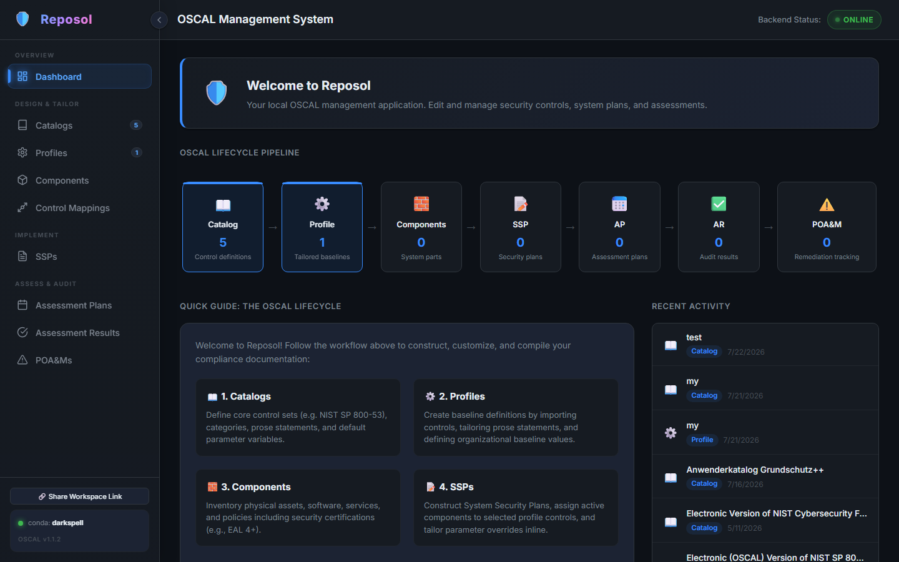
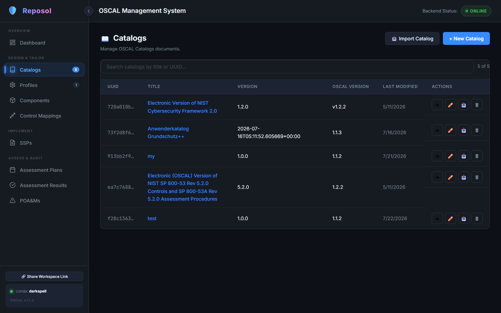
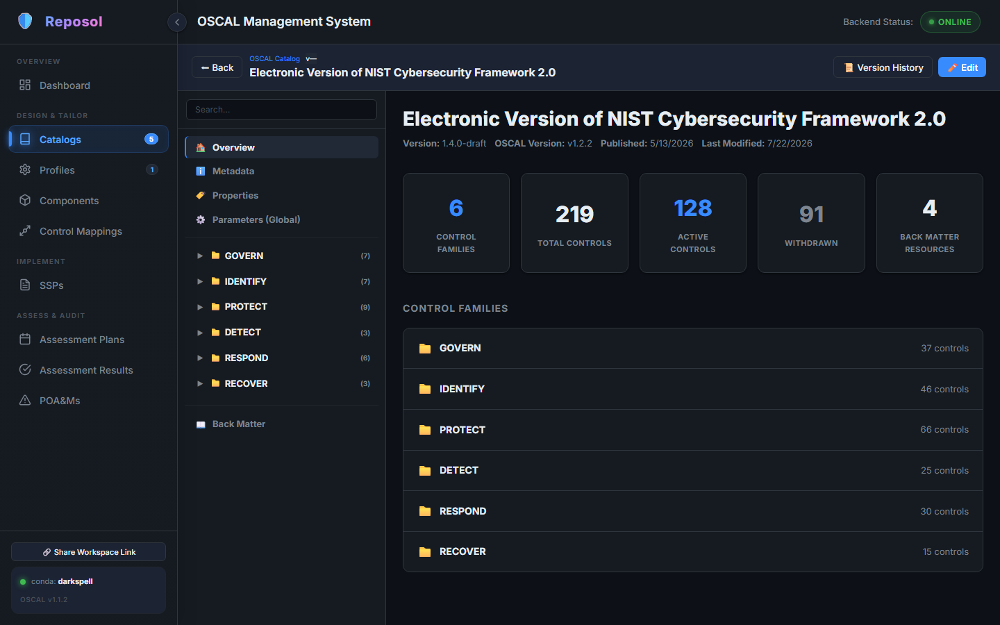
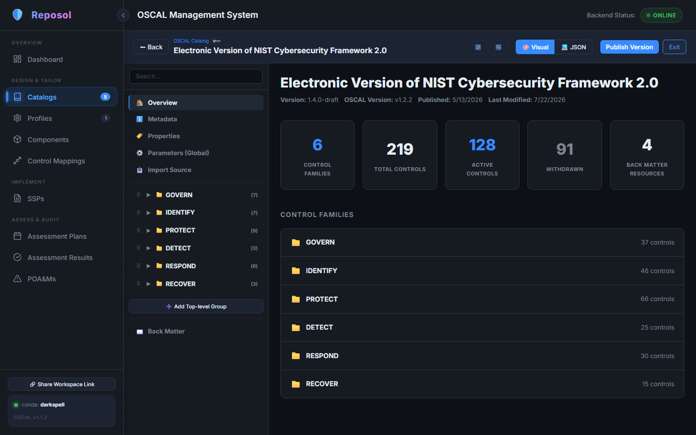
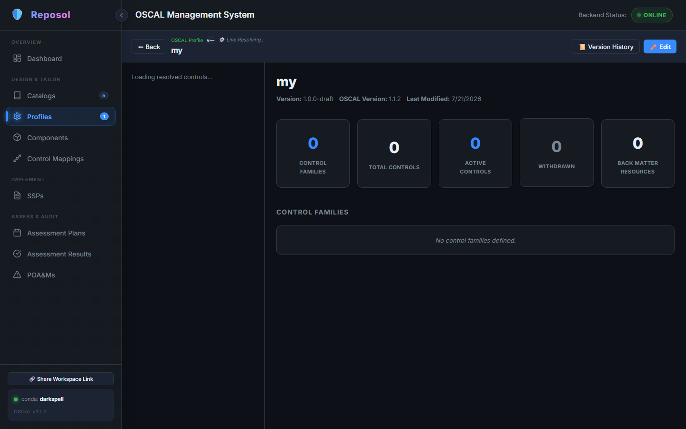
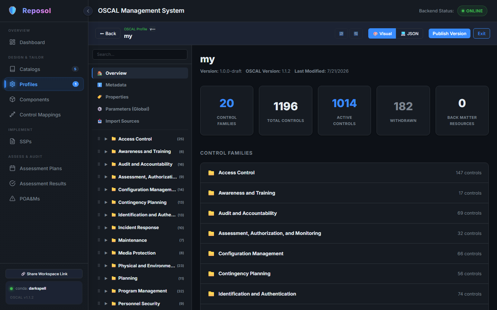
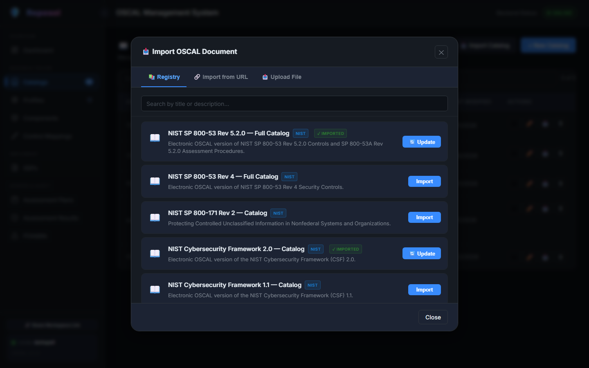

# Security Management OSCAL (Reposol)

<div align="center">
  <p>A full-stack web application for editing, managing, and validating <strong>NIST OSCAL</strong> (Open Security Controls Assessment Language) documents across all lifecycle stages.</p>

  <p>
    <a href="https://security-management-oscal.fly.dev/" target="_blank">
      
    </a>
  </p>

  <p><strong>🚀 <a href="https://security-management-oscal.fly.dev/">Open Live Web Application</a></strong></p>
  <p><em>Ready to use directly in your browser right now — No installation required!</em></p>
</div>

--- 

## ✨ Current Status

For now, the following features are **fully implemented**:

- **✅ Catalog Editor**: Create, view, and modify OSCAL Catalogs with ease.
- **✅ Profile Builder**: Build, customize, and manage OSCAL Profiles.

**🚧 In Development:**
- System Security Plans (SSP)
- Component Definitions
- Assessment Plans & Results
- POA&M (Plan of Action and Milestones)

*💡 I have more easy-to-edit features in the pipeline to make managing OSCAL documents seamless!*

---

## 📸 User Interface

Here is a visual overview of Reposol:

### 📊 Dashboard
The dashboard displays the OSCAL Lifecycle Pipeline and recent activity. By collapsing the left navigation sidebar (using the arrow toggle next to the logo), the workspace maximizes to fill the screen.



### 📚 Catalogs Overview
Browse, search, and manage all imported and custom OSCAL Catalogs.



### 📂 Catalog & Profile Editor ("Innenansicht")
When opening a Catalog or Profile, the interface displays the document tree in a sidebar and selected controls in the main workspace, giving you a full overview of parameters, prose, and metadata.

| View Mode | Edit Mode |
| :--- | :--- |
|  |  |
|  |  |

### 📥 Import Wizard
Easily upload and validate OSCAL documents in JSON, YAML, or XML formats.



---

## 🛠️ Tech Stack

- **Frontend**: React 18 + Vite (Dark Theme)
- **Backend**: Python 3.10+ / FastAPI
- **Storage**: Local JSON files (Zero configuration database!)

---

## 🏎️ Quick Start

This project requires **Python 3.10+** and **Node.js 18+**.

### 1. Start the Backend

Open a terminal and set up your Python environment:

```powershell
cd reposol/backend

# Create and activate a conda environment
conda create -n oscal python=3.11 -y
conda activate oscal

# Install dependencies and run
pip install -r requirements.txt
python -m app.main
```
The API and interactive docs will be available at **http://localhost:1000/docs**.

### 2. Start the Frontend

Open a **new terminal**:

```powershell
cd reposol/frontend

# Install dependencies and run
npm install
npm run dev
```
Open your browser to **http://localhost:1001** to view the app.

---

## 📚 Documentation

Please refer to the [documentation](./documentation/) folder for detailed insights into the project's foundation, including:
- **[Project Goals](./documentation/GOAL.md)**
- **[User Stories](./documentation/user_stories/)**
- **[Design Decisions](./documentation/design_decisions/)**

The interactive API documentation is available at **http://localhost:1000/docs** when the backend is running.

---

## 📄 License

This project is open-source software licensed under the **Apache License 2.0**.


