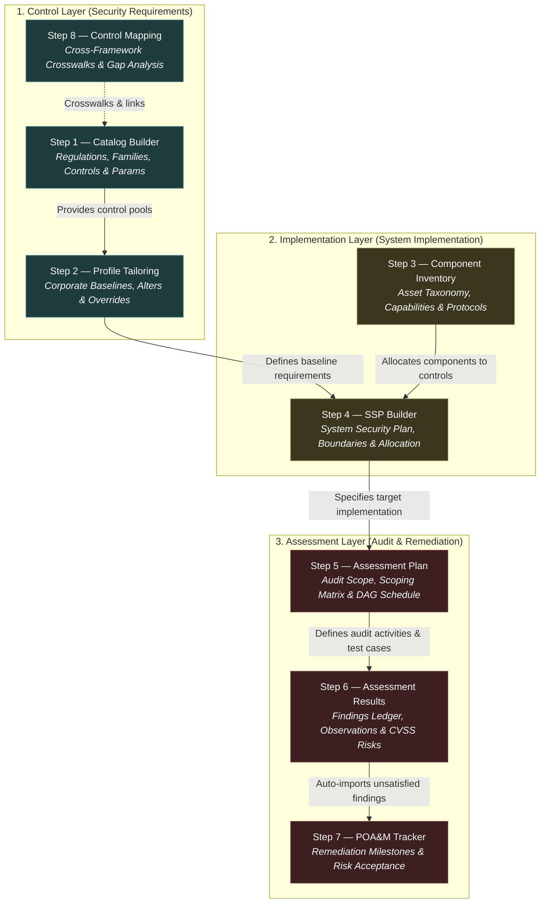
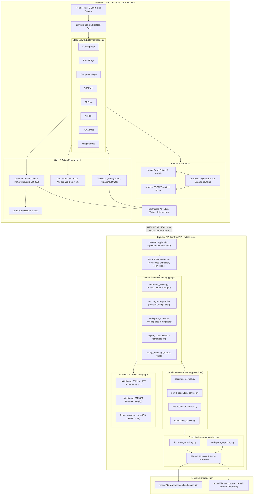

# Architecture: Reposol OSCAL Management Platform

## 1. Executive Summary & Core Architectural Tenets

Reposol is a full-stack, open-source security compliance platform engineered for authoring, tailoring, implementing, assessing, and remediating security documentation based on the **NIST Open Security Controls Assessment Language (OSCAL) v1.2.2** specification.

The platform spans all 8 official OSCAL document models across the complete governance and audit lifecycle. It is designed around seven foundational architectural tenets:

1. **Strict Metaschema & Schema Compliance:** Reposol adheres strictly to official NIST OSCAL v1.2.2 JSON schemas. No non-standard or proprietary top-level keys are stored (`additionalProperties: false` enforcement). All custom metadata must be modeled using standard constructs such as `props[]` and `links[]`.
2. **Zero-Database File-Based Persistence with Crash Safety:** Documents are persisted as formatted JSON files in isolated workspace directories. All disk writes use atomic write-and-replace (`.tmp` file + `os.replace`) guarded by inter-process file locks (`FileLock`), guaranteeing crash safety, ACID-like semantics on disk, and zero database setup overhead.
3. **Unidirectional Document Action Architecture (DD-029):** State mutations across all 8 lifecycle stages are managed by pure, typed document actions and reducers using Immer's `produce()`. UI components never mutate documents directly; every mutation creates an immutable state snapshot integrated with full undo/redo history.
4. **Single Active Draft Lifecycle (DD-004):** Each document maintains at most one active working draft (`<uuid>_draft.json`). Users can inspect historical published version snapshots in Read-Only View mode or switch into Edit mode on the active draft without duplicate draft accumulation.
5. **Dual-Mode Synchronous Authoring (Visual Form & Monaco JSON):** Users can seamlessly switch between domain visual forms and a virtualized Monaco JSON editor with real-time bidirectional cursor and scroll highlight synchronization (US 0.10, US 0.11).
6. **Session-Isolated Anonymous Workspaces (DD-015):** The application operates online without mandatory user registration. Every browser session receives an isolated workspace directory (`reposol/data/workspaces/{workspace_id}/`) with path traversal guards and master template protection.
7. **Modular Domain Separation:** Both backend (`reposol/backend/app/api/`) and frontend (`reposol/frontend/src/components/`) are structured into decoupled domain modules corresponding to each OSCAL stage, avoiding monolithic bottlenecks.

---

## 2. Multi-Layer OSCAL Compliance Lifecycle

OSCAL models the compliance lifecycle in three progressive layers, spanning 8 concrete document types:



### Control-Level Lifecycle Traceability
A core capability of Reposol is end-to-end traceability of individual security controls across all 8 stages:
1. **Catalog (Stage 1):** Control is authored with statements, objectives, and baseline parameters (`control.id: "ac-2"`).
2. **Profile (Stage 2):** Control is selected into an organizational baseline, its prose tailored via `modify.alters`, and its parameters tuned via `modify.set-parameters`.
3. **Component Definition (Stage 3):** IT assets (e.g., PostgreSQL, Keycloak) declare capability to satisfy `ac-2` via `implemented-requirements[]`.
4. **System Security Plan (Stage 4):** System allocates active components to `ac-2` via `by-components[]`, sets final system parameter values, and documents implementation narratives.
5. **Assessment Plan (Stage 5):** Assessor includes `ac-2` in the 3D scoping matrix (`reviewed-controls[]`), assigns assessment methods (`EXAMINE`, `INTERVIEW`, `TEST`), and schedules audit tasks.
6. **Assessment Results (Stage 6):** Assessor logs observations, correlates evidence, sets target status (`satisfied` | `not-satisfied`), and characterizes identified risks with CVSS scores.
7. **POA&M (Stage 7):** If `not-satisfied`, the finding is converted into a tracked POA&M item with scheduled remediation milestones and assigned owners.
8. **Control Mapping (Stage 8):** `ac-2` is correlated to equivalent controls in external frameworks (e.g., ISO/IEC 27001:2022 A.9.2.1) with confidence scoring.

---

## 3. Full-Stack System Architecture



---

## 4. Component Layer Relationships & Data Flow

### 4.1 Frontend Component Pipeline
The frontend follows a strict unidirectional architecture:

```
[UI Events / Form Inputs] 
         │
         ▼
[Domain Document Actions]  ───▶  [Immer produce() Reducers]
         │                                    │
         │ (Auto-snapshot)                    ▼
         ▼                          [New Document State]
[Undo/Redo History Stack]                     │
                                              ▼
                             [Jotai Atoms & TanStack Cache]
                                              │
                                              ▼
                                   [Re-rendered UI Views]
                                              │
                                              ▼ (Debounced 30s)
                                 [Backend Draft Auto-Save]
```

- **Domain Actions (`src/lib/document-actions/`):** Each OSCAL stage has a dedicated typed action file (e.g., `catalog-actions.ts`, `profile-actions.ts`, `assessment-results-actions.ts`). Action creators return pure `{ type, payload }` objects.
- **Reducers:** Functions take `(currentDoc, payload)` and use Immer to produce the next immutable state.
- **Document History (`useDocumentHistory`):** Automatically pushes changes onto the undo/redo stack, ensuring 100% undoability for all tree manipulations, control additions, and parameter edits.
- **Dual-Mode Visual ↔ Monaco JSON Synchronization:**
  - When switching from **Visual to JSON**: The system identifies the selected entity ID (e.g. `tree.selectedId`, `selectedControlId`, `finding.uuid`), locates the line number in the formatted JSON using Monaco's regex finder, and smoothly centers and highlights the region.
  - When switching from **JSON to Visual**: A backward bracket-counting parser inspects lines preceding the cursor to extract the nearest enclosing `"id"`, `"uuid"`, or `"control-id"`, updating the visual selection state instantly.

### 4.2 Backend Layer Separation
The backend follows strict domain-driven layering (`routes -> services -> repositories`):

```
[HTTP Request] ──▶ [FastAPI Route Handler (app/api/)]
                          │
                          ▼
            [Dependency Injection (app/dependencies.py)]
            - get_workspace_id: extracts & validates X-Workspace-Id
            - require_write_permission: guards master workspace
                          │
                          ▼
             [Service Layer (app/services/)]
             - Business orchestration & cascade logic
             - Calls validation.py (JSON Schema + semantic rules)
                          │
                          ▼
            [Repository Layer (app/repositories/)]
            - Resolves file path: data/workspaces/{ws}/{stage}/{uuid}.json
            - Acquires FileLock mutex ({uuid}.json.lock)
            - Writes to temporary file ({uuid}.tmp)
            - Atomically replaces target file (os.replace)
                          │
                          ▼
                  [OSCAL JSON on Disk]
```

### 4.3 Profile Resolution Engine (DD-028, DD-034, DD-035)
The profile resolution engine executes in three deterministic phases:

1. **Phase 1 — Import Resolution & Filtering:**
   - Resolves all `imports` entries (referencing Catalogs or upstream Profiles).
   - Evaluates `include-controls` and `exclude-controls` directives with ID lists and wildcard `matching` patterns.
   - Applies NIST precedence rule: **Exclusion always wins over inclusion**.
2. **Phase 2 — Structural Merge:**
   - Evaluates the profile's `merge` directive:
     - `as-is`: Retains the source catalog's group hierarchy and ordering.
     - `flat`: Flattens all controls into a single catalog root list.
     - `custom`: Evaluates `merge.custom.groups[]`, creating user-defined group hierarchies and assigning controls per `insert-controls`. Unassigned controls are isolated in a virtual pool without polluting persisted JSON.
3. **Phase 3 — Modify Application:**
   - Applies `modify.set-parameters[]` overrides (overriding catalog default parameter values and constraints).
   - Applies `modify.alters[]` directives:
     - `adds`: Injects new prose parts, parameters, properties, or links at `starting`, `ending`, `before`, or `after` positions.
     - `removes`: Deletes elements by ID, name, class, or item-type.
   - Detects and reports orphaned alters/parameters while allowing sleeping alters to reawaken upon control re-inclusion.

### 4.4 System Security Plan (SSP) 4-Tier Parameter Cascade (DD-036)
Parameter values in Reposol are resolved through an authoritative 4-tier precedence hierarchy:

```
┌────────────────────────────────────────────────────────┐
│ 1. Catalog Default Parameter Values (Base Source)       │
└───────────────────────────┬────────────────────────────┘
                            │ (Overridden by)
                            ▼
┌────────────────────────────────────────────────────────┐
│ 2. Profile Overrides (modify.set-parameters)            │
└───────────────────────────┬────────────────────────────┘
                            │ (Overridden by)
                            ▼
┌────────────────────────────────────────────────────────┐
│ 3. Component Definition Defaults (Stage 3 set-params)  │
└───────────────────────────┬────────────────────────────┘
                            │ (Overridden by)
                            ▼
┌────────────────────────────────────────────────────────┐
│ 4. System Security Plan Final Value (Stage 4 Value)    │
└────────────────────────────────────────────────────────┘
```

---

## 5. Technology Stack Matrix

| Layer / Subsystem | Technology | Version | Purpose & Rationale |
|---|---|---|---|
| **Frontend Framework** | React | 18.3.x | Component-based declarative UI with concurrent rendering |
| **Build & Dev Tooling** | Vite | 5.4.x | Fast ESM dev server and optimized production bundling |
| **Language (Frontend)** | TypeScript / JS | 5.5.x | Strict static typing for complex OSCAL metaschema structures |
| **Code / JSON Editor** | Monaco Editor | 0.50.x | Virtualized, lag-free editing of multi-megabyte OSCAL JSON documents |
| **Immutable State** | Immer | 10.1.x | Structural sharing for deep immutable OSCAL document action reducers |
| **Client State** | Jotai | 2.9.x | Atomic, fine-grained state management avoiding wide re-renders |
| **Data Fetching** | TanStack Query | 5.51.x | Request caching, background refetching, and draft synchronization |
| **Styling & Theme** | Vanilla CSS | CSS3 | Native CSS custom properties, Glassmorphism, Zero CSS runtime overhead |
| **Icons** | Lucide React | 0.428.x | Consistent, accessible icon set |
| **Backend Framework** | FastAPI | 0.111.x | High-performance Python async REST API framework with OpenAPI generation |
| **Language (Backend)** | Python | 3.10 / 3.11 | Rich ecosystem for OSCAL validation, format conversion, and graph algorithms |
| **Schema Validation** | jsonschema | 4.23.x | Strict Draft 2020-12 / Draft 7 validation against official NIST schemas |
| **XML / YAML Conversion**| xmltodict, PyYAML | 0.13.x / 6.0.x | Bidirectional conversion between JSON, XML, and YAML OSCAL formats |
| **File Locking** | filelock | 3.15.x | Process-safe file mutexes preventing write collisions on local JSON files |
| **Unit Testing (FE)** | Vitest | 2.0.x | Vite-native unit and component test runner |
| **Testing Library** | Testing Library | 16.0.x | React component accessibility and DOM interaction testing |
| **Unit Testing (BE)** | Pytest | 8.2.x | Backend test suite covering CRUD, semantic validation, and resolution |
| **End-to-End Testing** | Playwright | 1.45.x | Cross-browser automated user journey testing |
| **Containerization** | Docker | Multi-stage | Alpine/Debian slim container hosting frontend static build and backend API |
| **Cloud Deployment** | Fly.io | Managed | Lean edge container execution with attached persistent volume |

---

## 6. Cross-Cutting Design Decision Index (DD-001 – DD-038)

The table below catalogs all 37 Design Decisions governing the Reposol platform architecture:

### Category 1: Foundation, Core Architecture & Code Organization
| ID | Title | Status | Scope | Key Decision & Architectural Impact |
|---|---|---|---|---|
| [**DD-001**](design_decisions/DD-001_architecture_and_code_organization.md) | Architecture & Code Organization | Accepted | System-wide | Repository-wide directory structure (`reposol/backend/`, `reposol/frontend/`, `documentation/`); retirement of monolithic JSX components into domain-driven submodules. |
| [**DD-002**](design_decisions/DD-002_oscal_validation_strategy.md) | OSCAL Validation Strategy | Accepted | Backend / System | Multi-phase validation: official NIST v1.2.2 JSON schema validation (`jsonschema`) + domain semantic referential integrity checks before persistence. |
| [**DD-014**](design_decisions/DD-014_live_ui_form_validation.md) | Live UI Form Field Validation & Real-Time Schema Guidance | Accepted | Frontend | Real-time input validation (UUIDv4, ISO 8601 dates, email formats); visual red error highlights; automatic purging of empty string fields to prevent schema failures. |
| [**DD-015**](design_decisions/DD-015_anonymous_workspace_isolation_and_containerized_deployment.md) | Anonymous Workspace Isolation & Containerized Fly.io Deployment | Accepted | Backend / DevOps | Automatic browser session workspace assignment; path traversal protection; `localhost`-only master template guard; Fly.io persistent volume configuration. |
| [**DD-024**](design_decisions/DD-024_e2e_testing_strategy.md) | End-to-End Testing Strategy | Accepted | QA / Testing | Playwright-based browser testing strategy across all 8 lifecycle stages with isolated test workspaces and fixture management. |
| [**DD-025**](design_decisions/DD-025_typescript_migration_strategy.md) | TypeScript Migration Strategy | Accepted | Frontend | Incremental migration to strict TypeScript definitions (`oscal.d.ts`, `api.d.ts`), enforcing strict compile-time types for OSCAL metaschema structures. |
| [**DD-026**](design_decisions/DD-026_frontend_state_management_and_data_fetching.md) | Frontend State Management & Data Fetching | Accepted | Frontend | Bifurcated state: Jotai atoms for fine-grained local/UI state; TanStack Query for remote document fetching, caching, and optimistic draft updates. |
| [**DD-027**](design_decisions/DD-027_backend_api_modularization.md) | Backend API Modularization | Accepted | Backend | Separation of monolithic backend `routes.py` into decoupled domain routers (`app/api/document_routes.py`, `workspace_routes.py`, etc.). |

### Category 2: Editor UX, Interaction & UI Systems
| ID | Title | Status | Scope | Key Decision & Architectural Impact |
|---|---|---|---|---|
| [**DD-004**](design_decisions/DD-004_editor_ux_patterns.md) | Editor UX Patterns | Accepted | Frontend / System | Dual-Mode Editor (Visual form + Monaco JSON); Single Active Draft lifecycle (`<uuid>_draft.json`); Segmented View/Edit toggle; sidebar-centric navigation. |
| [**DD-007**](design_decisions/DD-007_base64_embedded_attachments_strategy.md) | Base64 Embedded Attachments Strategy | Accepted | Back-Matter | Client-side Base64 embedding for evidence artifacts ≤2MB; external `rlinks` with SHA-256 hashes for larger files, ensuring schema-compliant storage. |
| [**DD-008**](design_decisions/DD-008_unified_control_detail_editor.md) | Unified Control Detail Editor | Superseded | Step 1 / Step 2 | Early design for control detail editing; superseded by DD-030 (Unified Control Editor). |
| [**DD-013**](design_decisions/DD-013_universal_prose_with_params_integration.md) | Universal ProseWithParams Integration Pattern | Accepted | System-wide | Caret-relative inline parameter placeholder insertion (`{{ insert: param, param_id }}`) with smooth-scroll and scope-aware creation. |
| [**DD-020**](design_decisions/DD-020_status_badge_design_system.md) | Status Badge Design System | Accepted | UI / Frontend | Standardized status pill component and color tokens across all lifecycle stages (satisfied, not-satisfied, implemented, withdrawn). |
| [**DD-021**](design_decisions/DD-021_entity_list_detail_editor_pattern.md) | Entity List-Detail Editor Pattern | Accepted | Frontend | Reusable List-Detail layout pattern with search, multi-selection, batch actions, and responsive detail side-panels. |
| [**DD-022**](design_decisions/DD-022_dashboard_analytics_component_library.md) | Dashboard & Analytics Component Library | Accepted | Frontend / System | Standardized charting-free analytics widgets (`MetricCard`, `MetricCardGrid`, `ProgressBar`, `StatusBreakdown`, `CompletenessReport`) with Glassmorphism styling. |
| [**DD-029**](design_decisions/DD-029_document_actions_pattern.md) | Document Actions Pattern | Accepted | System-wide | Pure, typed domain action reducers with Immer `produce()` across all stages, eliminating direct object mutations and stubbed handlers. |
| [**DD-030**](design_decisions/DD-030_unified_control_editor.md) | Unified Control Editor | Accepted | Step 1 / Step 2 | Unified editing surface for controls across Catalogs and Profiles, reconciling statements, guidance, parameters, and metadata. |
| [**DD-031**](design_decisions/DD-031_schema_form_and_entity_editor.md) | Schema Form and Entity Editor | Accepted | Frontend | Schema-driven entity editing forms for complex nested OSCAL entities (parties, locations, roles, links). |
| [**DD-032**](design_decisions/DD-032_ui_infrastructure.md) | UI Infrastructure | Accepted | Frontend | Modal system, accessible confirmation dialogs (`useConfirm`), and toast notification infrastructure replacing legacy browser alerts. |
| [**DD-033**](design_decisions/DD-033_oscal_knowledge_base_and_tailoring_semantics.md) | OSCAL Master-Detail Knowledge Base & Tailoring Semantics Architecture | Accepted | System-wide | Dedicated in-app Knowledge Base at `/knowledge-base`; stage mutation comparison matrices; NIST OSCAL directive guides; deep-linking state synchronization. |

### Category 3: Parameters & Properties Domain Engine
| ID | Title | Status | Scope | Key Decision & Architectural Impact |
|---|---|---|---|---|
| [**DD-009**](design_decisions/DD-009_parameter_strategy.md) | Parameter Strategy (Profiles vs. System Security Plans) | Accepted | Step 2 / Step 4 | Clean conceptual separation between baseline parameter constraints (`select`, `choice`) and system-specific runtime values. |
| [**DD-010**](design_decisions/DD-010_parameter_scoping_and_inheritance.md) | Parameter Scoping and Inheritance in Catalogs and Profiles | Accepted | Step 1 / Step 2 | Multi-level parameter hierarchy (Catalog ➔ Group ➔ Control); resolution in prose; hierarchical parameter selection dropdowns. |
| [**DD-011**](design_decisions/DD-011_properties_vs_parameters_separation.md) | Properties vs. Parameters — Conceptual Separation | Accepted | System-wide | Strict boundary between static metadata annotations (`props[]`) and dynamic configurable values (`params[]`); removal of tag promotion. |
| [**DD-012**](design_decisions/DD-012_parameter_value_assignment_and_override_strategy.md) | Parameter Value Assignment, Selection UI, and Profile Override Strategy | Accepted | Step 2 | Interactive choice dropdowns for `select.choice`; multi-choice serialization; regex constraint checking; empty structure pruning. |

### Category 4: Profile Tailoring & Resolution Engines
| ID | Title | Status | Scope | Key Decision & Architectural Impact |
|---|---|---|---|---|
| [**DD-003**](design_decisions/DD-003_profile_resolution_engine.md) | Profile Resolution Engine | Accepted | Step 2 | Foundational algorithm for compiling profiles into resolved catalog structures. |
| [**DD-016**](design_decisions/DD-016_cross_document_import_resolution.md) | Cross-Document Import & Link Resolution Strategy | Accepted | System-wide | Universal URI and workspace UUID resolution strategy for cross-document links (`imports`, `import-ap`, `import-ssp`). |
| [**DD-028**](design_decisions/DD-028_backend_resolution_engine.md) | Backend Resolution Engine | Accepted | Backend / Step 2 | Backend-authoritative profile compilation service; conflict detection; live in-memory preview via `POST /api/resolve/profile/preview`. |
| [**DD-034**](design_decisions/DD-034_profile_merge_modes.md) | Profile Merge Modes and OSCAL Compliance | Accepted | Step 2 | Architecture for `as-is`, `flat`, and `custom` merge modes strictly adhering to NIST OSCAL v1.2.2 specification. |
| [**DD-035**](design_decisions/DD-035_custom_group_hierarchy_and_control_pool_assignment.md) | Custom Group Hierarchy and Control Pool Assignment | Accepted | Step 2 | Arbitrary custom group nesting; dual-surface drag-and-drop assignment; dynamically computed unassigned pool isolated from persisted JSON. |

### Category 5: System Security Plans (SSP) & Inheritance
| ID | Title | Status | Scope | Key Decision & Architectural Impact |
|---|---|---|---|---|
| [**DD-036**](design_decisions/DD-036_ssp_security_inheritance_and_baseline_resolution.md) | SSP Architecture — Baseline Resolution, 4-Tier Parameter Cascade, Security Inheritance | Accepted | Step 4 | Complete SSP builder architecture; baseline import; 4-tier parameter cascade; security inheritance (`provided`, `used`, `shared`); component linkages. |

### Category 6: Assessment, Audit & Risk Correlation
| ID | Title | Status | Scope | Key Decision & Architectural Impact |
|---|---|---|---|---|
| [**DD-017**](design_decisions/DD-017_shared_assessment_entities.md) | Shared Assessment Entities — Observations, Risks, and Findings | Accepted | Step 5 / 6 / 7 | Shared domain entity definitions between Assessment Plans, Assessment Results, and POA&Ms. |
| [**DD-018**](design_decisions/DD-018_risk_scoring_characterization_ui.md) | Risk Scoring, CVSS Characterization & Threat Identification UI | Accepted | Step 6 / Step 7 | Interactive CVSS v3.1 vector calculator, FedRAMP risk scoring badges, and threat identifier mapping across findings and POA&M. |
| [**DD-037**](design_decisions/DD-037_assessment_plan_architecture_and_scoping_model.md) | Assessment Plan Architecture — 6-Tab Modular Builder, 3D Scoping Matrix | Accepted | Step 5 | 6-tab builder architecture; 3D scoping matrix (controls × subjects × assets); procedural activities with methods (`EXAMINE`, `INTERVIEW`, `TEST`); task DAG. |
| [**DD-038**](design_decisions/DD-038_assessment_results_scoping_and_correlation.md) | Assessment Results Architecture — Scoping Model, Triad Correlation, AP Import | Accepted | Step 6 | Observation ↔ Finding ↔ Risk triad linking; result sets scoping; attestation logging; semantic integrity validation `_validate_ar_integrity`. |

### Category 7: Control Mapping & Crosswalks
| ID | Title | Status | Scope | Key Decision & Architectural Impact |
|---|---|---|---|---|
| [**DD-019**](design_decisions/DD-019_mapping_visualization_strategy.md) | Mapping Visualization & Gap Analysis Strategy | Accepted | Step 8 | Interactive visual mapping tools (Sankey diagrams, matrix views, bipartite graphs); 6 canonical relation tokens; confidence scoring; gap reporting. |

### Category 8: Historical & Reserved Records
| ID | Title | Status | Scope | Key Decision & Architectural Impact |
|---|---|---|---|---|
| [**DD-005/006**](design_decisions/DD-005_006_RESERVED.md) | Reserved (Not Assigned) | Reserved | — | Historical reserved slots kept for numbering sequence preservation. |
| [**DD-023**](design_decisions/DD-023_RETIRED.md) | Document Lifecycle State Machine | Retired | Lifecycle | Retired document state machine; fully superseded by DD-004 Single Active Draft lifecycle. |

---

## 7. Quality Assurance & Verification Architecture

The Reposol platform enforces a multi-tier testing and verification pyramid:

```
                  ┌──────────────────────┐
                  │    Playwright E2E    │  Full browser user journeys,
                  │  (reposol/e2e/tests) │  dialogs, mode toggles, exports
                  └──────────┬───────────┘
                             │
              ┌──────────────┴──────────────┐
              │    Backend Pytest Suite     │  FastAPI API CRUD, semantic
              │ (reposol/backend/tests/)    │  integrity, profile resolution
              └──────────────┬──────────────┘
                             │
       ┌─────────────────────┴─────────────────────┐
       │     Frontend Vitest & Testing Library     │  Pure Immer action reducers,
       │        (reposol/frontend/src/tests/)      │  custom React hooks, components
       └─────────────────────┬─────────────────────┘
                             │
┌────────────────────────────┴────────────────────────────┐
│         NIST OSCAL v1.2.2 JSON Schema Validation         │  jsonschema validation against
│           (reposol/backend/app/schemas/)                │  official NIST JSON schemas
└─────────────────────────────────────────────────────────┘
```
