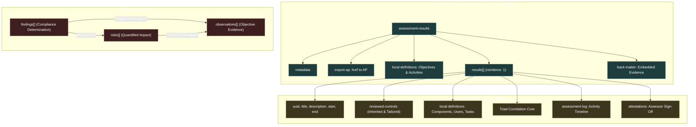

# DD-038: Assessment Results Architecture — Scoping Model, Observation-Finding Correlation, AP Import Resolution, and Risk Categorization

## Status: Accepted
## Date: 2026-09-04
## Decision Makers: Development Team
## Applies to: Stage 6 (Assessment Results / SAR), Stage 7 (POA&M)

> **Related Decisions:**
> - [DD-001](DD-001_architecture_and_code_organization.md): Architecture & Code Organization
> - [DD-002](DD-002_oscal_validation_strategy.md): OSCAL Validation Strategy (Levels L0–L3)
> - [DD-004](DD-004_editor_ux_patterns.md): Editor UX Patterns (Drafts, Mode Toggle, Undo/Redo)
> - [DD-007](DD-007_base64_embedded_attachments_strategy.md): Base64 Embedded Attachments & Back-Matter Strategy
> - [DD-014](DD-014_live_ui_form_validation.md): Empty Array Purging Strategy
> - [DD-016](DD-016_cross_document_import_resolution.md): Cross-Document Import Resolution Engine
> - [DD-017](DD-017_shared_assessment_entities.md): Shared Assessment Entities (Observations, Risks, Findings)
> - [DD-018](DD-018_risk_scoring_characterization_ui.md): Risk Scoring, CVSS Characterization & Threat Identification UI
> - [DD-020](DD-020_status_badge_design_system.md): Status Badge Design System
> - [DD-021](DD-021_entity_list_detail_editor_pattern.md): Entity List-Detail Editor Pattern
> - [DD-028](DD-028_backend_resolution_engine.md): Backend Resolution Engine
> - [DD-029](DD-029_document_actions_pattern.md): Document Actions Pattern & Reducer Middleware
> - [DD-036](DD-036_ssp_security_inheritance_and_baseline_resolution.md): SSP Architecture — Baseline Resolution & Security Inheritance
> - [DD-037](DD-037_assessment_plan_architecture_and_scoping_model.md): Assessment Plan Architecture — 6-Tab Builder, 3D Scoping Matrix & DAG

---

## Context

In the NIST OSCAL audit lifecycle, the **Security Assessment Results (AR / SAR)** document (Step 6) captures the authoritative evaluation findings, objective observations, collected evidence, and security risks resulting from the execution of a Security Assessment Plan (AP / SAP, Step 5) against a target System Security Plan (SSP, Step 4). The assessment results serve as the factual baseline for Plan of Action and Milestones (POA&M, Step 7) remediation tracking.

The official NIST OSCAL Assessment Results v1.2.2 JSON Schema (`oscal_assessment-results_schema.json`, Draft-07, schema ID `http://csrc.nist.gov/ns/oscal/1.2.3/oscal-ar-schema.json`) enforces strict structural requirements:
1. `additionalProperties: false` across all major assemblies.
2. `minItems: 1` on all arrays (`results`, `reviewed-controls.control-selections`, `observations.methods`, `finding.target`, `attestations.parts`, etc.).
3. Mandatory root-level assemblies: `uuid`, `metadata`, `import-ap`, and `results` (with at least one `result` entry).
4. Mandatory result-level assemblies: `uuid`, `title`, `description`, `start`, and `reviewed-controls`.
5. Strict triad requirements:
   - Every `observation` requires `uuid`, `description`, `methods` (minItems: 1), and `collected`.
   - Every `finding` requires `uuid`, `title`, `description`, and `target` (`type`: `statement-id` | `objective-id`, `target-id`, `status.state`: `satisfied` | `not-satisfied`).
   - Every `risk` requires `uuid`, `title`, `description`, `statement`, and `status`. Omission of `statement` strictly invalidates the schema.

Prior to this decision, Reposol's Assessment Results implementation exhibited several architectural gaps:
- The frontend (`ARPage.tsx`) was a monolithic prototype containing more than 20 non-operational stubbed event handlers (`onChange={() => {}}` and `onRowClick={() => {}}`), preventing users from editing observation methods, evidence links, finding targets, and risk facets.
- State mutations were performed directly without conforming to the DD-029 Document Actions pattern, lacking immutable state transitions and undo/redo capabilities.
- Backend validation in `reposol/backend/app/validation.py` implemented `_validate_ap_integrity` for Assessment Plans, but had no corresponding `_validate_ar_integrity` for Assessment Results, permitting dangling AP references and broken cross-references between findings, observations, and risks.
- No dedicated backend resolution endpoint existed for resolving the imported Assessment Plan context (`/api/resolve/assessment-results/preview`).
- TypeScript definitions in `oscal.d.ts` loosely typed AR entities (e.g. missing `statement` on `Risk`, typing `reviewed-controls` as an array rather than an object).

This decision establishes the comprehensive architectural foundation for the production-grade NIST OSCAL Assessment Results Builder and Reporter.

---

## Decisions



---

### 1. Assessment Results Scoping Model (`reviewed-controls` & `local-definitions` Partition)

#### A. Result Set Scoping Authority
In NIST OSCAL AR v1.2.2, scoping boundaries are established at the `result` level rather than the root level. Each result set represents a bounded assessment campaign or audit timeframe.
- Every `result` object MUST declare a valid `reviewed-controls` assembly:
  ```json
  {
    "reviewed-controls": {
      "description": "Reviewed controls evaluated during Phase 1 testing.",
      "control-selections": [
        {
          "description": "Core baseline controls selected from AP",
          "include-controls": [
            { "control-id": "ac-1", "statement-ids": ["ac-1_smt"] },
            { "control-id": "ac-2", "statement-ids": ["ac-2_smt_a", "ac-2_smt_b"] }
          ]
        }
      ],
      "control-objective-selections": [
        {
          "include-all": {}
        }
      ]
    }
  }
  ```
- Each item in `control-selections` must specify either `include-all: {}` OR `include-controls: [...]`, with optional `exclude-controls: [...]`.
- A result set without a valid `reviewed-controls` assembly strictly violates schema validation.

#### B. Inherited vs Actual Evaluated Scope
When an Assessment Plan is linked via `import-ap.href`, Reposol provides two distinct scoping mechanisms:
1. **Inherited Scope (Pre-population)**: Assessors can trigger `populateResultControlsFromAP`, which resolves the AP and seeds the result set's `reviewed-controls` with the exact control selections planned in the AP.
2. **Actual Evaluated Scope (Tailoring)**: Assessors can dynamically tailor `reviewed-controls` to document the *actual* controls evaluated during execution. Controls omitted due to testing constraints can be moved to `exclude-controls` with remarks explaining the rationale. Controls added dynamically during penetration testing can be appended to `include-controls`.

#### C. Two-Tier Local Definitions Separation
NIST OSCAL AR v1.2.2 strictly bifurcates `local-definitions` into two distinct schemas based on hierarchy:
1. **Root-Level `assessment-results.local-definitions` (Procedural Methodology)**:
   - Holds reusable assessment methodology definitions that transcend individual result sets.
   - Allowed properties: `objectives-and-methods` (`local-objective[]`), `activities` (`activity[]`), and `remarks`.
   - *Schema Rule*: Placing `components`, `inventory-items`, `users`, or `tasks` at the root level triggers an immediate `additionalProperties: false` schema error.
2. **Result-Level `result.local-definitions` (Execution Runtime Assets)**:
   - Holds operational assets specific to an individual testing execution run.
   - Allowed properties: `components` (`0..*`), `inventory-items` (`0..*`), `users` (`0..*`), `assessment-assets` (`0..1`), `tasks` (`0..*`), and `remarks`.
   - Reposol enforces unique UUIDs across all local components, inventory items, and users defined within each result set.

---

### 2. Triad Correlation Architecture: Findings, Observations, and Risks

The heart of the Assessment Results model is the tightly coupled **Triad**:

```
                  ┌─────────────────────────────────────────┐
                  │              OBSERVATION                │
                  │  • methods: [EXAMINE, TEST, INTERVIEW]  │
                  │  • collected: 2026-09-04T10:00:00Z      │
                  │  • relevant-evidence: [pcap, scan.xml]   │
                  └────────────────────┬────────────────────┘
                                       │
              originating evidence     │ supports determination
              (risk.related-           │ (finding.related-
               observations)           │  observations)
                                       ▼
┌─────────────────────────────────────────┐       arising risk      ┌─────────────────────────────────────────┐
│                 FINDING                 ├────────────────────────►│                  RISK                   │
│  • target.target-id: "ac-2_smt_a"       │ (finding.related-risks) │  • statement: "Unauthorized privilege..."│
│  • target.type: "statement-id"          │                         │  • status: "open"                       │
│  • target.status.state: "not-satisfied" │                         │  • characterizations: [CVSS 8.8, High]  │
└─────────────────────────────────────────┘                         └─────────────────────────────────────────┘
```

#### A. Triad Entity Semantics
1. **Observation (`results[].observations[]`)**:
   - Represents uninterpreted, empirical test evidence gathered by an assessor or automated tool.
   - Required fields: `uuid`, `description`, `methods` (`minItems: 1`), `collected`.
   - Standard evaluation methods: `EXAMINE`, `INTERVIEW`, `TEST`, `UNKNOWN` (allow-other).
   - Standard observation types: `ssp-statement-issue`, `control-objective`, `mitigation`, `finding`, `discovery`, `historic`.
   - Actors & Origins: Supports `origins[].actors[]` attributing evidence to specific tools, platforms, or parties.
   - Evidence Links: Supports `relevant-evidence[]` with required `description` and optional `href` (pointing to Base64 attachments in `back-matter` or external URLs).

2. **Finding (`results[].findings[]`)**:
   - Represents an authoritative compliance posture determination against a specific control statement or objective.
   - Required fields: `uuid`, `title`, `description`, `target`.
   - Target Assembly (`target`):
     - `type`: `statement-id` | `objective-id` (required).
     - `target-id`: Token matching control statement or objective (e.g. `ac-2_smt_a`, `ac-2_obj_1`) (required).
     - `status`: Object with `state` (`satisfied` | `not-satisfied`) (required), optional `reason` (`pass` | `fail` | `other`), and optional `remarks`.
     - `implementation-status`: Optional object with `state` (`implemented`, `partial`, `planned`, `alternative`, `not-applicable`) mirroring SSP component implementation status.
   - SSP Statement Traceability: Optional `implementation-statement-uuid` pointing directly to the specific SSP statement implementation under review.

3. **Risk (`results[].risks[]`)**:
   - Represents a quantified security risk resulting from one or more `not-satisfied` findings.
   - Required fields: `uuid`, `title`, `description`, `statement`, `status`.
   - *Critical Schema Rule*: The `statement` field is strictly required by NIST OSCAL AR v1.2.2. Omission invalidates the document.
   - Status Enums: `open`, `investigating`, `remediating`, `deviation-requested`, `deviation-approved`, `closed` (allow-other).

#### B. Bi-Directional Traceability & Cross-Reference Integrity
1. **Finding-to-Observation Link**: `finding.related-observations[].observation-uuid` binds findings to supporting evidence.
2. **Finding-to-Risk Link**: `finding.related-risks[].risk-uuid` links deficiency findings to corresponding impact assessments.
3. **Risk-to-Observation Link**: `risk.related-observations[].observation-uuid` links risks directly to originating evidence.
4. **Referential Integrity Validation**:
   - Every UUID referenced in `finding.related-observations` MUST exist in `result.observations`.
   - Every UUID referenced in `finding.related-risks` MUST exist in `result.risks`.
   - Every UUID referenced in `risk.related-observations` MUST exist in `result.observations`.
   - Dangling references trigger Level 2 semantic validation errors during save and preview.

---

### 3. Assessment Plan Import Resolution Engine (`import-ap.href`)

#### A. URI Resolution Standards
The `import-ap.href` property links the Assessment Results document to its governing Assessment Plan:
- **Workspace-Relative URIs**: `../assessment-plans/{uuid}.json` or `/api/documents/assessment-plans/{uuid}`.
- **Direct UUID / Fragment URIs**: `#{uuid}` or `{uuid}` referencing APs within the active workspace storage.
- **External HTTPS URIs**: `https://...` referencing external or third-party assessment plans.

#### B. Backend Resolution Endpoint
A dedicated resolution route is established:
`POST /api/resolve/assessment-results/preview`
- **Payload**: Accepts either the current in-memory AR JSON payload or an AR document ID.
- **Processing**:
  1. Resolves `import-ap.href` against the workspace document registry.
  2. Extracts the AP's `metadata`, `reviewed-controls`, `assessment-subjects`, `assessment-assets`, `activities`, and `tasks`.
  3. Computes a scoping comparison matrix:
     - **Planned Controls**: All controls declared in the AP's `reviewed-controls`.
     - **Assessed Controls**: Controls present in the AR's `result.reviewed-controls`.
     - **Evaluated Finding Targets**: Control statements evaluated in `findings`.
     - **Scoping Delta**: Identifies planned controls not yet evaluated and ad-hoc controls evaluated without prior AP declaration.
- **Response**:
  ```json
  {
    "ap_metadata": {
      "uuid": "8f5a2b1c-...",
      "title": "Annual NIST SP 800-53 Rev 5 Assessment Plan",
      "version": "1.0.0",
      "import_ssp": "../ssps/ssp-01.json"
    },
    "scoping_matrix": {
      "total_planned_controls": 42,
      "total_assessed_controls": 42,
      "satisfied_count": 38,
      "not_satisfied_count": 4,
      "delta": []
    },
    "candidate_subjects": [...],
    "candidate_activities": [...]
  }
  ```

#### C. Scoping Auto-Population Action
Assessors can execute `populateResultControlsFromAP(resultIndex)`, which reads the resolved AP context and initializes:
- `result.reviewed-controls.control-selections` matching the AP's planned control list.
- Candidate subjects and actors for selection in observations and findings.

---

### 4. Finding Risk Categorization & Characterization Model (NIST OSCAL v1.2.2 & DD-018)

#### A. Mandatory Risk Fields & Schema Compliance
Every risk object within `result.risks[]` must strictly satisfy:
```json
{
  "uuid": "3fa85f64-5717-4562-b3fc-2c963f66afa6",
  "title": "Weak Password Complexity Policy",
  "description": "The current password configuration permits 8-character passwords without complexity requirements.",
  "statement": "Failure to enforce password complexity significantly increases susceptibility to credential stuffing and offline dictionary attacks.",
  "status": "open"
}
```

#### B. Risk Lifecycle State Machine & Automated Risk Log
Transitions between risk lifecycle states follow strict transition paths:
- `open` ➔ `investigating` | `remediating` | `closed` (if `false-positive`)
- `investigating` ➔ `remediating` | `deviation-requested` | `closed`
- `remediating` ➔ `deviation-requested` | `closed`
- `deviation-requested` ➔ `deviation-approved` | `remediating`
- `deviation-approved` ➔ `closed`
- `closed` ➔ `open` (reopened upon recurring finding)

**Automated Risk Log Generation**:
Whenever a risk's `status` changes, the document action layer automatically appends an entry to `risk.risk-log.entries[]`:
```json
{
  "uuid": "generated-uuid",
  "start": "2026-09-04T12:00:00Z",
  "title": "Status updated to remediating",
  "description": "Assigned to DevSecOps team for remediation implementation.",
  "status-change": "remediating",
  "logged-by": [{ "party-uuid": "current-user-party-uuid", "role-id": "lead-assessor" }]
}
```

#### C. Characterization Scoring Facets (DD-018 Integration)
Each risk supports `characterizations[]` capturing multi-system risk scores:
- **CVSS (v2.0, v3.0, v3.1, v4.0)**:
  - System URI: `http://www.first.org/cvss/v3.1` or `https://www.first.org/cvss/v4-0`
  - Facets: `score` (0.0–10.0), `vector-string`, `base-score`, `exploitability-score`, `impact-score`.
  - UI renders color-coded score bars conforming to DD-018 thresholds (0.0 Gray, 0.1–3.9 Green, 4.0–6.9 Yellow, 7.0–8.9 Orange, 9.0–10.0 Red).
- **FedRAMP Severity**:
  - System URI: `http://fedramp.gov/ns/oscal`
  - Facet: `severity` with value `high` | `moderate` | `low`.
- **External Threat Catalogs**:
  - Captured in `threat-ids[]` with `system` (e.g. `http://cve.mitre.org`), `id` (e.g. `CVE-2024-12345`), and optional `href`.

#### D. Risk Remediations (Responses)
Risks can define structured responses in `remediations[]` (represented as OSCAL `response` objects):
- `uuid` (required), `title` (required), `description` (required).
- `lifecycle`: `recommendation` | `planned` | `completed`.
- Response Strategy Classification via `props`: `avoid`, `mitigate`, `transfer`, `accept`, `share`, `contingency`, `none`.
- Optional `required-assets` and remediation `tasks`.

---

### 5. Granular Document Actions Suite (`assessment-results-actions.ts` per DD-029)

In compliance with DD-029, all mutations to Assessment Results documents are strictly encapsulated in pure, typed action functions. Direct in-place mutation of the document tree in UI components is prohibited.

#### A. Action Categories & Signatures

```typescript
// Root Document & Metadata Actions
setARTitle(title: string): DocumentAction<AssessmentResultsDocument>;
setARVersion(version: string): DocumentAction<AssessmentResultsDocument>;
setImportAP(href: string, remarks?: string): DocumentAction<AssessmentResultsDocument>;
addARParty(party: Party): DocumentAction<AssessmentResultsDocument>;
removeARParty(partyUuid: string): DocumentAction<AssessmentResultsDocument>;
addARRole(role: Role): DocumentAction<AssessmentResultsDocument>;
removeARRole(roleId: string): DocumentAction<AssessmentResultsDocument>;
setARProp(prop: Property): DocumentAction<AssessmentResultsDocument>;
removeARProp(name: string): DocumentAction<AssessmentResultsDocument>;

// Result Set Actions
addResultSet(result: Partial<Result>): DocumentAction<AssessmentResultsDocument>;
updateResultSet(resultIndex: number, updates: Partial<Result>): DocumentAction<AssessmentResultsDocument>;
removeResultSet(resultIndex: number): DocumentAction<AssessmentResultsDocument>;
setResultReviewedControlsDescription(resultIndex: number, description: string): DocumentAction<AssessmentResultsDocument>;
setResultControlSelections(resultIndex: number, selections: ControlSelection[]): DocumentAction<AssessmentResultsDocument>;
toggleResultIncludeAllControls(resultIndex: number, selectionIndex: number, includeAll: boolean): DocumentAction<AssessmentResultsDocument>;
addResultIncludeControl(resultIndex: number, selectionIndex: number, controlId: string, statementIds?: string[]): DocumentAction<AssessmentResultsDocument>;
removeResultIncludeControl(resultIndex: number, selectionIndex: number, controlId: string): DocumentAction<AssessmentResultsDocument>;
populateResultControlsFromAP(resultIndex: number, apControls: Array<{ controlId: string; statementIds?: string[] }>): DocumentAction<AssessmentResultsDocument>;

// Observation Actions
addObservation(resultIndex: number, observation: Partial<Observation>): DocumentAction<AssessmentResultsDocument>;
updateObservation(resultIndex: number, observationIndex: number, updates: Partial<Observation>): DocumentAction<AssessmentResultsDocument>;
removeObservation(resultIndex: number, observationIndex: number): DocumentAction<AssessmentResultsDocument>;
toggleObservationMethod(resultIndex: number, observationIndex: number, method: 'EXAMINE' | 'INTERVIEW' | 'TEST' | 'UNKNOWN'): DocumentAction<AssessmentResultsDocument>;
addObservationRelevantEvidence(resultIndex: number, observationIndex: number, evidence: { description: string; href?: string }): DocumentAction<AssessmentResultsDocument>;
removeObservationRelevantEvidence(resultIndex: number, observationIndex: number, evidenceIndex: number): DocumentAction<AssessmentResultsDocument>;
addObservationSubject(resultIndex: number, observationIndex: number, subject: { subjectUuid: string; type: string }): DocumentAction<AssessmentResultsDocument>;
removeObservationSubject(resultIndex: number, observationIndex: number, subjectIndex: number): DocumentAction<AssessmentResultsDocument>;

// Finding Actions
addFinding(resultIndex: number, finding: Partial<Finding>): DocumentAction<AssessmentResultsDocument>;
updateFinding(resultIndex: number, findingIndex: number, updates: Partial<Finding>): DocumentAction<AssessmentResultsDocument>;
removeFinding(resultIndex: number, findingIndex: number): DocumentAction<AssessmentResultsDocument>;
setFindingTarget(resultIndex: number, findingIndex: number, target: FindingTarget): DocumentAction<AssessmentResultsDocument>;
linkFindingObservation(resultIndex: number, findingIndex: number, observationUuid: string, remarks?: string): DocumentAction<AssessmentResultsDocument>;
unlinkFindingObservation(resultIndex: number, findingIndex: number, observationUuid: string): DocumentAction<AssessmentResultsDocument>;
linkFindingRisk(resultIndex: number, findingIndex: number, riskUuid: string, remarks?: string): DocumentAction<AssessmentResultsDocument>;
unlinkFindingRisk(resultIndex: number, findingIndex: number, riskUuid: string): DocumentAction<AssessmentResultsDocument>;

// Risk Actions
addRisk(resultIndex: number, risk: Partial<Risk>): DocumentAction<AssessmentResultsDocument>;
updateRisk(resultIndex: number, riskIndex: number, updates: Partial<Risk>): DocumentAction<AssessmentResultsDocument>;
removeRisk(resultIndex: number, riskIndex: number): DocumentAction<AssessmentResultsDocument>;
setRiskStatus(resultIndex: number, riskIndex: number, status: string, userPartyUuid?: string, userRoleId?: string, remarks?: string): DocumentAction<AssessmentResultsDocument>;
setRiskStatement(resultIndex: number, riskIndex: number, statement: string): DocumentAction<AssessmentResultsDocument>;
addRiskCharacterizationFacet(resultIndex: number, riskIndex: number, facet: { name: string; system: string; value: string }): DocumentAction<AssessmentResultsDocument>;
removeRiskCharacterizationFacet(resultIndex: number, riskIndex: number, facetIndex: number): DocumentAction<AssessmentResultsDocument>;
addRiskThreatID(resultIndex: number, riskIndex: number, threat: { system: string; id: string; href?: string }): DocumentAction<AssessmentResultsDocument>;
removeRiskThreatID(resultIndex: number, riskIndex: number, threatIndex: number): DocumentAction<AssessmentResultsDocument>;
addRiskMitigatingFactor(resultIndex: number, riskIndex: number, factor: { uuid: string; description: string }): DocumentAction<AssessmentResultsDocument>;
removeRiskMitigatingFactor(resultIndex: number, riskIndex: number, factorIndex: number): DocumentAction<AssessmentResultsDocument>;
addRiskRemediation(resultIndex: number, riskIndex: number, remediation: Partial<Response>): DocumentAction<AssessmentResultsDocument>;
updateRiskRemediation(resultIndex: number, riskIndex: number, remediationIndex: number, updates: Partial<Response>): DocumentAction<AssessmentResultsDocument>;
removeRiskRemediation(resultIndex: number, riskIndex: number, remediationIndex: number): DocumentAction<AssessmentResultsDocument>;
addRiskLogEntry(resultIndex: number, riskIndex: number, entry: RiskLogEntry): DocumentAction<AssessmentResultsDocument>;

// Assessment Log & Attestation Actions
addAssessmentLogEntry(resultIndex: number, entry: AssessmentLogEntry): DocumentAction<AssessmentResultsDocument>;
updateAssessmentLogEntry(resultIndex: number, entryIndex: number, updates: Partial<AssessmentLogEntry>): DocumentAction<AssessmentResultsDocument>;
removeAssessmentLogEntry(resultIndex: number, entryIndex: number): DocumentAction<AssessmentResultsDocument>;
addAttestation(resultIndex: number, attestation: Attestation): DocumentAction<AssessmentResultsDocument>;
updateAttestation(resultIndex: number, attestationIndex: number, updates: Partial<Attestation>): DocumentAction<AssessmentResultsDocument>;
removeAttestation(resultIndex: number, attestationIndex: number): DocumentAction<AssessmentResultsDocument>;

// Local Definitions & Back-Matter Actions
addRootLocalObjective(objective: LocalObjective): DocumentAction<AssessmentResultsDocument>;
removeRootLocalObjective(objectiveId: string): DocumentAction<AssessmentResultsDocument>;
addRootLocalActivity(activity: Activity): DocumentAction<AssessmentResultsDocument>;
removeRootLocalActivity(activityUuid: string): DocumentAction<AssessmentResultsDocument>;
addResultLocalComponent(resultIndex: number, component: Component): DocumentAction<AssessmentResultsDocument>;
removeResultLocalComponent(resultIndex: number, componentUuid: string): DocumentAction<AssessmentResultsDocument>;
addResultLocalUser(resultIndex: number, user: User): DocumentAction<AssessmentResultsDocument>;
removeResultLocalUser(resultIndex: number, userUuid: string): DocumentAction<AssessmentResultsDocument>;
addResultLocalTask(resultIndex: number, task: Task): DocumentAction<AssessmentResultsDocument>;
removeResultLocalTask(resultIndex: number, taskUuid: string): DocumentAction<AssessmentResultsDocument>;
addBackMatterResource(resource: Resource): DocumentAction<AssessmentResultsDocument>;
removeBackMatterResource(resourceUuid: string): DocumentAction<AssessmentResultsDocument>;
```

#### B. Reducer Middleware Integration
All actions execute via Immer's `produce()`. The `useDocumentLifecycle` hook intercepts action dispatches:
- Creates undo/redo history snapshots.
- Marks document state as dirty (`isDirty = true`).
- Triggers debounced draft autosaving to `<uuid>_draft.json` (30s interval).

---

### 6. Modular Frontend UI Architecture

The monolithic `ARPage.tsx` is restructured into 7 focused, decoupled tabs matching the Assessment Results domain:

```
┌────────────────────────────────────────────────────────────────────────────────────────┐
│ Top Bar: Title, Target AP Import Selector, Active Result Set Picker, View/Edit Mode   │
├────────────────────────────────────────────────────────────────────────────────────────┤
│ Modular AR Navigation Tabs:                                                            │
│ 1. Overview & Metadata (AROverviewMetadataTab.tsx)                                     │
│    • Document Title, Version, Parties, Roles, Remarks, Target AP Resolution Summary    │
│ 2. Result Sets & Scoping (ARResultSetsTab.tsx)                                         │
│    • Result Set Manager, Start/End Timestamps, Reviewed Controls Scoping Editor        │
│ 3. Findings & Compliance (ARFindingsTab.tsx)                                           │
│    • Findings Data Table, Status (Satisfied/Not), Objective/Statement Selector,        │
│      Linked Observations Multi-select, Linked Risks Multi-select                       │
│ 4. Observations & Evidence (ARObservationsTab.tsx)                                     │
│    • Observations Data Table, Methods (EXAMINE/INTERVIEW/TEST), Origin & Actors,        │
│      Collected Timestamp, Relevant Evidence Links (Back-Matter Fragments)              │
│ 5. Identified Risks (ARRisksTab.tsx)                                                   │
│    • Risk Inventory, Mandatory Statement Editor, Status State Machine, CVSS Facets,   │
│      Threat IDs (CVE), Mitigating Factors, Remediations, Risk Log Timeline             │
│ 6. Assessment Log & Attestations (ARAssessmentLogTab.tsx)                             │
│    • Chronological Event Timeline, Logged-By Roles, Formal Assessor Sign-Off Parts     │
│ 7. Local Definitions & Attachments (ARLocalDefinitionsTab.tsx)                         │
│    • Root Objectives/Activities, Result Components/Users, Base64 Back-Matter Attachments│
└────────────────────────────────────────────────────────────────────────────────────────┘
```

#### Elimination of Stubbed Event Handlers
All stubbed `onChange={() => {}}` and `onRowClick={() => {}}` handlers are replaced with live action dispatches:
- Clicking a table row opens the corresponding entity detail drawer with real two-way binding.
- Form field modifications dispatch granular actions immediately updating state.
- Checkbox selections for observation methods (`EXAMINE`, `INTERVIEW`, `TEST`) update `observation.methods` array while enforcing `minItems: 1`.
- Multi-select dropdowns for `related-observations` and `related-risks` query live UUIDs from the active result set.

---

### 7. Backend Semantic Integrity Validation (`_validate_ar_integrity`)

In addition to JSON Schema Draft-07 validation (Level 1), Reposol enforces strict Level 2 domain semantic integrity checks in `reposol/backend/app/validation.py`:

```python
def _validate_ar_integrity(doc: Dict[str, Any], workspace_dir: Optional[str] = None) -> List[str]:
    """
    Validates semantic integrity of NIST OSCAL Assessment Results documents:
    1. Root structure and non-empty results array (minItems: 1).
    2. Import AP resolution against workspace storage.
    3. Mandatory result assemblies (start, reviewed-controls).
    4. Internal triad referential integrity:
       - Finding -> Observation links
       - Finding -> Risk links
       - Risk -> Observation links
       - Risk Log -> Remediation links
    5. Observation method enums and non-empty methods array.
    6. Risk statement presence and non-empty status.
    7. Attestation parts non-empty constraint.
    """
```

#### Validation Rules & Error Conditions:

| Rule ID | Check Description | Error Message |
|---|---|---|
| `AR-01` | Root mandatory fields | `Assessment Results missing required field: {field}` |
| `AR-02` | `results` array minItems: 1 | `Assessment Results must contain at least one result set in 'results'` |
| `AR-03` | `import-ap.href` resolution | `Referenced Assessment Plan does not exist in workspace: {href}` |
| `AR-04` | `reviewed-controls` presence | `Result set '{uuid}' missing required 'reviewed-controls'` |
| `AR-05` | Control selections valid | `Result set '{uuid}' reviewed-controls must define at least one control-selection` |
| `AR-06` | Observation methods valid | `Observation '{uuid}' must contain at least one method from [EXAMINE, INTERVIEW, TEST, UNKNOWN]` |
| `AR-07` | Finding target valid | `Finding '{uuid}' target missing required type, target-id, or status.state` |
| `AR-08` | Finding observation link | `Finding '{uuid}' references non-existent observation UUID: '{obs_uuid}'` |
| `AR-09` | Finding risk link | `Finding '{uuid}' references non-existent risk UUID: '{risk_uuid}'` |
| `AR-10` | Risk mandatory statement | `Risk '{uuid}' missing mandatory 'statement' field` |
| `AR-11` | Risk observation link | `Risk '{uuid}' references non-existent observation UUID: '{obs_uuid}'` |
| `AR-12` | Attestation parts valid | `Attestation in result '{uuid}' must define at least one assessment part` |

---

### 8. Pre-Serialization Empty Array Purging (DD-014 Integration)

- The NIST OSCAL AR v1.2.2 schema forbids empty arrays across all assemblies.
- Before serialization to disk or submission to backend validation, the document tree is processed with `remove_empty_arrays()`.
- Optional assemblies like `props`, `links`, `relevant-evidence`, `related-observations`, `related-risks`, `threat-ids`, `characterizations`, `mitigating-factors`, and `remediations` are stripped if empty, ensuring zero schema validation errors due to empty containers.

---

## Consequences

### Positive
- **Strict OSCAL v1.2.2 Compliance**: Created and edited Assessment Results documents strictly conform to the NIST OSCAL AR schema with zero schema invalidations.
- **Flawless Evidence Traceability**: Assessor determinations (Findings) are directly traceable to empirical evidence (Observations) and security impacts (Risks).
- **Zero Stubbed Handlers**: The user interface is fully interactive with real-time state synchronization, drawer editors, and active dispatches.
- **Robust Undo/Redo & Draft Safety**: The DD-029 document actions architecture protects assessors from accidental data loss during lengthy audit sessions.
- **Prevention of Data Corruption**: Backend semantic validation prevents broken cross-references, dangling AP links, and missing mandatory fields.

### Negative
- **Cross-Reference Maintenance Overhead**: When deleting an observation or risk, all referencing findings must update their `related-observations` and `related-risks` arrays to prevent dangling references.
- **Resolution Latency**: Resolving large Assessment Plans with hundreds of scoped controls requires efficient caching in the backend resolution service.

### Mitigations
- Document actions automatically cascade-remove references when an observation or risk is deleted from a result set.
- The resolution engine caches resolved AP control matrices in memory during the editing session.
