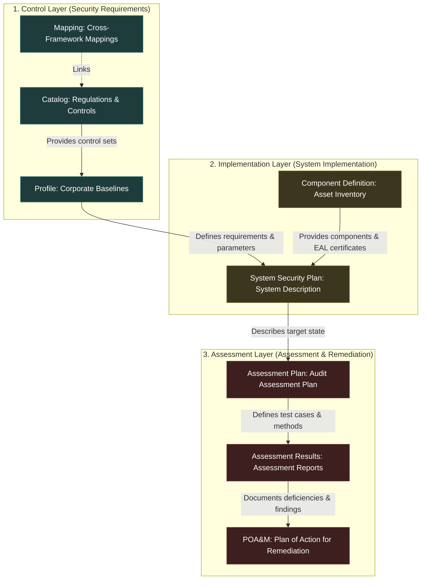

# Step 0: Cross-System Requirements (Global Requirements)

* **Persona:** All Users (Alice, Bob, etc.)
* **Goal:** Functional requirements that are not assigned to a single OSCAL step but apply system-wide.

---

## The Three Layers of the OSCAL Architecture

The compliance lifecycle progresses in stages from requirement definition to implementation, and on to continuous assessment and remediation:

---

## Overview of User Stories

Each step of the security lifecycle is described in detail in a separate file:

1. **[Step 1: Catalog Builder (Catalog Editor)](step1_catalog_builder.md)**
   * Creation of basic security catalogs with groups, controls, and default parameter placeholders.
2. **[Step 2: Profile Tailoring (Profile Editor)](step2_profile_tailoring.md)**
   * Merging multiple catalogs, modifying specifications, and capturing text additions (`alters`).
3. **[Step 3: Component Definition (Component Inventory)](step3_component_inventory.md)**
   * Structured capture of IT assets (software, services, policies) including properties such as Common Criteria EAL certifications and system-wide product capabilities.
4. **[Step 4: SSP Builder (System Security Plan)](step4_ssp_builder.md)**
   * Definition of system boundaries, assignment of active components to controls, and fine-tuning of control parameters.
5. **[Step 5: Assessment Plan Builder (Assessment Plan Editor)](step5_assessment_plan.md)**
   * Planning the system assessment, defining assessment objectives, assessment subjects, teams, tools, and milestones.
6. **[Step 6: Assessment Results Reporter (Assessment Report Creation)](step6_assessment_results.md)**
   * Documentation of test results, logging, capturing observations, evidence references, vulnerabilities, and final assessment attestation.
7. **[Step 7: POA&M Tracker (Remediation Plan Editor)](step7_poam.md)**
   * Continuous tracking of open risks, planning remediation milestones, and documenting special cases such as risk acceptance.
8. **[Step 8: Control Mapping (Framework Mappings)](step8_control_mapping.md)**
   * Mapping controls between different frameworks (e.g., NIST 800-53 ↔ ISO 27001) with relationship types, gap analysis, and visualization.

---

## Detailed User Stories

### US 0.1: Automatic Provisioning of Example Data (OSCAL Core Examples)
> **As a** new user or auditor (Alice / Bob)  
> **I want** the system to automatically create a complete, standard-compliant example dataset (catalog, profile, components, SSP, assessment plan, assessment report, and POA&M) upon initial startup,  
> **so that** I can immediately understand the entire OSCAL compliance lifecycle visually and use it as a template for my own plans.
*   **Acceptance Criteria:**
    *   Automatic creation of example documents for all 7 OSCAL categories if the directory is empty.
    *   The example documents cover all phases and refer correctly to each other via UUIDs (e.g., POA&M imports the SSP and the Assessment Results).
    *   The complete generation and UUID consistency is verified by automated tests in the pipeline.

### US 0.2: Direct Document Creation without Intermediate Steps
> **As a** compliance officer and enterprise architect (Alice)  
> **I want** the `+ New` button to immediately open the configuration terminal (document editor),  
> **so that** I can start editing directly without intermediate steps and flexibly switch between the Visual Editor and the Raw JSON Editor.
*   **Acceptance Criteria:**
    *   [x] The `+ New [Model]` button on the dashboard immediately opens the document editor in an empty state.
    *   [x] The previous intermediate screen ("Create or Import") is completely removed.
    *   [x] Within the editor, there is a "Load Template" quick selection for new documents to load an existing document (e.g., from the registry) directly into the current editor (both Visual and JSON).
    *   [x] The Raw JSON mode provides a clean, single textarea for the entire OSCAL document (no splitting into metadata fields and sub-textareas).
    *   [x] Manual editing in Raw JSON mode is parsed when switching back to Visual mode and synchronizes all visual states.
    *   [x] Validating and saving in Raw JSON mode directly uses the content of the textarea.

### US 0.3: OSCAL Document Import (Any Format & Registry Sources)
> **As a** compliance officer (Alice)  
> **I want** to be able to upload externally created OSCAL documents (JSON/XML/YAML) and select from a cleaned registry of verified standard OSCAL catalogs and baseline profiles from the official OSCAL Content Registry,  
> **so that** I can seamlessly import official security control frameworks and compliance baselines into Reposol without encountering broken remote URLs.
*   **Acceptance Criteria:**
    *   Upload dialog for files in JSON, XML, and YAML formats.
    *   Automatic format detection and conversion into the internal JSON format.
    *   **Pre-bundled OSCAL Content Registry Sources:** The import registry modal includes official, pre-configured raw JSON endpoints matching the official OSCAL Content Registry repository (`usnistgov/oscal-content` and BSI). Non-working/broken remote endpoints (e.g. HTTP 404 URLs for NIST SP 800-171, NIST CSF 1.1, and legacy FedRAMP profiles) are excluded from `KNOWN_SOURCES` so that only valid, importing endpoints are offered in the UI.
    *   **Uniform Publisher Badge Styling:** All source publisher badges (NIST, BSI, FedRAMP, etc.) in the Import Wizard registry list use a single uniform standard blue badge style (`#1a7fd4`), eliminating publisher-specific color mapping.
    *   **Official Schema Validation:** The imported document is strictly validated against the official NIST OSCAL JSON schemas stored locally under `reposol/backend/app/schemas/`.
    *   **Error Mapping:** In case of a failed import, a detailed error message with the exact JSON path and error description is returned according to the strategy defined in [DD-002](../design_decisions/DD-002_oscal_validation_strategy.md).

### US 0.4: OSCAL Export to Different Formats
> **As a** compliance officer (Alice)  
> **I want** to be able to download any OSCAL document as JSON, XML, or YAML,  
> **so that** I can share documents with external auditors, partners, or tools in their preferred format.
*   **Acceptance Criteria:**
    *   Download button with format selection (JSON, XML, YAML) in the document view.
    *   Exported documents are 100% schema-compliant with the respective official NIST OSCAL schema.
    *   Filename contains document title and version number.

### US 0.5: OSCAL Lifecycle Dashboard
> **As a** compliance officer or auditor (Alice / Bob)  
> **I want** to see a visual comprehensive overview of all OSCAL documents and their connections (import chains),  
> **so that** I can grasp the status of the entire compliance lifecycle at a glance.
*   **Acceptance Criteria:**
    *   Dashboard page with a graphical representation of all documents as linked nodes (Catalog → Profile → SSP → AP → AR → POA&M + Mappings + Component Definitions).
    *   Status indicator per document (e.g., draft, active, archived).
    *   Drill-down: Clicking a node opens the respective document.
    *   Filters by document type and status.

### US 0.6: Reference Integrity Check and Advanced Deletion
> **As a** compliance officer (Alice)  
> **I want** to be automatically warned when import references between OSCAL documents are broken, and warned when deleting a document if it is still being referenced,  
> **so that** I can ensure the consistency of my document landscape.
*   **Acceptance Criteria:**
    *   Automatic check of all `import-*` references (such as `imports` in profiles) for the existence of the target documents.
    *   Visual warning (yellow banner at the top of the Profile Viewer) if an imported resource (catalog or profile) is missing from the system or if a reference is broken.
    *   If a document that is referenced by other documents is to be deleted, the frontend intercepts the backend's 409 message and opens a detailed confirmation dialog.
    *   The confirmation dialog lists all referencing documents and offers the user a "Force Delete" button (Force Delete via API with `?force=true`) as well as a cancel button.

### US 0.7: OSCAL Revision History in Document
> **As a** user (Alice / Bob)  
> **I want** the OSCAL-internal revision history (`metadata.revisions[]`) to be updated automatically on every version save and to be manually editable,  
> **so that** the exported OSCAL document contains a complete, schema-compliant change history, and external tools can parse it.
*   **Acceptance Criteria:**
    *   **Automatic Revision Tracking:** When saving a new version (see US 0.P2), a new entry is automatically added to `metadata.revisions[]`, containing the version number, the timestamp (last-modified), the OSCAL version, and the entered remarks.
    *   **Manual Editing:** In the Document Overview (Metadata tab), existing revision entries can be viewed, edited, and deleted (fields: title, published, last-modified, version, oscal-version, props, links, remarks).
    *   **Sorting:** Revisions are displayed in reverse chronological order (newest first), as prescribed by the OSCAL standard.
    *   Distinction from file versioning: The revision history is a JSON-internal concept and complements filesystem-based versioning (US 0.P2). Both concepts are independent.

### US 0.8: Automatic Scrolling and Expansion for the Selected Element in the Sidebar and JSON Editor
> **As a** user (Alice / Bob)  
> **I want** that selecting a control or a group in the sidebar automatically scrolls this element into the visible area of the sidebar, and when switching the mode to the Raw JSON Editor, the corresponding position of the element is focused and scrolled into view,  
> **so that** I always keep my orientation in large catalogs and profiles, regardless of whether I am in the reading view (Viewer), editing mode (Edit Mode), or the Raw JSON Editor.
*   **Acceptance Criteria:**
    *   **Automatic Scrolling in Sidebar:** In both the reading view (Viewer) and editing mode (Edit Mode) of catalogs and profiles, the currently selected element (control or group) in the sidebar is automatically smoothly scrolled into the visible area (`scrollIntoView`) if it is not fully visible.
    *   **Automatic Expansion:** When an element is loaded or selected (e.g., by clicking, after loading the page, through search matches, or when switching modes), all parent groups and the element itself in the sidebar are automatically expanded (`expanded`) if they are currently collapsed.
    *   **Manual Collapse of Selected Elements:** The user can manually collapse the selected element (and any of its parent groups) at any time by clicking the expand/collapse arrow icon. The selection state itself must not force the element to remain expanded or override manual collapse actions.
    *   **Synchronization with JSON Editor:** When switching to Raw JSON Editor mode (while an element is selected), the corresponding line of the element in the JSON text field (e.g., using `"id": "control-id"`) is automatically focused, the selection is set to the ID line, and the text field is scrolled to center on this position.
    *   The functionality is robust, does not lead to disruptive jumping during normal sidebar interaction, and is controlled via useEffect hooks.

### US 0.9: Virtualized JSON Editor for High-Performance Mode Switching on Large Documents
> **As a** compliance officer (Alice)  
> **I want** the switch from Visual Mode to JSON Mode and typing in the JSON editor to happen without noticeable delay (under 300ms) even for extremely large OSCAL documents (such as the 255,000-line NIST catalog),  
> **so that** my workflow is not interrupted and the application feels responsive and professional.
*   **Acceptance Criteria:**
    *   **No UI Freezing:** When switching to JSON Mode, the user interface must not block or freeze for several seconds.
    *   **Virtualized Rendering:** The JSON editor uses a virtual rendering engine (e.g., Monaco Editor) that only keeps visible lines in the DOM, allowing it to load instantly regardless of file size.
    *   **No Keystroke Lag:** Typing in the JSON editor must be absolutely lag-free by ensuring that state synchronizations to the parent container do not trigger blocking re-renderings on every keystroke.
    *   **Preservation of Features:** The automatic scroll and highlight synchronization (US 0.8) as well as live validation must remain fully functional and align with the API of the new editor.

### US 0.10: Under Development Indicator Badges for Uncompleted OSCAL Stages
> **Als** Compliance-Officer oder Auditor (Alice / Bob)  
> **möchte ich** eine visuelle Kennzeichnung (Baustellensymbol 🚧 / "Under Development"-Badge) an den OSCAL-Lifecycle-Elementen sehen, deren spezialisierte Editoren/Viewer noch in der Entwicklung sind (Component Definitions, SSP, Assessment Plans, Assessment Results, POA&M, Control Mappings),  
> **damit** sofort transparent erkennbar ist, welche OSCAL-Stufen bereits vollständig implementiert sind (Catalogs, Profiles) und welche sich noch in aktiver Entwicklung befinden.
*   **Akzeptanzkriterien:**
    *   **Dashboard Pipeline Cards:** Die Pipeline-Schritte im OSCAL Lifecycle Pipeline Dashboard für `Component Definitions`, `SSP`, `Assessment Plans`, `Assessment Results`, `POA&M` und `Control Mappings` zeigen ein deutliches 🚧 Baustellensymbol sowie eine gelbe/diskrete `In Dev`-Badge auf der Karte.
    *   **Sidebar Navigation:** In der Navigation (`Navigation.jsx`) wird neben den unvollständigen Arbeitsstufen ein dezentes 🚧 Baustellensymbol im Label oder als Badge angezeigt, inklusive eines verständlichen Tooltips ("Under Active Development").
    *   **Stage Header Warning Banner:** Beim Öffnen einer Arbeitsstufe, deren spezialisierter Editor noch nicht fertiggestellt ist (Components, SSPs, Assessment Plans, Assessment Results, POA&Ms, Control Mappings), wird am oberen Bildschirmrand ein informativer Hinweis-Banner angezeigt ("🚧 Dieser OSCAL-Editor befindet sich aktuell in der Entwicklung. Grundlegende JSON-Bearbeitung ist verfügbar.").

### US 0.11: Master Templates Admin Mode & Automatic User Workspace Seeding
> **Als** Administrator / System-Maintainer (Philipp)  
> **möchte ich** über einen speziellen Modus (`?w=master` oder `?w=templates`) direkt die schreibgeschützten Master-Templates (Kataloge & Profile) in `reposol/data/templates/` verwalten und editieren können – **ausschließlich im lokalen Betrieb (`localhost`)**,  
> **damit** alle normalen Benutzer bei ihrem ersten Start in ihrem eigenen anonymen Workspace automatisch meine aktuellsten Master-Vorlagen vorgelegt bekommen und fremde Personen auf der öffentlichen Live-Demo die Master-Templates niemals überschreiben können.
*   **Akzeptanzkriterien:**
    *   **Standard-Benutzer (Normal Mode):** Neue Benutzer-Sessions (`session-xyz`) erhalten beim Erstellen automatisch eine lokale Kopie aller Master-Vorlagen in ihren eigenen isolierten Workspace. Alle Bearbeitungen, Änderungen und Löschungen betreffen nur ihren eigenen Workspace.
    *   **Localhost-Admin Guard:** Der Master-Template-Schreibmodus (`?w=master` / `?w=templates`) ist **streng auf Anfragen von `localhost` / `127.0.0.1` beschränkt**. Auf der öffentlichen Live-Demo (Fly.io) werden Schreibzugriffe auf den Master-Workspace mit HTTP 403 Forbidden geblockt.
    *   **Master Persistence (Lokal):** Speicher- und Löschoperationen im Master-Mode auf `localhost` wirken direkt auf `reposol/data/templates/catalogs/` und `reposol/data/templates/profiles/`.
    *   **UI Indicator:** In der UI wird im Master-Mode ein deutlicher Hinweis/Badge angezeigt (`👑 Master Templates Mode (Local Admin)`), um versehentliches Überschreiben von Vorlagen zu verhindern.

---

## Global Pattern Stories (Applicable to All Steps 1–8)

The following stories define recurring UI and backend patterns implemented identically across each document type (Steps 1–8). Individual steps reference these patterns and only document step-specific deviations.

### US 0.P1: Standard Pattern – Simplified Creation (Inner View)
> **As a** user (Alice / Bob)  
> **I want** to be able to create a new OSCAL document by entering only the title initially and being redirected immediately to the editor,  
> **so that** I can start editing directly without cumbersome setup wizards.
*   **Acceptance Criteria:**
    *   Minimal creation screen requiring only the input of the document title.
    *   Immediate redirection to the edit view after creation (`/{model}/{uuid}?edit=true`).
    *   All other settings are made in-place within the editor.
    *   Applied in: US 1.9, US 2.1, US 3.7, US 4.8, US 5.6, US 6.6, US 7.6, US 8.5.

### US 0.P2: Standard Pattern – Integrated Document Versioning and Validation
> **As a** user (Alice / Bob)  
> **I want** to be able to save, load, and delete versions of an OSCAL document as separate JSON files in the backend while adhering to strict OSCAL compliance,  
> **so that** version states are managed persistently, compliantly, and transparently for all users.
*   **Acceptance Criteria:**
    *   **Save Version Dialog:** "Save Version" button opens a dialog to enter a version number and optional remarks.
    *   **Integrated Schema Validation:** Saving a version (or the main document) strictly validates the document in the backend against the appropriate official NIST OSCAL JSON schema (locally under `reposol/backend/app/schemas/`). If validation fails, saving fails.
    *   **Detailed Error Feedback:** In case of a validation error, the backend returns a structured JSON error object containing the exact JSON path (e.g., `catalog.metadata.roles[0].title`) and a clear error cause according to the strategy defined in [DD-002](../design_decisions/DD-002_oscal_validation_strategy.md). The frontend intercepts this, highlighting the affected fields in red in the editor or displaying a detailed error list.
    *   **Version Synchronization:** When saving a version, the value of the `metadata.version` field inside the JSON file is automatically updated to the entered version number.
    *   **Revision Update:** When saving a version, a new entry is automatically added to `metadata.revisions[]` in accordance with US 0.7.
    *   **Version Saving:** Saved as `<uuid>_v<version>.json` and updates the main document `<uuid>.json`.
    *   **Read-Only Lock:** Older versions are read-only.
    *   **Version History:** Drawer showing the active version in parentheses, with a delete function requiring confirmation.
    *   The document list displays the latest version by default.
    *   Applied in: US 1.8, US 2.13, US 3.8, US 4.9, US 5.7, US 6.7, US 7.7, US 8.6.

### US 0.P3: Standard Pattern – Document Overview & Property Management
> **As a** user (Alice / Bob)  
> **I want** to manage the metadata and properties of an OSCAL document in clearly separated views,  
> **so that** I have a clear, OSCAL-correct overview of document metadata vs. property usage.
*   **Acceptance Criteria:**
    *   Right main area (Document Overview) is displayed when no element is selected.
    *   Separate sidebar navigation items for **ℹ️ Metadata** (document-level metadata + MetadataEditor) and **🏷️ Properties** (property management).
    *   **Metadata View:** MetadataEditor fields only (title, version, OSCAL version, roles, parties, locations, document-ids, remarks, revisions).
    *   **Properties View:** Two sections:
        *   **Document Properties (`metadata.props`):** Editable properties describing the document itself (e.g., `marking`, `publication-status`).
        *   **Property Usage Overview:** Read-only analysis of all property names/values used across controls and groups, with usage counts and click-to-navigate.
    *   No "Promote to Global Property" concept — `metadata.props` does not cascade to controls (see [DD-011](../design_decisions/DD-011_properties_vs_parameters_separation.md)).
    *   Applied in: US 1.10, US 2.14/2.16, US 3.9, US 4.10, US 5.8, US 6.8, US 7.8, US 8.6.
> **Note (2026-07-20):** Restructured from "Tags" to "Properties" per DD-011. Promote concept removed.

### US 0.P4: Standard Pattern – Editability, Exit Button & Backend Draft
> **As a** user (Alice / Bob)  
> **I want** to edit all components of an OSCAL document inline within a unified detail card and secure edits via an Exit button,  
> **so that** the operation is consistent and error-resistant.
*   **Acceptance Criteria:**
    *   Combined Card Layout: Header (ID, title) and properties in a single, cohesive card.
    *   Autocomplete suggestions (`datalist`) for property keys.
    *   Exit button replaces Cancel, redirecting to the reading view.
    *   Unsaved drafts are stored in IndexedDB and restored or discarded upon re-entering.
    *   Applied in: US 1.11, US 2.15, US 3.10, US 4.11, US 5.9, US 6.9, US 7.9, US 8.6.

### US 0.P5: Standard Pattern – Unified UI Component & Data Model Framework
> **As a** frontend developer and system architect  
> **I want** to use reusable, schema-driven UI components and data models for all common OSCAL elements,  
> **so that** the implementation remains consistent, code duplication is avoided, and changes to shared structures (like parameters, properties, links, parts) are instantly available in all editors (e.g., Catalog and Profile Editor).
*   **Acceptance Criteria:**
    *   **Common UI Components:** Use of identical React components for editing actions of:
        *   Properties (`props`)
        *   Links (`links`)
        *   Metadata (`metadata`) including roles, parties, and locations
        *   Parameter editing masks (`params`, including choices, select, constraints, guidelines)
        *   Prose parts (`parts` such as statements, guidance, discussion)
    *   **Unified Read/Write Mode:** The same visual structure is used in both the Catalog and Profile Editor (e.g., gray card borders, type badges, inline title/ID fields).
    *   **Generic Data Synchronization:** The synchronization logic between the graphical editor and the Raw JSON text field (Dual-Mode) uses generic parsers applying the same error handling and schema validation for all OSCAL document types.
    *   **Backend Draft Management:** Backend draft storage uses the `_draft.json` file extension for temporary drafts.
    *   **Advanced OSCAL Fields (Advanced):** Rarely used schema fields such as `property.uuid`, `property.group`, `link.media-type`, `link.resource-fragment`, `part.ns`, and `part.class` are offered in the edit masks as an expandable Advanced section, ensuring the schema is fully covered without cluttering the standard view.

### US 0.10: Cleanup of Empty OSCAL Arrays on Saving and Exporting
> **As a** compliance officer (Alice)  
> **I want** empty arrays like `parts` or `params` to be automatically cleaned up (removed) when saving documents and drafts,  
> **so that** the documents are always compliant with the official OSCAL schemas and no schema validation errors occur due to empty lists (`minItems: 1`).
*   **Acceptance Criteria:**
    *   When saving a document (draft or release), empty arrays for `parts`, `params`, and other optional lists are recursively removed from the JSON object.
    *   Both the Catalog Editor and the Profile Builder apply this cleanup.
    *   Existing drafts in `reposol/data` are automatically corrected after being loaded and subsequently saved.

### US 0.11: Detailed Address Data and External Identifiers in the Metadata Editor
> **As a** compliance officer (Alice)  
> **I want** to be able to manage postal addresses (including street, city, postal code, country), external identifiers, and location associations for parties and locations in the metadata editor,  
> **so that** the organizational master data of the compliance document is fully and schema-compliantly captured.
*   **Acceptance Criteria:**
    *   The metadata editor (`MetadataEditor.jsx`) allows the input of addresses (`addresses`) for parties and locations (fields: `addr-lines`, `city`, `postal-code`, `country`).
    *   Parties can be assigned external identifiers (`external-ids` with system and identifier) and location associations (`location-uuids`) via a UI input/selection field.
    *   All captured address data is correctly saved in the OSCAL document.

### US 0.12: Support for Parameter Dependencies (Depends-on)
> **As a** compliance officer (Alice)  
> **I want** to be able to define dependencies between parameters,  
> **so that** logical relationships and preconditions between control specifications are declared in a machine-readable manner.
*   **Acceptance Criteria:**
    *   The parameter editor (`ParameterEditor.jsx`) offers an input option for dependencies (`depends-on` with referenced parameter ID) in editing mode.
    *   The dependencies are stored in the OSCAL document under the parameter object.

### US 0.13: Sidebar-Centric Navigation and Dashboard Overview for Catalog and Profile Editors
> **Als** Compliance Officer (Alice) / Auditor (Bob)  
> **möchte ich** die Haupt-Dokumentbereiche (Overview, Metadata, Tags/Properties und Back Matter) direkt über die linke Sidebar ansteuern können und ein übersichtliches Dashboard als Dokumenten-Overview sehen,  
> **damit** die Navigation in Übereinstimmung mit dem offiziellen NIST OSCAL Catalog Viewer erfolgt und ich die wichtigsten Statistiken des Dokuments auf einen glance erfassen kann.
*   **Akzeptanzkriterien:**
    *   **Sidebar-Menüpunkte:** In der linken Sidebar von Katalogen und Profilen gibt es oben dauerhaft die Navigationspunkte:
        *   `🏠 Overview` (navigiert zum Dashboard)
        *   `ⓘ Metadata` (navigiert direkt zum Metadata-Editor)
        *   `🏷️ Declared Properties` (navigiert direkt zur globalen Property-Verwaltung)
    *   **Back Matter am Ende:** Am unteren Ende der Sidebar (unterhalb der Control-Hierarchie) gibt es einen dauerhaften Navigationspunkt:
        *   `📖 Back Matter` (navigiert zur Verwaltung der Back-Matter-Ressourcen)
    *   **Dashboard-Overview:** Die Overview-Seite (wenn `Overview` ausgewählt ist) zeigt:
        *   Titel des Dokuments als Hauptüberschrift (groß und prominent).
        *   Eine Zeile mit Metadaten (Version, OSCAL-Version, Published Date, Last Modified Date).
        *   Fünf Info-Karten mit Kennzahlen:
            *   `Control Families` (Anzahl der Haupt-Control-Gruppen)
            *   `Total Controls` (Gesamtanzahl aller Controls, rekursiv berechnet)
            *   `Active Controls` (Anzahl der aktiven Controls, also ohne `status` = `withdrawn`)
            *   `Withdrawn` (Anzahl der stillgelegten Controls mit `status` = `withdrawn` in `props`)
            *   `Back Matter Resources` (Anzahl der Ressourcen im Back Matter)
        *   Einen Bereich `CONTROL FAMILIES` darunter, der alle Hauptgruppen des Katalogs mit ihrer jeweiligen Control-Anzahl (z.B. `2 controls`) auflistet.
    *   **Keine Top-Tabs:** Die bisherigen Reiter (Tabs) über dem Hauptbereich werden durch die Sidebar-Steuerung abgelöst.
    *   **Synchronität mit Edit-Mode:** Die Sidebar-Navigation funktioniert sowohl im Lese- als auch im Bearbeitungsmodus (Edit-Mode) und zeigt jeweils das entsprechende Formular oder die Leseansicht für die ausgewählte Sektion.
    *   **Gruppen-Overview (GroupEditor):** Wenn eine Control-Gruppe (Folder) ausgewählt ist, zeigt der rechte Bereich:
        *   Breadcrumbs: `Overview / [Gruppen-Titel]`.
        *   Gruppen-Titel mit Ordner-Symbol: `📁 [Gruppen-Titel]`.
        *   Vier Metriken-Karten: `Family ID`, `Controls` (direkte Anzahl), `Sub-groups` (Anzahl direkter Unterordner), `Total (incl. enhancements)` (rekursive Gesamtanzahl aller Controls in dieser Gruppe).
        *   Einen Bereich `SUB-GROUPS` mit einer Liste aller direkten Untergruppen (inklusive Ordner-Symbol, Titel und Control-Anzahl) und interaktiver Navigation per Klick.
        *   Einen Bereich `CONTROLS` mit einer Liste aller direkten Controls und interaktiver Navigation per Klick.
    *   **Control-Detailansicht (ControlDetailView):** Wenn ein Control ausgewählt ist, zeigt der rechte Bereich:
        *   Breadcrumbs: `Overview / [Pfad der Eltern-Gruppen...] / [Control-Titel]`.
        *   Control-Titel mit Hexagon-Symbol: `⬡ [Control-Titel]`.
        *   Unterzeile mit Control ID und Class-Badge (sofern definiert).
        *   Einzelne Karten mit farbigem linken Rand für `Statement` (Listen-Symbol `☵`, blauer Rand) und `Guidance` (Buch-Symbol `📖`, Akzent-Rand).
        *   Einen Bereich `PROPERTIES` am unteren Ende der Detailansicht, der Properties als abgerundete Pills rendert (im Lese-Modus).

### US 0.14: Caret-relative Autocomplete for Inline Parameter Insertion in Textareas (System-wide Context)
> **Als** Compliance Officer (Alice) / Lead Assessor (Bob)  
> **möchte ich** beim Bearbeiten aller OSCAL-Textfelder (Control-Statements, Sub-Control-Enhancements, Gruppen-Beschreibungen, Parameter-Usage/Guidelines und Assessment-Objectives/-Methoden) über einen dedizierten „Add Parameter“-Button ein Auswahlfenster direkt an der aktuellen Cursor-Position öffnen können, welches auch eine Option bietet, direkt einen neuen Parameter auf der passenden Scope-Ebene anzulegen und dorthin zu scrollen,  
> **damit** ich Parameter in sämtlichen Dokumenttypen und Editor-Sektionen komfortabel einbinden und konsistent verwalten kann.
*   **Akzeptanzkriterien:**
    *   **Universelle Button-Integration:** Neben allen Prose-Bearbeitungsfeldern (Statements, Sub-Controls, Group Parts, Parameter Usage/Guidelines, Assessment Objectives/Methods) wird der Button „🏷️ Add Parameter“ (bzw. Icon) bereitgestellt.
    *   **Caret-relative Positionierung:** Klick auf den Button öffnet das Parameterauswahl-Dropdown direkt an der Cursor-Position (Caret) im aktiven Textfeld.
    *   **Scope-bewusste „Define New Parameter“-Option:** Das Dropdown enthält am Ende die Option „➕ Define New Parameter...“. Klick darauf schließt das Dropdown, löst den entsprechenden `onNewParam`-Callback für die jeweilige Scope-Ebene aus (Control-, Gruppen- oder Dokumentenebene) und führt einen Smooth-Scroll zum Parameter-Erstellungsbereich aus.
    *   **Kontextsensitive Insertion:** Klick auf einen ausgewählten Parameter fügt das Platzhalter-Token `{{ insert: param, param_id }}` exakt an der Cursor-Position ein.

### US 0.15: Real-Time Form Field Validation and OSCAL Schema Guidance (Metadata, Parameter & Back-Matter Completeness)
> **Als** Compliance Officer (Alice)  
> **möchte ich** beim Bearbeiten von Formularfeldern im Visual UI-Editor (Metadaten, Parameter & Back-Matter) sofortiges Feedback zu Formatvorgaben und volle Abdeckung aller OSCAL-Standardfelder (wie Responsible Parties, Parameterebenen-Anmerkungen, Revisionshistorie sowie globale Metadaten-Properties & Links) erhalten,  
> **damit** Fehleingaben direkt verhindert werden und Reposol eine 100%ige Abdeckung aller OSCAL-Standardstrukturen im UI bietet.
*   **Akzeptanzkriterien:**
    *   **Formularfeld-Validierung in Echtzeit:** Felder im `MetadataEditor` (und weiteren UI-Formularen) validieren ihre Werte gegen OSCAL-Formatvorgaben (z. B. ISO 8601 Datum `YYYY-MM-DDTHH:MM:SSZ` für `published` und `last-modified`, E-Mail-Syntax für `email-addresses`, UUIDv4 für UUID-Felder).
    *   **Visuelle Rückmeldung:** Invalide Eingaben werden optisch hervorgehoben (roter Rahmen um das Eingabefeld, roter Hilfetext unterhalb des Feldes mit dem erwarteten Format).
    *   **Automatisches Bereinigen leerer Werte:** Wenn optionale Datumsfelder (wie `published`) im UI-Formular gelöscht/geleert werden, wird die Eigenschaft aus dem Dokument-Objekt entfernt, statt einen leeren String `""` zu übermitteln, der die Schema-Validierung verletzen würde.
    *   **Responsible Parties im MetadataEditor:** Der `MetadataEditor.jsx` bietet eine eigene Sektion `Responsible Parties` (Verantwortliche Partys), in der einer Rolle (`role.id`) eine oder mehrere Personen/Organisationen (`party.uuid`) über interaktive Selektoren zugewiesen werden können.
    *   **Globale Metadaten-Properties & Links:** Der `MetadataEditor.jsx` bettet den `PropsEditor` und `LinksEditor` ein, sodass Metadaten-weite Eigenschaften (`metadata.props`) und Referenz-Links (`metadata.links`) visuell verwaltet werden können.
    *   **Metadaten-Entitäten Verschachtelungen:** Unterstützung von verschachtelten `props`, `links` und `remarks` auf Ebene von Rollen, Partys und Standorten in `MetadataEditor.jsx`.
    *   **Revisionshistorie (`metadata.revisions`):** Der `MetadataEditor.jsx` enthält einen Bereich zur Erfassung und Anzeige der formalen OSCAL-Revisionshistorie (`revisions` mit Titel, Datum, Version, OSCAL-Version und Anmerkungen).
    *   **Parameter-Remarks (`param.remarks`):** Das `ParameterCard.jsx`-Bauteil enthält im Bereich *Advanced & Optional Metadata* ein Eingabefeld für Anmerkungen (`remarks`) auf Parameterebene.
    *   **Resource-Links, Remarks & Document-IDs (`back-matter.resources`):** Das `BackMatterEditor.jsx`-Bauteil enthält für jede Ressource den `LinksEditor` für Ressourcen-Links (`resource.links`), ein Anmerkungsfeld (`resource.remarks`) sowie Unterstützung für `document-ids` und Zitations-Properties.
    *   **Profile Alter Removal Remarks (`alter.remove.remarks`):** Das `ModifyPanel.jsx`-Bauteil unterstützt Anmerkungen für entfernte Statement-/Property-Objekte in Profilen.
    *   **Schema-Konformität:** Alle hinzugefügten/bearbeiteten Felder bleiben zu 100% valide gegen die offiziellen NIST-OSCAL-JSON-Schemas im Backend.

### US 0.16: Session-Isolated Anonymous Workspaces & Docker Containerized Deployment
> **Als** öffentlicher Demo-Nutzer oder Open-Source Selbst-Hoster (Alice / Bob)  
> **möchte ich** Reposol ohne Registrierungs-Zwang online im Browser nutzen und Dokumente bearbeiten können, wobei meine Daten in einem eigenen anonymen Workspace isoliert bleiben und das Gesamtsystem als schlanker Docker-Container (z. B. auf Fly.io) betreibbar ist,  
> **damit** mehrere Online-Tester sich nicht gegenseitig Dokumente überschreiben und das System 100% zukunftssicher für spätere Nutzer-Accounts (SaaS) aufgestellt ist.
*   **Akzeptanzkriterien:**
    *   **Anonyme Session Workspace-ID:** Das Frontend generiert beim ersten Aufruf automatisch eine Session-ID (`session-{uuid}`) im `localStorage` und sendet diese im `X-Workspace-ID` HTTP-Header bei allen API-Requests mit.
    *   **Frontend Workspace Integration:** Frontend components (`App.jsx`, `CatalogViewer.jsx`, `DocumentEditor.jsx`, `ImportWizard.jsx`, `MappingViewer.jsx`) nutzen `authFetch` / `getWorkspaceId()` aus `lib/api.js` für alle API-Anfragen (`/api/documents/...`, `/api/import/...`, `/api/validate/...`), sodass der `X-Workspace-ID` Header bei allen Anfragen im Master Template Mode (`?w=master`) sowie in anonymen Session-Workspaces ausnahmslos übermittelt wird.
    *   **Backend Workspace ID Extraktion:** Backend `get_ws_id(request)` in `routes.py` & `import_routes.py` extrahiert den `?w=` Abfrageparameter (Query Parameter) zusätzlich zu `workspace_id` und `workspace` aus Headern/QueryParams.
    *   **Isolierte Dateispeicherung im Backend:** Das Backend speichert Dokumente unter `reposol/data/workspaces/{workspace_id}/{stage}/`, wenn eine Workspace-ID übermittelt wird, und fällt andernfalls auf den Standardordner `reposol/data/{stage}/` zurück.
    *   **Unified Multi-Stage Dockerfile & Security:** Ein `Dockerfile` im Root-Verzeichnis baut das Frontend (`npm run build`) und führt das FastAPI-Backend aus. In Stage 2 wird eine dedizierte Nicht-Root System-Gruppe und ein System-Benutzer `reposol` angelegt, die Dateirechte unter `/app` auf `reposol:reposol` gesetzt und der Container unter `USER reposol` ausgeführt.
    *   **Fly.io Deployment & Persistent Volume:** Eine `fly.toml`-Datei bindet ein mehrsicherstelliges Fly-Volume `reposol_data` an `/app/data` an (`[mounts] source = "reposol_data"`, `destination = "/app/data"`), sodass gespeicherte Workspaces bei Container-Restarts erhalten bleiben.
    *   **Root .dockerignore:** Eine `.dockerignore`-Datei im Root-Verzeichnis schließt `.git`, `.agents`, `node_modules`, `dist`, `reposol/data`, `*.md` und `__pycache__` vom Docker-Kontext aus.
    *   **SPA-Routing Fallback:** Aufrufe von Unterseiten (z. B. `/catalog`, `/profile`) werden serverseitig auf `index.html` geleitet, um 404-Fehler beim Direktaufruf im Browser zu verhindern.

