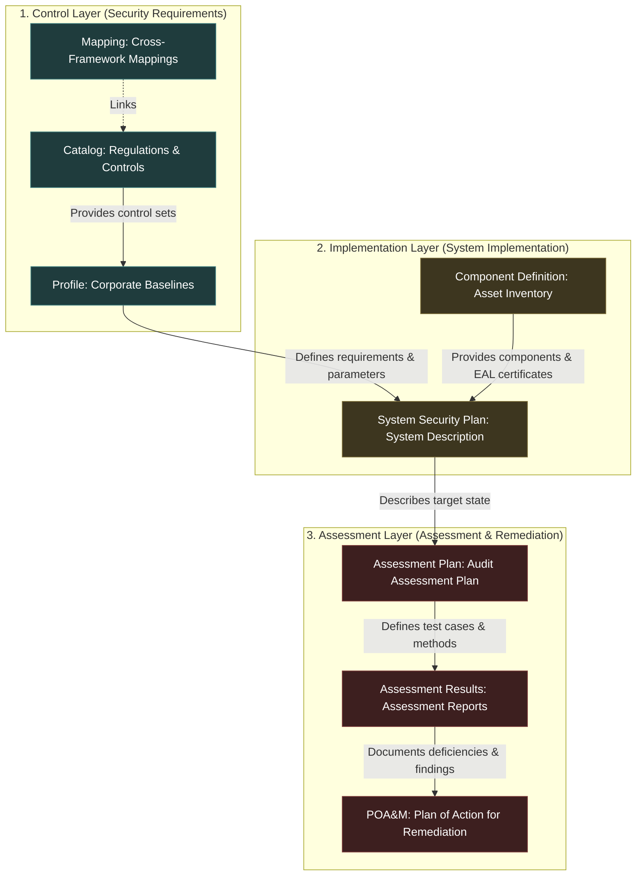

# Step 0: Cross-System Requirements (Global Requirements)

- **Persona:** All Users (Alice, Bob, etc.)
- **Goal:** Functional requirements that are not assigned to a single OSCAL step but apply system-wide.

---

## The Three Layers of the OSCAL Architecture

The compliance lifecycle progresses in stages from requirement definition to implementation, and on to continuous assessment and remediation:

```mermaid
graph TD
    %% Layers
    subgraph Control_Layer["1. Control Layer (Security Requirements)"]
        Catalog[Catalog: Regulations & Controls] -->|Provides control sets| Profile[Profile: Corporate Baselines]
        Mapping[Mapping: Cross-Framework Mappings] -.->|Links| Catalog
    end

    subgraph Implementation_Layer["2. Implementation Layer (System Implementation)"]
        Profile -->|Defines requirements & parameters| SSP[System Security Plan: System Description]
        CompDef[Component Definition: Asset Inventory] -->|Provides components & EAL certificates| SSP
    end

    subgraph Assessment_Layer["3. Assessment Layer (Assessment & Remediation)"]
        SSP -->|Describes target state| AP[Assessment Plan: Audit Assessment Plan]
        AP -->|Defines test cases & methods| AR[Assessment Results: Assessment Reports]
        AR -->|Documents deficiencies & findings| POAM[POA&M: Plan of Action for Remediation]
    end

    classDef control fill:#1f3c3d,stroke:#3a7b7d,color:#fff;
    classDef impl fill:#3d361f,stroke:#7d6e3a,color:#fff;
    classDef assess fill:#3d1f1f,stroke:#7d3a3a,color:#fff;
    
    class Catalog,Profile,Mapping control;
    class CompDef,SSP impl;
    class AP,AR,POAM assess;
```

---

## Overview of User Stories

Each step of the security lifecycle is described in detail in a separate file:

1. **[Step 1: Catalog Builder (Catalog Editor)](step1_catalog_builder.md)**
   - Creation of basic security catalogs with groups, controls, sub-controls, multi-level parameters, parameter constraint live test validation, multi-format import (JSON, XML, YAML), schema-compliant export, control withdrawal/deprecation workflow, functional `label`/`sort-id` display, and part-level metadata editing.
2. **[Step 2: Profile Tailoring (Profile Editor)](step2_profile_tailoring.md)**
   - Merging multiple catalogs/profiles, modifying specifications (`alters`, `set-parameters`), custom restructuring, multi-catalog conflict resolution (`merge.combine`), cascading profile imports, and visual baseline diff viewer.
3. **[Step 3: Component Definition (Component Inventory)](step3_component_inventory.md)**
   - Structured capture of IT assets (software, services, policies) including properties such as Common Criteria EAL certifications and system-wide product capabilities.
4. **[Step 4: SSP Builder (System Security Plan)](step4_ssp_builder.md)**
   - Definition of system boundaries, assignment of active components to controls, and fine-tuning of control parameters.
5. **[Step 5: Assessment Plan Builder (Assessment Plan Editor)](step5_assessment_plan.md)**
   - Planning the system assessment, defining assessment objectives, assessment subjects, teams, tools, and milestones.
6. **[Step 6: Assessment Results Reporter (Assessment Report Creation)](step6_assessment_results.md)**
   - Documentation of test results, logging, capturing observations, evidence references, vulnerabilities, and final assessment attestation.
7. **[Step 7: POA&M Tracker (Remediation Plan Editor)](step7_poam.md)**
   - Continuous tracking of open risks, planning remediation milestones, and documenting special cases such as risk acceptance.
8. **[Step 8: Control Mapping (Framework Mappings)](step8_control_mapping.md)**
   - Mapping controls between different frameworks (e.g., NIST 800-53 ↔ ISO 27001) with relationship types, gap analysis, and visualization.

---

## Detailed User Stories

### US 0.1: Automatic Provisioning of Example Data (OSCAL Core Examples)
> **As a** new user or auditor (Alice / Bob)  
> **I want to** have the system automatically create a complete, standard-compliant example dataset (catalog, profile, components, SSP, assessment plan, assessment report, and POA&M) upon initial startup,  
> **so that** I can immediately understand the entire OSCAL compliance lifecycle visually and use it as a template for my own plans.
- [ ] Automatic creation of example documents for all 7 OSCAL categories if the directory is empty.
- [ ] The example documents cover all phases and refer correctly to each other via UUIDs (e.g., POA&M imports the SSP and the Assessment Results).
- [ ] The complete generation and UUID consistency is verified by automated tests in the pipeline.

### US 0.2: Direct Document Creation without Intermediate Steps
> **As a** compliance officer and enterprise architect (Alice)  
> **I want to** use the `+ New` button to immediately open the configuration terminal (document editor),  
> **so that** I can start editing directly without intermediate steps and flexibly switch between the Visual Editor and the Raw JSON Editor.
- [x] The `+ New [Model]` button on the dashboard immediately opens the document editor in an empty state.
- [x] The previous intermediate screen ("Create or Import") is completely removed.
- [x] Within the editor, there is a "Load Template" quick selection for new documents to load an existing document (e.g., from the registry) directly into the current editor (both Visual and JSON).
- [x] The Raw JSON mode provides a clean, single textarea for the entire OSCAL document (no splitting into metadata fields and sub-textareas).
- [x] Manual editing in Raw JSON mode is parsed when switching back to Visual mode and synchronizes all visual states.
- [x] Validating and saving in Raw JSON mode directly uses the content of the textarea.

### US 0.3: OSCAL Document Import (Any Format & Registry Sources)
> **As a** compliance officer (Alice)  
> **I want to** upload externally created OSCAL documents (JSON/XML/YAML) and select from a cleaned registry of verified standard OSCAL catalogs and baseline profiles from the official OSCAL Content Registry,  
> **so that** I can seamlessly import official security control frameworks and compliance baselines into Reposol without encountering broken remote URLs.
- [ ] Upload dialog for files in JSON, XML, and YAML formats.
- [ ] Automatic format detection and conversion into the internal JSON format.
- [ ] **Pre-bundled OSCAL Content Registry Sources:** The import registry modal includes official, pre-configured raw JSON endpoints matching the official OSCAL Content Registry repository (`usnistgov/oscal-content` and BSI). Non-working/broken remote endpoints (e.g. HTTP 404 URLs for NIST SP 800-171, NIST CSF 1.1, and legacy FedRAMP profiles) are excluded from `KNOWN_SOURCES` so that only valid, importing endpoints are offered in the UI.
- [ ] **Uniform Publisher Badge Styling:** All source publisher badges (NIST, BSI, FedRAMP, etc.) in the Import Wizard registry list use a single uniform standard blue badge style (`#1a7fd4`), eliminating publisher-specific color mapping.
- [ ] **Official Schema Validation:** The imported document is strictly validated against the official NIST OSCAL JSON schemas stored locally under `reposol/backend/app/schemas/`.
- [ ] **Error Mapping:** In case of a failed import, a detailed error message with the exact JSON path and error description is returned according to the strategy defined in [DD-002](../design_decisions/DD-002_oscal_validation_strategy.md).

### US 0.4: OSCAL Export to Different Formats
> **As a** compliance officer (Alice)  
> **I want to** download any OSCAL document as JSON, XML, or YAML,  
> **so that** I can share documents with external auditors, partners, or tools in their preferred format.
- [ ] Download button with format selection (JSON, XML, YAML) in the document view.
- [ ] Exported documents are 100% schema-compliant with the respective official NIST OSCAL schema.
- [ ] Filename contains document title and version number.

### US 0.5: OSCAL Lifecycle Dashboard
> **As a** compliance officer or auditor (Alice / Bob)  
> **I want to** see a visual comprehensive overview of all OSCAL documents and their connections (import chains),  
> **so that** I can grasp the status of the entire compliance lifecycle at a glance.
- [ ] Dashboard page with a graphical representation of all documents as linked nodes (Catalog → Profile → SSP → AP → AR → POA&M + Mappings + Component Definitions).
- [ ] Status indicator per document (e.g., draft, active, archived).
- [ ] Drill-down: Clicking a node opens the respective document.
- [ ] Filters by document type and status.

### US 0.6: Control-Level Cross-Document Traceability View
> **As a** Compliance Officer or Auditor (Alice / Bob)  
> **I want to** trace a single control's journey across all OSCAL documents in my workspace — from Catalog definition through Profile selection, SSP implementation, Assessment Plan scope, Assessment Results findings, to POA&M remediation status  
> **so that** I can instantly see the full compliance posture of any control across the entire lifecycle.
- [ ] **Control Drill-Down:** From the Lifecycle Dashboard (US 0.5), clicking on a document node and then selecting a specific control opens a traceability panel.
- [ ] **Lifecycle Stages:** The traceability view shows the control through all applicable stages:
    1.  **Catalog:** Control definition (title, statement, parameters)
    2.  **Profile:** Selection status (included/excluded), parameter overrides
    3.  **Component Definition:** Which components claim to implement this control
    4.  **SSP:** Which system components implement this control (`by-components[]`), implementation status (`implemented`/`partial`/`planned`), parameter final values
    5.  **Assessment Plan:** Whether this control is in the `reviewed-controls` scope
    6.  **Assessment Results:** Findings for this control (`target.status`: `satisfied`/`not-satisfied`)
    7.  **POA&M:** Open remediation items related to this control's findings
- [ ] **Cross-Reference Resolution:** The system resolves UUID links across documents (e.g., `finding.target.target-id` → `control-id`, `finding.implementation-statement-uuid` → `ssp.by-component.uuid`).
- [ ] **Visual Summary:** The traceability view uses a vertical timeline layout with status indicators (✅ satisfied, ❌ not-satisfied, ⏳ in-progress, ⬜ not-assessed) at each stage.

### US 0.7: Reference Integrity Check and Advanced Deletion
> **As a** compliance officer (Alice)  
> **I want to** be automatically warned when import references between OSCAL documents are broken, and warned when deleting a document if it is still being referenced,  
> **so that** I can ensure the consistency of my document landscape.
- [ ] Automatic check of all `import-*` references (such as `imports` in profiles) for the existence of the target documents.
- [ ] Visual warning (yellow banner at the top of the Profile Viewer) if an imported resource (catalog or profile) is missing from the system or if a reference is broken.
- [ ] If a document that is referenced by other documents is to be deleted, the frontend intercepts the backend's 409 message and opens a detailed confirmation dialog.
- [ ] The confirmation dialog lists all referencing documents and offers the user a "Force Delete" button (Force Delete via API with `?force=true`) as well as a cancel button.

### US 0.8: Single Active Draft Lifecycle & Header Version Dropdown
> **As a** Compliance Officer (Alice)  
> **I want to** maintain exactly one active working draft per document, browse historical published versions in Read-Only View mode, and seamlessly transition into Edit mode to work on the active draft or create a draft from a selected version,  
> **so that** version browsing is effortless, no duplicate drafts accumulate, and editing always targets a clean single working copy until explicitly published.
> *See also: [DD-004](../design_decisions/DD-004_editor_ux_patterns.md), [DD-023](../design_decisions/DD-023_document_lifecycle_state_machine.md)*
- [ ] **Single Active Draft Rule:** Each document (Catalog, Profile, SSP, etc.) has at most one active working draft (`<uuid>_draft.json`).
- [ ] **Unified Header Version Selector (`VersionDropdown`):** Replaces the separate status dropdown and right-side version history drawer with a single header dropdown.
- [ ] **Version Inspection in View Mode:** In Read-Only View mode (`👁️ View`), the user can freely select and inspect any published version snapshot (`v1.0.0`, `v0.9.0`) or switch to view the active `📝 Draft`.
- [ ] **View to Edit Mode Transition:** Clicking `✏️ Edit`:
    - If an active draft already exists, the editor seamlessly loads that active `📝 Draft`.
    - If no active draft exists, the editor creates a new working `📝 Draft` initialized from whichever version the user is currently viewing.
- [ ] **Automatic Draft Indicator:** Whenever active uncommitted changes exist, the header dropdown badge automatically displays **`📝 Draft`**.
- [ ] **Delete Draft Action (`🗑️ Delete Draft`):** Inside the `VersionDropdown` menu item for the active draft (replacing the "Working copy" badge), a dedicated **Delete Draft** button allows the user to discard/delete the active working draft (`<uuid>_draft.json`), reverting the document view back to the last published active version and clearing the draft state.
- [ ] **Explicit Publishing:** Editing continues on `📝 Draft` until the user explicitly clicks `🚀 Publish Version`, which snapshots the draft into a formal release (e.g. `v1.1.0`), clears the temporary draft file, and updates the header badge to `v1.1.0`.

### US 0.9: OSCAL Revision History in Document
> **As a** user (Alice / Bob)  
> **I want to** have the OSCAL-internal revision history (`metadata.revisions[]`) updated automatically on every version save and to be manually editable,  
> **so that** the exported OSCAL document contains a complete, schema-compliant change history, and external tools can parse it.
- [ ] **Automatic Revision Tracking:** When saving a new version (see US 0.15), a new entry is automatically added to `metadata.revisions[]`, containing the version number, the timestamp (last-modified), the OSCAL version, and the entered remarks.
- [ ] **Manual Editing:** In the Document Overview (Metadata tab), existing revision entries can be viewed, edited, and deleted (fields: title, published, last-modified, version, oscal-version, props, links, remarks).
- [ ] **Sorting:** Revisions are displayed in reverse chronological order (newest first), as prescribed by the OSCAL standard.
- [ ] Distinction from file versioning: The revision history is a JSON-internal concept and complements filesystem-based versioning (US 0.15). Both concepts are independent.

### US 0.10: Automatic Scrolling and Expansion for the Selected Element in the Sidebar and JSON Editor
> **As a** user (Alice / Bob)  
> **I want to** select a control or a group in the sidebar and have it automatically scroll into view, and when switching the mode to the Raw JSON Editor, have the corresponding position of the element focused and scrolled into view,  
> **so that** I always keep my orientation in large catalogs and profiles, regardless of whether I am in the reading view (Viewer), editing mode (Edit Mode), or the Raw JSON Editor.
- [ ] **Automatic Scrolling in Sidebar:** In both the reading view (Viewer) and editing mode (Edit Mode) of catalogs and profiles, the currently selected element (control or group) in the sidebar is automatically smoothly scrolled into the visible area (`scrollIntoView`) if it is not fully visible.
- [ ] **Automatic Expansion:** When an element is loaded or selected (e.g., by clicking, after loading the page, through search matches, or when switching modes), all parent groups and the element itself in the sidebar are automatically expanded (`expanded`) if they are currently collapsed.
- [ ] **Manual Collapse of Selected Elements:** The user can manually collapse the selected element (and any of its parent groups) at any time by clicking the expand/collapse arrow icon. The selection state itself must not force the element to remain expanded or override manual collapse actions.
- [ ] **Synchronization with JSON Editor:** When switching to Raw JSON Editor mode (while an element is selected), the corresponding line of the element in the JSON text field (e.g., using `"id": "control-id"`) is automatically focused, the selection is set to the ID line, and the text field is scrolled to center on this position.
- [ ] The functionality is robust, does not lead to disruptive jumping during normal sidebar interaction, and is controlled via useEffect hooks.

### US 0.11: Virtualized JSON Editor for High-Performance Mode Switching on Large Documents
> **As a** compliance officer (Alice)  
> **I want to** switch from Visual Mode to JSON Mode and type in the JSON editor without noticeable delay (under 300ms) even for extremely large OSCAL documents (such as the 255,000-line NIST catalog),  
> **so that** my workflow is not interrupted and the application feels responsive and professional.
- [ ] **No UI Freezing:** When switching to JSON Mode, the user interface must not block or freeze for several seconds.
- [ ] **Virtualized Rendering:** The JSON editor uses a virtual rendering engine (e.g., Monaco Editor) that only keeps visible lines in the DOM, allowing it to load instantly regardless of file size.
- [ ] **No Keystroke Lag:** Typing in the JSON editor must be absolutely lag-free by ensuring that state synchronizations to the parent container do not trigger blocking re-renderings on every keystroke.
- [ ] **Preservation of Features:** The automatic scroll and highlight synchronization (US 0.10) as well as live validation must remain fully functional and align with the API of the new editor.

### US 0.12: Under Development Indicator Badges for Uncompleted OSCAL Stages
> **As a** Compliance Officer or Auditor (Alice / Bob)  
> **I want to** see a visual indicator (construction site symbol 🚧 / "Under Development" badge) on the OSCAL lifecycle elements whose specialized editors/viewers are still in development (Component Definitions, SSP, Assessment Plans, Assessment Results, POA&M, Control Mappings),  
> **so that** it is immediately transparent which OSCAL stages are already fully implemented (Catalogs, Profiles) and which are still under active development.
- [ ] **Dashboard Pipeline Cards:** The pipeline steps in the OSCAL Lifecycle Pipeline Dashboard for `Component Definitions`, `SSP`, `Assessment Plans`, `Assessment Results`, `POA&M`, and `Control Mappings` show a clear 🚧 construction site symbol as well as a yellow/discrete `In Dev` badge on the card.
- [ ] **Sidebar Navigation:** In the navigation (`Navigation.tsx`), a subtle 🚧 construction site symbol is displayed next to the incomplete work stages in the label or as a badge, including an understandable tooltip ("Under Active Development").
- [ ] **Stage Header Warning Banner:** When opening a work stage whose specialized editor is not yet finished (Components, SSPs, Assessment Plans, Assessment Results, POA&Ms, Control Mappings), an informative warning banner is displayed at the top of the screen ("🚧 This OSCAL editor is currently under development. Basic JSON editing is available.").

### US 0.13: Master Templates Admin Mode & Automatic User Workspace Seeding
> **As a** system administrator / maintainer (Philipp)  
> **I want to** manage and edit the master templates (Catalogs & Profiles) in `reposol/data/workspaces/default/` directly via a special mode (`?w=default`, `?w=master`, or `?w=templates`) – **exclusively in local operation (`localhost`)**,  
> **so that** all normal users are automatically presented with my latest master templates in their own anonymous workspace upon their first launch, while legacy folders (`data/templates/`, `data/catalogs/`) are eliminated.
- [ ] **Master Template Single Store (`data/workspaces/default/`):** Master templates are consolidated under `reposol/data/workspaces/default/`. The legacy folders `reposol/data/templates/` and `reposol/data/catalogs/` are deprecated and removed.
- [ ] **Standard Users (Normal Mode):** New user sessions (`session-xyz`) automatically receive a local copy of all master templates from `data/workspaces/default/` into their own isolated workspace upon creation. All edits, modifications, and deletions affect only their own workspace.
- [ ] **Localhost-Admin Guard:** The master template write mode (`?w=default` / `?w=master` / `?w=templates`) is **strictly limited to requests from `localhost` / `127.0.0.1`**. On public live demo deployments (Fly.io), write access to the `default` / `master` workspace is blocked with HTTP 403 Forbidden.
- [ ] **Master Persistence (Local):** Save and delete operations in master mode on `localhost` act directly on `reposol/data/workspaces/default/catalogs/` and `reposol/data/workspaces/default/profiles/`.
- [ ] **UI Indicator:** In the UI, a clear notice/badge is displayed in master mode (`👑 Master Templates Mode (Local Admin)`) to prevent accidental overwriting of templates.

### US 0.14: Standard Pattern – Simplified Creation (Inner View)
> **As a** user (Alice / Bob)  
> **I want to** create a new OSCAL document by entering only the title initially and being redirected immediately to the editor,  
> **so that** I can start editing directly without cumbersome setup wizards.
- [ ] Minimal creation screen requiring only the input of the document title.
- [ ] Immediate redirection to the edit view after creation (`/{model}/{uuid}?edit=true`).
- [ ] All other settings are made in-place within the editor.
- [ ] Applied in: US 1.9, US 2.1, US 3.7, US 4.8, US 5.6, US 6.6, US 7.6, US 8.5.

### US 0.15: Standard Pattern – Integrated Document Versioning and Validation
> **As a** user (Alice / Bob)  
> **I want to** save, load, and delete versions of an OSCAL document as separate JSON files in the backend while adhering to strict OSCAL compliance,  
> **so that** version states are managed persistently, compliantly, and transparently for all users.
> *See also: [DD-002](../design_decisions/DD-002_oscal_validation_strategy.md)*
- [ ] **Save Version Dialog:** "Save Version" button opens a dialog to enter a version number and optional remarks.
- [ ] **Integrated Schema Validation:** Saving a version (or the main document) strictly validates the document in the backend against the appropriate official NIST OSCAL JSON schema (locally under `reposol/backend/app/schemas/`). If validation fails, saving fails.
- [ ] **Detailed Error Feedback:** In case of a validation error, the backend returns a structured JSON error object containing the exact JSON path (e.g., `catalog.metadata.roles[0].title`) and a clear error cause according to the strategy defined in [DD-002](../design_decisions/DD-002_oscal_validation_strategy.md). The frontend intercepts this, highlighting the affected fields in red in the editor or displaying a detailed error list.
- [ ] **Version Synchronization:** When saving a version, the value of the `metadata.version` field inside the JSON file is automatically updated to the entered version number.
- [ ] **Revision Update:** When saving a version, a new entry is automatically added to `metadata.revisions[]` in accordance with US 0.9.
- [ ] **Version Saving:** Saved as `<uuid>_v<version>.json` and updates the main document `<uuid>.json`.
- [ ] **Read-Only Lock:** Older versions are read-only.
- [ ] **Version History:** Drawer showing the active version in parentheses, with a delete function requiring confirmation.
- [ ] The document list displays the latest version by default.
- [ ] Applied in: US 1.8, US 2.13, US 3.8, US 4.9, US 5.7, US 6.7, US 7.7, US 8.6.

### US 0.16: Standard Pattern – Document Overview & Property Management
> **As a** user (Alice / Bob)  
> **I want to** manage the metadata and properties of an OSCAL document in clearly separated views,  
> **so that** I have a clear, OSCAL-correct overview of document metadata vs. property usage.
- [ ] Right main area (Document Overview) is displayed when no element is selected.
- [ ] Separate sidebar navigation items for **ℹ️ Metadata** (document-level metadata + MetadataEditor) and **🏷️ Properties** (property management).
- [ ] **Metadata View:** MetadataEditor fields only (title, version, OSCAL version, roles, parties, locations, document-ids, remarks, revisions).
- [ ] **Properties View:** Two sections:
    - [ ] **Document Properties (`metadata.props`):** Editable properties describing the document itself (e.g., `marking`, `publication-status`).
    - [ ] **Property Usage Overview:** Read-only analysis of all property names/values used across controls and groups, with usage counts and click-to-navigate.
- [ ] No "Promote to Global Property" concept — `metadata.props` does not cascade to controls (see [DD-011](../design_decisions/DD-011_properties_vs_parameters_separation.md)).
- [ ] Applied in: US 1.10, US 2.14/2.16, US 3.9, US 4.10, US 5.8, US 6.8, US 7.8, US 8.6.

> **Note (2026-07-20):** Restructured from "Tags" to "Properties" per DD-011. Promote concept removed.

### US 0.17: Standard Pattern – Editability, View/Edit Mode Toggle & Backend Draft
> **As a** user (Alice / Bob)  
> **I want to** switch seamlessly between Read-Only (Viewing) and Edit Mode using an intuitive mode toggle, save drafts automatically in the backend, and publish explicit document versions via a dedicated "Publish Version" button,  
> **so that** the active document state is always clear, intuitive, and consistent across all OSCAL stages.
- [ ] **Combined Card Layout:** Header (ID, title) and properties in a single, cohesive card.
- [ ] **Autocomplete suggestions (`datalist`):** For property keys.
- [ ] **Segmented View/Edit Mode Toggle (`[ 👁️ View | ✏️ Edit ]`):** Replaces ambiguous "Exit" button. Explicitly indicates active mode and allows instant in-memory switching between read preview and edit mode without full page refreshes or blank loading screens. Switching to `👁️ View` auto-saves the current draft silently and transitions to read-only preview mode cleanly while keeping URL query parameters (`?edit=true`) synchronized.
- [ ] **Dedicated "Publish Version" Action (`🚀 Publish Version`):** Prominent button next to mode controls that opens the version release modal to snapshot and bump the document version.
- [ ] **Backend Draft Storage:** Temporary unsaved drafts are stored automatically (`<uuid>_draft.json`) and restored upon re-entering.
- [ ] Applied in: US 1.11, US 2.15, US 3.10, US 4.11, US 5.9, US 6.9, US 7.9, US 8.6.

### US 0.18: Standard Pattern – Unified UI Component & Data Model Framework
> **As a** frontend developer and system architect  
> **I want to** use reusable, schema-driven UI components and data models for all common OSCAL elements,  
> **so that** the implementation remains consistent, code duplication is avoided, and changes to shared structures (like parameters, properties, links, parts) are instantly available in all editors (e.g., Catalog and Profile Editor).
- [ ] **Common UI Components:** Use of identical React components for editing actions of:
    - [ ] Properties (`props`)
    - [ ] Links (`links`)
    - [ ] Metadata (`metadata`) including roles, parties, and locations
    - [ ] Parameter editing masks (`params`, including choices, select, constraints, guidelines)
    - [ ] Prose parts (`parts` such as statements, guidance, discussion)
- [ ] **Unified Read/Write Mode:** The same visual structure is used in both the Catalog and Profile Editor (e.g., gray card borders, type badges, inline title/ID fields).
- [ ] **Generic Data Synchronization:** The synchronization logic between the graphical editor and the Raw JSON text field (Dual-Mode) uses generic parsers applying the same error handling and schema validation for all OSCAL document types.
- [ ] **Backend Draft Management:** Backend draft storage uses the `_draft.json` file extension for temporary drafts.
- [ ] **Advanced OSCAL Fields (Advanced):** Rarely used schema fields such as `property.uuid`, `property.group`, `link.media-type`, `link.resource-fragment`, `part.ns`, and `part.class` are offered in the edit masks as an expandable Advanced section, ensuring the schema is fully covered without cluttering the standard view.

### US 0.19: Cleanup of Empty OSCAL Arrays on Saving and Exporting
> **As a** compliance officer (Alice)  
> **I want to** have empty arrays like `parts` or `params` automatically cleaned up (removed) when saving documents and drafts,  
> **so that** the documents are always compliant with the official OSCAL schemas and no schema validation errors occur due to empty lists (`minItems: 1`).
- [ ] When saving a document (draft or release), empty arrays for `parts`, `params`, and other optional lists are recursively removed from the JSON object.
- [ ] Both the Catalog Editor and the Profile Builder apply this cleanup.
- [ ] Existing drafts in `reposol/data` are automatically corrected after being loaded and subsequently saved.

### US 0.20: Detailed Address Data and External Identifiers in the Metadata Editor
> **As a** compliance officer (Alice)  
> **I want to** manage postal addresses (including street, city, postal code, country), external identifiers, and location associations for parties and locations in the metadata editor,  
> **so that** the organizational master data of the compliance document is fully and schema-compliantly captured.
- [ ] The metadata editor (`MetadataEditor.tsx`) allows the input of addresses (`addresses`) for parties and locations (fields: `addr-lines`, `city`, `postal-code`, `country`).
- [ ] Parties can be assigned external identifiers (`external-ids` with system and identifier) and location associations (`location-uuids`) via a UI input/selection field.
- [ ] All captured address data is correctly saved in the OSCAL document.

### US 0.21: Support for Parameter Dependencies (Depends-on)
> **As a** compliance officer (Alice)  
> **I want to** define dependencies between parameters,  
> **so that** logical relationships and preconditions between control specifications are declared in a machine-readable manner.
- [ ] The parameter editor (`ParameterEditor.tsx`) offers an input option for dependencies (`depends-on` with referenced parameter ID) in editing mode.
- [ ] The dependencies are stored in the OSCAL document under the parameter object.

### US 0.22: Sidebar-Centric Navigation and Dashboard Overview for Catalog and Profile Editors
> **As a** Compliance Officer (Alice) / Auditor (Bob)  
> **I want to** navigate to the main document areas (Overview, Metadata, Tags/Properties, and Back Matter) directly via the left sidebar and see a clear dashboard as a document overview,  
> **so that** the navigation matches the official NIST OSCAL Catalog Viewer and I can grasp the most important statistics of the document at a glance.
> *See also: [DD-004](../design_decisions/DD-004_editor_ux_patterns.md)*
- [ ] **Sidebar Menu Items:** In the left sidebar of catalogs and profiles, the following navigation items are permanently available at the top:
    - [ ] `🏠 Overview` (navigates to the dashboard)
    - [ ] `ⓘ Metadata` (navigates directly to the metadata editor)
    - [ ] `🏷️ Declared Properties` (navigates directly to global property management)
- [ ] **Back Matter at the Bottom:** At the bottom of the sidebar (below the control hierarchy), there is a permanent navigation item:
    - [ ] `📖 Back Matter` (navigates to the management of back-matter resources)
- [ ] **Dashboard Overview:** The overview page (when `Overview` is selected) shows:
    - [ ] Title of the document as the main heading (large and prominent).
    - [ ] A row with metadata (Version, OSCAL Version, Published Date, Last Modified Date).
    - [ ] Five info cards with key metrics:
        - [ ] `Control Families` (Number of main control groups)
        - [ ] `Total Controls` (Total number of all controls, calculated recursively)
        - [ ] `Active Controls` (Number of active controls, i.e., without `status` = `withdrawn`)
        - [ ] `Withdrawn` (Number of deprecated controls with `status` = `withdrawn` in `props`)
        - [ ] `Back Matter Resources` (Number of resources in the back matter)
    - [ ] A `CONTROL FAMILIES` section below, listing all main groups of the catalog with their respective control count (e.g., `2 controls`).
- [ ] **No Top Tabs:** The previous tabs above the main area are replaced by the sidebar navigation.
- [ ] **Synchronicity with Edit Mode:** The sidebar navigation works in both read and edit modes, displaying the corresponding form or view for the selected section.
- [ ] **Group Overview (GroupEditor):** When a control group (folder) is selected, the right area shows:
    - [ ] Breadcrumbs: `Overview / [Group Title]`.
    - [ ] Group title with folder icon: `📁 [Group Title]`.
    - [ ] Four metric cards: `Family ID`, `Controls` (direct count), `Sub-groups` (number of direct subfolders), `Total (incl. enhancements)` (recursive total count of all controls in this group).
    - [ ] A `SUB-GROUPS` section with a list of all direct subgroups (including folder icon, title, and control count) and interactive click navigation.
    - [ ] A `CONTROLS` section with a list of all direct controls and interactive click navigation.
- [ ] **Control Detail View (UnifiedControlEditor):** When a control is selected, the right area shows:
    - [ ] Breadcrumbs: `Overview / [Path of Parent Groups...] / [Control Title]`.
    - [ ] Control title with hexagon icon: `⬡ [Control Title]`.
    - [ ] Subline with Control ID and Class badge (if defined).
    - [ ] Individual cards with a colored left border for `Statement` (list icon `☵`, blue border) and `Guidance` (book icon `📖`, accent border).
    - [ ] A `PROPERTIES` section at the bottom of the detail view, rendering properties as rounded pills (in read mode).

### US 0.23: Caret-relative Autocomplete for Inline Parameter Insertion in Textareas (System-wide Context)
> **As a** Compliance Officer (Alice) / Lead Assessor (Bob)  
> **I want to** open a selection window directly at the current cursor position (caret) via a dedicated "Add Parameter" button when editing all OSCAL text fields (control statements, sub-control enhancements, group descriptions, parameter usage/guidelines, and assessment objectives/methods), which also offers an option to create a new parameter directly at the appropriate scope level and scroll there,  
> **so that** I can easily insert and consistently manage parameters in all document types and editor sections.
> *See also: [DD-013](../design_decisions/DD-013_universal_prose_with_params_integration.md)*
- [ ] **Universal Button Integration:** Next to all prose editing fields (statements, sub-controls, group parts, parameter usage/guidelines, assessment objectives/methods), the "🏷️ Add Parameter" button (or icon) is provided.
- [ ] **Caret-relative Positioning:** Clicking the button opens the parameter selection dropdown directly at the cursor position (caret) in the active text field.
- [ ] **Scope-aware "Define New Parameter" Option:** The dropdown includes the option "➕ Define New Parameter..." at the end. Clicking it closes the dropdown, triggers the corresponding `onNewParam` callback for the respective scope level (control, group, or document level), and performs a smooth scroll to the parameter creation area.
- [ ] **Context-sensitive Insertion:** Clicking a selected parameter inserts the placeholder token `{{ insert: param, param_id }}` exactly at the cursor position.

### US 0.24: Real-Time Form Field Validation and OSCAL Schema Guidance (Metadata, Parameter & Back-Matter Completeness)
> **As a** Compliance Officer (Alice)  
> **I want to** receive immediate feedback on formatting requirements and full coverage of all OSCAL standard fields (such as Responsible Parties, parameter-level remarks, revision history, and global metadata properties & links) when editing form fields in the Visual UI Editor (metadata, parameters & back-matter),  
> **so that** incorrect entries are immediately prevented and Reposol offers 100% coverage of all OSCAL standard structures in the UI.
> *See also: [DD-002](../design_decisions/DD-002_oscal_validation_strategy.md)*
- [ ] **Real-Time Form Field Validation:** Fields in the `MetadataEditor` (and other UI forms) validate their values against OSCAL format requirements (e.g., ISO 8601 Date `YYYY-MM-DDTHH:MM:SSZ` for `published` and `last-modified`, email syntax for `email-addresses`, UUIDv4 for UUID fields).
- [ ] **Visual Feedback:** Invalid entries are visually highlighted (red border around the input field, red helper text below the field with the expected format).
- [ ] **Automatic Purging of Empty Values:** If optional date fields (such as `published`) are cleared/emptied in the UI form, the property is removed from the document object instead of submitting an empty string `""`, which would violate schema validation.
- [ ] **Responsible Parties in MetadataEditor:** The `MetadataEditor.tsx` provides a dedicated `Responsible Parties` section where one or more persons/organizations (`party.uuid`) can be assigned to a role (`role.id`) via interactive selectors.
- [ ] **Global Metadata Properties & Links:** The `MetadataEditor.tsx` embeds the `PropsEditor` and `LinksEditor` so that document-wide metadata properties (`metadata.props`) and reference links (`metadata.links`) can be visually managed.
- [ ] **Nested Metadata Entities:** Support for nested `props`, `links`, and `remarks` at the level of roles, parties, and locations in `MetadataEditor.tsx`.
- [ ] **Revision History (`metadata.revisions`):** The `MetadataEditor.tsx` includes a section for capturing and displaying the formal OSCAL revision history (`revisions` with title, date, version, OSCAL version, and remarks).
- [ ] **Parameter Remarks (`param.remarks`):** The `ParameterCard.tsx` component includes an input field for remarks (`remarks`) at the parameter level in the *Advanced & Optional Metadata* section.
- [ ] **Resource Links, Remarks & Document-IDs (`back-matter.resources`):** The `BackMatterEditor.tsx` component includes the `LinksEditor` for resource links (`resource.links`), a remarks field (`resource.remarks`), and support for `document-ids` and citation properties for each resource.
- [ ] **Profile Alter Removal Remarks (`alter.remove.remarks`):** The `ModifyPanel.tsx` component supports remarks for removed statement/property objects in profiles.
- [ ] **Schema Conformity:** All added/edited fields remain 100% valid against the official NIST OSCAL JSON schemas in the backend.

### US 0.25: Session-Isolated Anonymous Workspaces & Docker Containerized Deployment
> **As a** public demo user or open-source self-hoster (Alice / Bob)  
> **I want to** use Reposol online in the browser without forced registration and be able to edit documents, with my data remaining isolated in a separate anonymous workspace and the entire system operable as a lean Docker container (e.g., on Fly.io),  
> **so that** multiple online testers do not overwrite each other's documents and the system is 100% future-proofed for later user accounts (SaaS).
> *See also: [DD-015](../design_decisions/DD-015_anonymous_workspace_isolation_and_containerized_deployment.md)*
- [ ] **Anonymous Session Workspace ID:** Upon the first visit, the frontend automatically generates a session ID (`session-{uuid}`) in `localStorage` and sends it in the `X-Workspace-ID` HTTP header with all API requests.
- [ ] **Frontend Workspace Integration:** Frontend components (`App.tsx`, `CatalogPage.tsx`, `ProfilePage.tsx`, `SSPPage.tsx`, `MappingPage.tsx`, `ImportWizard.tsx`) use `authFetch` / `getWorkspaceId()` from `lib/api.ts` for all API requests (`/api/documents/...`, `/api/import/...`, `/api/validate/...`), so that the `X-Workspace-ID` header is consistently transmitted in all requests in Master Template Mode (`?w=master`) and in anonymous session workspaces.
- [ ] **Backend Workspace ID Extraction:** Backend `get_ws_id(request)` in `routes.py` & `import_routes.py` extracts the `?w=` query parameter in addition to `workspace_id` and `workspace` from headers/query parameters.
- [ ] **Isolated File Storage in the Backend:** The backend saves documents under `reposol/data/workspaces/{workspace_id}/{stage}/` when a workspace ID is provided, and otherwise falls back to the default folder `reposol/data/workspaces/default/{stage}/`.
- [ ] **Unified Multi-Stage Dockerfile & Security:** A `Dockerfile` in the root directory builds the frontend (`npm run build`) and runs the FastAPI backend. In Stage 2, a dedicated non-root system group and user `reposol` are created, file permissions under `/app` are set to `reposol:reposol`, master templates are copied from `reposol/data/workspaces/default` to `/app/templates_seed`, and the container is run under `USER reposol`.
- [ ] **Fly.io Deployment & Persistent Volume:** A `fly.toml` file binds a Fly volume (`oscal_data`) to `/app/data` (`[mounts] source = "oscal_data"`, `destination = "/app/data"`), so that saved workspaces (`/app/data/workspaces/*`) are permanently preserved during container restarts and new deployments.
- [ ] **Master Templates Auto-Synchronization on Deployment:** In the `Dockerfile`, master templates are copied to a dedicated seed directory (`/app/templates_seed`). When the backend starts (`storage.py`), the master templates in `/app/data/workspaces/default/` are automatically updated/synchronized from `/app/templates_seed/` to always provide the latest default templates upon new deployments, without affecting user workspaces or custom data.
- [ ] **Root .dockerignore & Master Templates Inclusion:** A `.dockerignore` file in the root directory excludes `.git`, `.agents`, `node_modules`, `dist`, `reposol/data/workspaces/session-*`, `reposol/data/uploads/*`, `*.md` and `__pycache__` from the Docker context, while allowing `reposol/data/workspaces/default` through for the image build.

### US 0.26: Responsive Navigation Sidebar Collapse & Footer Action Hiding
> **As a** Compliance Officer (Alice) / Auditor (Bob)  
> **I want to** have distracting/distorted action buttons like "Share Workspace Link" and notice badges automatically hidden when the left main navigation is collapsed,  
> **so that** the collapsed sidebar remains lean, tidy, and free of broken line breaks.
- [ ] **Automatic Hiding in Footer on Collapsed Status:** When the main navigation is collapsed (`isCollapsed === true` or `.navigation-sidebar.collapsed`), the "Share Workspace Link" button (`btn-secondary` in `.nav-footer`) as well as the Master Templates badge in the sidebar are completely hidden (`display: none`).
- [ ] **Clean Icon Rendering:** In the collapsed state, only the minimalist system status indicator (green `env-dot` for the Conda environment status) remains in the sidebar footer.
- [ ] **Full Function in Expanded State:** When the sidebar is expanded (`isCollapsed === false`), the "Share Workspace Link" button and any Master Templates notices are displayed in full width with normal layout.

### US 0.27: Shared Dashboard & Analytics Components
> **As a** Frontend Developer and System Architect (Philipp)  
> **I want to** use a shared, standardized component library for dashboards, metrics, and progress displays (such as MetricCard, ProgressBar, StatusBreakdown, CompletenessReport),  
> **so that** all 22 dashboard views across all 8 OSCAL phases look consistent, are responsive, and require no external charting libraries.
> *See also: [DD-022](../design_decisions/DD-022_dashboard_analytics_component_library.md)*
*   **Acceptance Criteria:**
    *   The components `MetricCard`, `MetricCardGrid`, `ProgressBar`, `StatusBreakdown`, and `CompletenessReport` are implemented functionally and visually (Vanilla CSS, Glassmorphism, Responsive Grid).
    *   The components comply with the API contracts (props) defined in DD-022.
    *   No external frameworks like TailwindCSS or charting libraries are used.

### US 0.28: Prominent Development & Local Data Backup Notice Banner
> **As a** user (Alice / Bob)  
> **I want to** see a clear, high-visibility warning banner in the application frontend stating that the application is currently under active development and recommending that data be downloaded and saved locally for permanent retention,  
> **so that** I am immediately aware of potential data loss risks during development and know how to preserve my work locally.
- [ ] **High-Visibility Banner Placement:** A prominent, styled warning banner is rendered globally in the top header/navigation container of the frontend application layout.
- [ ] **Clear Warning & Guidance Message:** The banner explicitly communicates that the system is currently in active development ("In Development / Development Mode") and strongly recommends downloading and backing up files locally to prevent data loss.
- [ ] **Modern Dark Theme Aesthetic:** The banner uses a sleek amber/yellow badge indicator (`⚠️ IN DEVELOPMENT`), high contrast readable text, glassmorphic dark amber background with subtle glowing borders, and an optional close/dismiss button or sticky display.

### US 0.29: E2E Test Workspace Cleanup & Clean State Guarantee
> **As a** developer running E2E tests  
> **I want to** have each test run leave the backend data directory in a clean state with zero leftover workspace folders or orphaned documents,  
> **so that** tests are fully isolated, deterministic, and do not pollute the filesystem across repeated runs.
*   **Acceptance Criteria:**
    - [ ] **Backend Workspace Delete Endpoint:** A `DELETE /api/workspaces/{workspace_id}` endpoint exists that deletes the entire workspace directory (all stages, all documents, all versions) in a single call, protected against deleting the `default`/`master`/`templates` workspace.
    - [ ] **Fixture-Level Workspace Cleanup:** The `ApiSetup.cleanup()` method in the E2E fixture calls the workspace delete endpoint instead of deleting documents one by one, ensuring that UI-created documents are also cleaned up.
    - [ ] **Global Teardown Safety Net:** A Playwright `globalTeardown` script runs after all tests and removes any leftover test workspace directories (UUID-named folders) from `data/workspaces/`, skipping the `default` workspace.
    - [ ] **Backend Unit Test Coverage:** A Pytest unit test verifies that the workspace delete endpoint correctly removes a workspace directory and returns 404 for non-existent workspaces, and returns 400 for protected workspace IDs.
    - [ ] **No Regression:** Existing E2E tests continue to pass without modification (the base fixture transparently upgrades to workspace-level cleanup).

### US 0.30: Clean Domain-Driven Component Architecture & Test Coverage
> **As a** developer and maintainer  
> **I want to** have the frontend codebase strictly consist of modular, domain-driven page components (`CatalogPage`, `ProfilePage`, `SSPPage`, `MappingPage`, etc.) with comprehensive unit test coverage,  
> **so that** the application is clean, maintainable, performant, and completely free of monolithic legacy code.
*   **Acceptance Criteria:**
    - [ ] **Modular Domain Architecture:** The frontend strictly uses domain-driven page and editor components under `src/components/` with no legacy monolith components present in the codebase.
    - [ ] **Domain Test Suite:** All frontend tests in `src/tests/` target the active domain components (`CatalogPage`, `ProfilePage`, `SSPPage`, `MappingPage`, etc.).
    - [ ] **Clean Test Execution:** All Vitest unit tests (`npm test`) pass cleanly with 100% success.

### US 0.31: Atomic Storage Persistence, File Locking & Backend Layer Separation
> **As a** backend developer and system architect  
> **I want to** ensure document writes in `storage.py` are atomic (`.tmp` + `os.replace`), protected by inter-process file locks, and organized with clear layer separation (`routes` -> `services` -> `repositories`) without function-level lazy imports,  
> **so that** document persistence is crash-safe, concurrent API calls do not cause race conditions or corrupt JSON files, and backend modules are clean and decoupled.
*   **Acceptance Criteria:**
    - [ ] **Atomic File Writes:** Saving documents or version snapshots writes to a temporary file (`.tmp`) first and uses `os.replace` for atomic file replacement.
    - [ ] **Inter-Process Locking:** Critical write and delete disk operations use `filelock` mutexes to prevent concurrent write collisions.
    - [ ] **Clean Layer Separation:** Storage operations are encapsulated in `repositories/`, business transformations in `services/`, and API handlers in `routes.py`.
    - [ ] **No Function-Level Lazy Imports:** Circular module imports are resolved through clean layer direction (`routes -> services -> repositories`), eliminating lazy import functions.
    - [ ] **Pytest Verification:** All Pytest backend tests in `reposol/backend/tests/` pass 100%.
