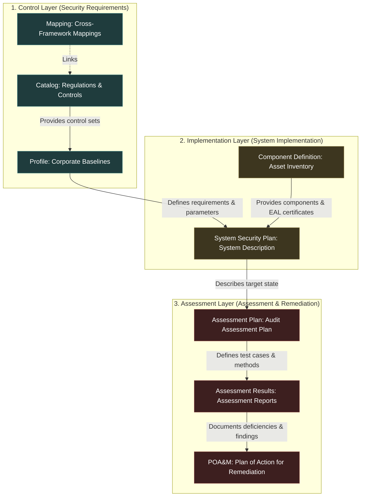

# Step 0: Cross-System Requirements (Global Requirements)

- **Persona:** All Users (Alice, Bob, etc.)
- **Goal:** Functional requirements that are not assigned to a single OSCAL step but apply system-wide.
- **Architecture Reference:** [DD-001: Architecture & Code Organization](../design_decisions/DD-001_architecture_and_code_organization.md)

---

## The Three Layers of the OSCAL Architecture

The compliance lifecycle progresses in stages from requirement definition to implementation, and on to continuous assessment and remediation:

```mermaid
graph TD
    %% Layers
    subgraph Control_Layer["1. Control Layer (Security Requirements)"]
        Catalog[Catalog: Regulations & Controls] -->|Provides control sets| Profile[Profile: Corporate Baselines]
        Mapping[Mapping: Cross-Framework Mappings] -.->|Links| Catalog
    end

    subgraph Implementation_Layer["2. Implementation Layer (System Implementation)"]
        Profile -->|Defines requirements & parameters| SSP[System Security Plan: System Description]
        CompDef[Component Definition: Asset Inventory] -->|Provides components & EAL certificates| SSP
    end

    subgraph Assessment_Layer["3. Assessment Layer (Assessment & Remediation)"]
        SSP -->|Describes target state| AP[Assessment Plan: Audit Assessment Plan]
        AP -->|Defines test cases & methods| AR[Assessment Results: Assessment Reports]
        AR -->|Documents deficiencies & findings| POAM[POA&M: Plan of Action for Remediation]
    end

    classDef control fill:#1f3c3d,stroke:#3a7b7d,color:#fff;
    classDef impl fill:#3d361f,stroke:#7d6e3a,color:#fff;
    classDef assess fill:#3d1f1f,stroke:#7d3a3a,color:#fff;
    
    class Catalog,Profile,Mapping control;
    class CompDef,SSP impl;
    class AP,AR,POAM assess;
```

---

## Overview of User Stories

Each step of the security lifecycle is described in detail in a separate file:

1. **[Step 1: Catalog Builder (Catalog Editor)](step1_catalog_builder.md)**
   - Creation of basic security catalogs with groups, controls, sub-controls, multi-level parameters, parameter constraint live test validation, multi-format import (JSON, XML, YAML), schema-compliant export, control withdrawal/deprecation workflow, functional `label`/`sort-id` display, and part-level metadata editing.
2. **[Step 2: Profile Tailoring (Profile Editor)](step2_profile_tailoring.md)**
   - Merging multiple catalogs/profiles, modifying specifications (`alters`, `set-parameters`), custom restructuring, multi-catalog conflict resolution (`merge.combine`), and cascading profile imports.
3. **[Step 3: Component Definition (Component Inventory)](step3_component_inventory.md)**
   - Structured capture of IT assets (software, services, policies) including properties such as Common Criteria EAL certifications and system-wide product capabilities.
4. **[Step 4: SSP Builder (System Security Plan)](step4_ssp_builder.md)**
   - Definition of system boundaries, assignment of active components to controls, and fine-tuning of control parameters.
5. **[Step 5: Assessment Plan Builder (Assessment Plan Editor)](step5_assessment_plan.md)**
   - Authoritative planning of system security assessments referencing target SSPs: 6-tab builder architecture, 3D scoping matrix (reviewed controls × assessment subjects × assessment assets), local definitions & procedural activities with evaluation methods (`INTERVIEW`, `EXAMINE`, `TEST`), task scheduling with timing variants & dependency DAG cycle validation, 7 canonical rules-of-engagement terms parts, Base64 embedded back-matter attachments, and schema-compliant export.
6. **[Step 6: Assessment Results Reporter (Assessment Report Creation)](step6_assessment_results.md)**
   - Documentation of test results, logging, capturing observations, evidence references, vulnerabilities, and final assessment attestation.
7. **[Step 7: POA&M Tracker (Remediation Plan Editor)](step7_poam.md)**
   - Continuous tracking of open risks, planning remediation milestones, and documenting special cases such as risk acceptance.
8. **[Step 8: Control Mapping (Framework Mappings)](step8_control_mapping.md)**
   - Mapping controls between different frameworks (e.g., NIST 800-53 ↔ ISO 27001) with relationship types, gap analysis, and visualization.

---

## Historical Story Numbering & Consolidation Notes

The Step 0 user story sequence contains historical numbering gaps resulting from story consolidation and architectural evolution:
- **US 0.12 (Document Creation Wizard):** Retired when intermediate creation wizards were replaced by immediate in-place document creation and direct editor redirection (see [US 0.2](#us-02-direct-document-creation-without-intermediate-steps) and [US 0.14](#us-014-standard-pattern--simplified-creation-inner-view)).
- **US 0.19 (Shared Components):** Consolidated into [US 0.18](#us-018-standard-pattern--unified-ui-component--data-model-framework) (*Unified UI Component & Data Model Framework*) to centralize all reusable schema-driven UI elements per [DD-001](../design_decisions/DD-001_architecture_and_code_organization.md).
- **US 0.26 (Persistent Workspace Volumes):** Consolidated into [US 0.25](#us-025-session-isolated-anonymous-workspaces--containerized-deployment) (*Session-Isolated Anonymous Workspaces & Containerized Deployment*).
- **US 0.28–0.30 (Storage Refactoring):** Reserved during earlier persistence planning phases; consolidated directly into [US 0.31](#us-031-atomic-storage-persistence-file-locking--backend-layer-separation) (*Atomic Storage Persistence, File Locking & Backend Layer Separation*) and [US 0.32](#us-032-interactive-master-detail-oscal-knowledge-base-portal) (*Interactive Master-Detail OSCAL Knowledge Base Portal*).

---

## Detailed User Stories

### US 0.1: Automatic Provisioning of Example Data (OSCAL Core Examples)
> **As a** new user or auditor (Alice / Bob)  
> **I want to** have the system automatically create a complete, standard-compliant example dataset (catalog, profile, components, SSP, assessment plan, assessment report, and POA&M) upon initial startup,  
> **so that** I can immediately understand the entire OSCAL compliance lifecycle visually and use it as a template for my own plans.
- [x] Automatic creation of example documents for all 7 OSCAL categories if the directory is empty.
- [x] The example documents cover all phases and refer correctly to each other via UUIDs (e.g., POA&M imports the SSP and the Assessment Results).
- [x] The complete generation and UUID consistency is verified by automated tests in the pipeline.

### US 0.2: Direct Document Creation without Intermediate Steps
> **As a** compliance officer and enterprise architect (Alice)  
> **I want to** use the `+ New` button to immediately open the configuration terminal (document editor),  
> **so that** I can start editing directly without intermediate steps and flexibly switch between the Visual Editor and the Raw JSON Editor.
- [x] The `+ New [Model]` button on the dashboard immediately opens the document editor in an empty state.
- [x] The previous intermediate screen ("Create or Import") is completely removed.
- [x] Within the editor, there is a "Load Template" quick selection for new documents to load an existing document (e.g., from the registry) directly into the current editor (both Visual and JSON).
- [x] The Raw JSON mode provides a clean, single textarea for the entire OSCAL document (no splitting into metadata fields and sub-textareas).
- [x] Manual editing in Raw JSON mode is parsed when switching back to Visual mode and synchronizes all visual states.
- [x] Validating and saving in Raw JSON mode directly uses the content of the textarea.

### US 0.3: OSCAL Document Import (Any Format & Registry Sources)
> **As a** compliance officer (Alice)  
> **I want to** upload externally created OSCAL documents (JSON/XML/YAML) and select from a cleaned registry of verified standard OSCAL catalogs and baseline profiles from the official OSCAL Content Registry,  
> **so that** I can seamlessly import official security control frameworks and compliance baselines into Reposol without encountering broken remote URLs.
- [x] Upload dialog for files in JSON, XML, and YAML formats.
- [x] Automatic format detection and conversion into the internal JSON format.
- [x] **Pre-bundled OSCAL Content Registry Sources:** The import registry modal includes official, pre-configured raw JSON endpoints matching the official OSCAL Content Registry repository. Non-working/broken remote endpoints are excluded so that only valid, importing endpoints are offered in the UI.
- [x] **Uniform Publisher Badge Styling:** All source publisher badges in the Import Wizard registry list use a uniform standard style, eliminating publisher-specific mapping.
- [x] **Official Schema Validation:** The imported document is strictly validated against the official NIST OSCAL JSON schemas stored locally.
- [x] **Intelligent Version & Duplicate Identity Verification:**
  - **Exact Version & Content Match (`already_exists`):** Re-importing a document with matching UUID and identical content/version returns status `already_exists` with informative UI notice (`ℹ️ Already imported`), avoiding misleading overwrite messages.
  - **Divergent Content & Version Upgrade (`updated`):** When an existing document has the same UUID but different content or a bumped version, the import applies the update and details whether the version upgraded or modified content was updated.
  - **Duplicate Title Detection:** When importing a document whose title matches an existing document in the workspace stage under a different UUID, the system detects whether the underlying content is identical or different (e.g., customized local profile sharing the name) and presents a distinct warning badge.
  - **Stage-Specific Presets:** The URL import tab offers standard official presets tailored to the current stage (NIST SP 800-53 Rev 5 Low/Moderate/High baselines for profiles, NIST & BSI catalogs for catalogs, and IAM/Cloud presets for component definitions).
- [x] **Error Mapping:** In case of a failed import, a detailed error message with the exact JSON path and error description is returned.

### US 0.4: OSCAL Export to Different Formats
> **As a** compliance officer (Alice)  
> **I want to** download any OSCAL document as JSON, XML, or YAML via a dedicated format export selection modal (`ExportModal`),  
> **so that** I can share documents with external auditors, partners, or tools in their preferred format without legacy browser prompts.
- [x] Format selection UI utilizes a standardized accessible modal (`ExportModal`) offering JSON, YAML, and XML options with format descriptions instead of legacy `window.prompt`.
- [x] Triggering export executes backend `/api/export/{stage}/{doc_id}?format={fmt}&w={wsId}` download with appropriate content disposition headers.
- [x] Export failures or serialization errors display non-blocking `toast.error()` notifications without crashing the UI.
- [x] Exported documents are 100% schema-compliant with the respective official NIST OSCAL schema.
- [x] Filename contains document title and version number.

### US 0.5: OSCAL Lifecycle Dashboard
> **As a** compliance officer or auditor (Alice / Bob)  
> **I want to** see a visual comprehensive overview of all OSCAL documents and their connections (import chains),  
> **so that** I can grasp the status of the entire compliance lifecycle at a glance.
- [x] Dashboard page with a graphical representation of all documents as linked nodes (Catalog → Profile → SSP → AP → AR → POA&M + Mappings + Component Definitions).
- [x] Status indicator per document (e.g., draft, active, archived).
- [x] Drill-down: Clicking a node opens the respective document.
- [x] Filters by document type and status.

### US 0.6: Control-Level Cross-Document Traceability View
> **As a** Compliance Officer or Auditor (Alice / Bob)  
> **I want to** trace a single control's journey across all OSCAL documents in my workspace — from Catalog definition through Profile selection, SSP implementation, Assessment Plan scope, Assessment Results findings, to POA&M remediation status  
> **so that** I can instantly see the full compliance posture of any control across the entire lifecycle.
- [x] **Control Drill-Down:** From the Lifecycle Dashboard (US 0.5), clicking on a document node and then selecting a specific control opens a traceability panel.
- [x] **Lifecycle Stages:** The traceability view shows the control through all applicable stages:
    1.  **Catalog:** Control definition (title, statement, parameters)
    2.  **Profile:** Selection status (included/excluded), parameter overrides
    3.  **Component Definition:** Which components claim to implement this control
    4.  **SSP:** Which system components implement this control (`by-components[]`), implementation status (`implemented`/`partial`/`planned`), parameter final values
    5.  **Assessment Plan:** Whether this control is in the `reviewed-controls` scope
    6.  **Assessment Results:** Findings for this control (`target.status`: `satisfied`/`not-satisfied`)
    7.  **POA&M:** Open remediation items related to this control's findings
- [x] **Cross-Reference Resolution:** The system resolves UUID links across documents (e.g., `finding.target.target-id` → `control-id`, `finding.implementation-statement-uuid` → `ssp.by-component.uuid`).
- [x] **Visual Summary:** The traceability view uses a vertical timeline layout with status indicators (✅ satisfied, ❌ not-satisfied, ⏳ in-progress, ⬜ not-assessed) at each stage.

### US 0.7: Reference Integrity Check and Advanced Deletion
> **As a** compliance officer (Alice)  
> **I want to** be automatically warned when import references between OSCAL documents are broken, and prompted via accessible confirmation dialogs (`useConfirm`) when deleting a document or resolving reference conflicts,  
> **so that** I can ensure the consistency of my document landscape without native browser confirmation popups.
- [x] Automatic check of all `import-*` references (such as `imports` in profiles) for the existence of the target documents.
- [x] Visual warning (yellow banner at the top of the Profile Viewer) if an imported resource (catalog or profile) is missing from the system or if a reference is broken.
- [x] Document deletion triggers a standard `useConfirm()` modal confirmation dialog instead of native `window.confirm()`.
- [x] If a document referenced by downstream documents is marked for deletion, the frontend catches backend 409 Conflict responses and presents a force-delete dialog via `useConfirm()`.
- [x] The 409 conflict confirmation dialog lists referencing documents and provides a "Force Delete" action button (executing API call with `?force=true`) and a cancel button.

### US 0.8: Single Active Draft Lifecycle & Header Version Dropdown
> **As a** Compliance Officer (Alice)  
> **I want to** maintain exactly one active working draft per document, browse historical published versions in Read-Only View mode, and seamlessly transition into Edit mode to work on the active draft or create a draft from a selected version,  
> **so that** version browsing is effortless, no duplicate drafts accumulate, and editing always targets a clean single working copy until explicitly published.
> *See also: [DD-004](../design_decisions/DD-004_editor_ux_patterns.md)*
- [x] **Single Active Draft Rule:** Each document has at most one active working draft.
- [x] **Unified Header Version Selector:** Replaces separate dropdowns with a single header dropdown.
- [x] **Version Inspection:** In Read-Only View mode, users can view any published version snapshot or switch to the active draft.
- [x] **Mode Transition:** Switching to edit mode either loads the active draft or creates a new one from the currently viewed version.
- [x] **Draft Indicator:** Indicates when active uncommitted changes exist.
- [x] **Dirty-Aware Navigation:** Warns users about unsaved changes when navigating away.
- [x] **Delete Draft:** Allows discarding the active working draft to revert back to the last published active version.
- [x] **Explicit Publishing:** Editing targets the active draft until explicitly published into a formal release.

### US 0.9: OSCAL Revision History in Document
> **As a** user (Alice / Bob)  
> **I want to** have the OSCAL-internal revision history (`metadata.revisions[]`) updated automatically on every version save and to be manually editable,  
> **so that** the exported OSCAL document contains a complete, schema-compliant change history, and external tools can parse it.
- [x] **Automatic Revision Tracking:** When saving a new version (see US 0.15), a new entry is automatically added to `metadata.revisions[]`, containing the version number, the timestamp (last-modified), the OSCAL version, and the entered remarks.
- [x] **Manual Editing:** In the Document Overview (Metadata tab), existing revision entries can be viewed, edited, and deleted (fields: title, published, last-modified, version, oscal-version, props, links, remarks).
- [x] **Sorting:** Revisions are displayed in reverse chronological order (newest first), as prescribed by the OSCAL standard.
- [x] Distinction from file versioning: The revision history is a JSON-internal concept and complements filesystem-based versioning (US 0.15). Both concepts are independent.

### US 0.10: Visual → JSON Source Scroll & Highlight Synchronization
> **As a** compliance officer or auditor (Alice / Bob)  
> **I want to** have the JSON Source view automatically scroll to and highlight the JSON region corresponding to the element I was last viewing or editing in the Visual view when I switch tabs,  
> **so that** I can seamlessly cross-reference the visual representation with the underlying OSCAL JSON structure without manually searching through potentially thousands of lines.
> *See also: [DD-004 §1 Dual-Mode Editor](../design_decisions/DD-004_editor_ux_patterns.md), [US 0.11](#us-011-virtualized-json-editor-for-high-performance-mode-switching-on-large-documents)*
- [x] **Automatic Scroll on Tab Switch:** When the user switches from any Visual tab (e.g., Components, Control Implementation, Tasks, Items) to the JSON Source tab, the JSON editor MUST scroll to and highlight the JSON region corresponding to the currently selected element.
- [x] **Element ID Matching:** The scroll target is determined by searching for the selected element's `"id"` field in the serialized JSON using the existing `performScroll()` mechanism in `JsonEditor` (Monaco `findMatches` + `revealLineInCenter`).
- [x] **Universal Across All OSCAL Document Types:** This behavior MUST be consistent across all 8 OSCAL lifecycle stages:
    - Stage 1 — Catalog (`CatalogPage`): Scroll to selected control or group via `tree.selectedId`.
    - Stage 2 — Profile (`ProfilePage`): Scroll to selected control via `selectedControlId`. *(Already implemented.)*
    - Stage 3 — Component Definition (`ComponentPage`): Scroll to selected component, capability, control implementation, or requirement.
    - Stage 4 — System Security Plan (`SSPPage`): Scroll to selected control (via `tree.selectedId`), component, inventory item, or user.
    - Stage 5 — Assessment Plan (`APPage`): Scroll to selected task, activity, or term.
    - Stage 6 — Assessment Results (`ARPage`): Scroll to selected result or finding.
    - Stage 7 — POA&M (`POAMPage`): Scroll to selected POA&M item, observation, or risk.
    - Stage 8 — Mapping Collection (`MappingPage`): Scroll to selected mapping or map entry.
- [x] **Priority Selection Logic:** When a page tracks multiple selection states (e.g., `selectedComponent` and `selectedRequirement`), the most specific (deepest) non-null selection SHOULD be used as the `highlightId`.
- [x] **Reverse Sync (JSON → Visual):** When the user switches from the JSON Source tab to any Visual tab, the Visual view SHOULD select the element corresponding to the cursor position in the JSON editor. The cursor-to-entity mapping uses a backward bracket-counting scan from the cursor line to find the nearest containing object's `"id"`, `"uuid"`, or `"control-id"` field.
- [x] **Read-Only and Edit Mode:** The scroll synchronization MUST work in both read-only view mode and edit mode.

### US 0.11: Virtualized JSON Editor for High-Performance Mode Switching on Large Documents
> **As a** compliance officer (Alice)  
> **I want to** switch from Visual Mode to JSON Mode and type in the JSON editor without noticeable delay (under 300ms) even for extremely large OSCAL documents (such as the 255,000-line NIST catalog),  
> **so that** my workflow is not interrupted and the application feels responsive and professional.
- [x] **No UI Freezing:** When switching to JSON Mode, the user interface must not block or freeze for several seconds.
- [x] **Virtualized Rendering:** The JSON editor uses a virtual rendering engine (e.g., Monaco Editor) that only keeps visible lines in the DOM, allowing it to load instantly regardless of file size.
- [x] **No Keystroke Lag:** Typing in the JSON editor must be absolutely lag-free by ensuring that state synchronizations to the parent container do not trigger blocking re-renderings on every keystroke.
- [x] **Preservation of Features:** The automatic scroll and highlight synchronization (US 0.10) as well as live validation must remain fully functional and align with the API of the new editor.

### US 0.13: Master Templates Admin Mode & Automatic User Workspace Seeding
> **As a** system administrator / maintainer (Philipp)  
> **I want to** manage and edit the master templates (Catalogs & Profiles) in `reposol/data/workspaces/default/` via a backend-controlled feature flag (`ALLOW_MASTER_EDIT` environment variable) and an in-app sidebar toggle — **exclusively in local operation (`localhost`)** — without any URL parameter hacks,  
> **so that** all normal users are automatically presented with my latest master templates in their own anonymous workspace upon their first launch, while the master workspace is invisible and inaccessible on production deployments.
> *See also: [DD-015](../design_decisions/DD-015_anonymous_workspace_isolation_and_containerized_deployment.md)*
- [x] **Master Template Single Store (`data/workspaces/default/`):** Master templates are consolidated under `reposol/data/workspaces/default/`. The legacy folders `reposol/data/templates/` and `reposol/data/catalogs/` are deprecated and removed.
- [x] **Standard Users (Normal Mode):** New user sessions (`session-xyz`) automatically receive a local copy of all master templates from `data/workspaces/default/` into their own isolated workspace upon creation. All edits, modifications, and deletions affect only their own workspace.
- [x] **Backend Feature Flag (`ALLOW_MASTER_EDIT`):** Master Template Mode is **exclusively activated via the backend environment variable `ALLOW_MASTER_EDIT=true`**. There are no URL parameters (`?w=master`, `?w=templates`) for this purpose — these reserved workspace IDs are completely blocked from URL-based activation in both the frontend and backend.
- [x] **Backend Config Endpoint (`GET /api/config`):** The frontend fetches `GET /api/config` on startup, which returns `{ "masterEditEnabled": true/false }` based on the env var. This is the single source of truth for whether master editing is available.
- [x] **Frontend Sidebar Toggle:** When `masterEditEnabled` is `true`, a `👑 Master Templates` toggle button appears in the navigation sidebar footer. Clicking it activates Master Template Mode (with a confirmation dialog). Clicking `Exit ✕` deactivates the mode.
- [x] **Localhost Guard (Defense-in-Depth):** Even with `ALLOW_MASTER_EDIT=true`, the backend's `require_write_permission()` additionally restricts write access to protected workspace IDs to requests from `localhost` / `127.0.0.1`.
- [x] **Production Safety:** On public deployments (Fly.io), `ALLOW_MASTER_EDIT` is never set, so the toggle is invisible and the master workspace is inaccessible.
- [x] **Master Persistence (Local):** Save and delete operations in master mode on `localhost` act directly on `reposol/data/workspaces/default/catalogs/` and `reposol/data/workspaces/default/profiles/`.
- [x] **UI Indicator:** In the UI, a prominent `👑 Master Templates` badge with a purple gradient is displayed in master mode to prevent accidental overwriting of templates.

### US 0.14: Standard Pattern – Simplified Creation (Inner View)
> **As a** user (Alice / Bob)  
> **I want to** create a new OSCAL document by entering only the title initially and being redirected immediately to the editor,  
> **so that** I can start editing directly without cumbersome setup wizards.
- [x] Minimal creation screen requiring only the input of the document title.
- [x] Immediate redirection to the edit view after creation (`/{model}/{uuid}?edit=true`).
- [x] All other settings are made in-place within the editor.
- [x] Applied in: US 1.9, US 2.1, US 3.7, US 4.8, US 5.6, US 6.6, US 7.6, US 8.5.

### US 0.15: Standard Pattern – Integrated Document Versioning and Validation
> **As a** user (Alice / Bob)  
> **I want to** save, load, and delete versions of an OSCAL document as separate JSON files in the backend while adhering to strict OSCAL compliance,  
> **so that** version states are managed persistently, compliantly, and transparently for all users.
> *See also: [DD-002](../design_decisions/DD-002_oscal_validation_strategy.md)*
- [x] **Save Version Dialog:** "Save Version" button opens a dialog to enter a version number and optional remarks.
- [x] **Integrated Schema Validation:** Saving a version (or the main document) strictly validates the document in the backend against the appropriate official NIST OSCAL JSON schema (locally under `reposol/backend/app/schemas/`). If validation fails, saving fails.
- [x] **Detailed Error Feedback:** In case of a validation error, the backend returns a structured JSON error object containing the exact JSON path (e.g., `catalog.metadata.roles[0].title`) and a clear error cause according to the strategy defined in [DD-002](../design_decisions/DD-002_oscal_validation_strategy.md). The frontend intercepts this, highlighting the affected fields in red in the editor or displaying a detailed error list.
- [x] **Version Synchronization:** When saving a version, the value of the `metadata.version` field inside the JSON file is automatically updated to the entered version number.
- [x] **Revision Update:** When saving a version, a new entry is automatically added to `metadata.revisions[]` in accordance with US 0.9.
- [x] **Version Saving:** Saved as `<uuid>_v<version>.json` and updates the main document `<uuid>.json`.
- [x] **Read-Only Lock:** Older versions are read-only.
- [x] **Version History:** Drawer showing the active version in parentheses, with a delete function requiring confirmation.
- [x] The document list displays the latest version by default.
- [x] Applied in: US 1.8, US 2.13, US 3.8, US 4.9, US 5.7, US 6.7, US 7.7, US 8.6.

### US 0.16: Standard Pattern – Document Overview & Property Management
> **As a** user (Alice / Bob)  
> **I want to** manage the metadata and properties of an OSCAL document in clearly separated views,  
> **so that** I have a clear, OSCAL-correct overview of document metadata vs. property usage.
- [x] Right main area (Document Overview) is displayed when no element is selected.
- [x] Separate sidebar navigation items for **ℹ️ Metadata** (document-level metadata + MetadataEditor) and **🏷️ Properties** (property management).
- [x] **Metadata View:** MetadataEditor fields only (title, version, OSCAL version, roles, parties, locations, document-ids, remarks, revisions).
- [x] **Properties View:** Two sections:
    - [x] **Document Properties (`metadata.props`):** Editable properties describing the document itself (e.g., `marking`, `publication-status`).
    - [x] **Property Usage Overview:** Read-only analysis of all property names/values used across controls and groups, with usage counts and click-to-navigate.
- [x] No "Promote to Global Property" concept — `metadata.props` does not cascade to controls (see [DD-011](../design_decisions/DD-011_properties_vs_parameters_separation.md)).
- [x] Applied in: US 1.10, US 2.14/2.16, US 3.9, US 4.10, US 5.8, US 6.8, US 7.8, US 8.6.

> **Note (2026-07-20):** Restructured from "Tags" to "Properties" per DD-011. Promote concept removed.

### US 0.17: Standard Pattern – Editability, View/Edit Mode Toggle & Backend Draft
> **As a** user (Alice / Bob)  
> **I want to** switch seamlessly between Read-Only (Viewing) and Edit Mode using an intuitive mode toggle, save drafts automatically in the backend, and publish explicit document versions via a dedicated "Publish Version" button,  
> **so that** the active document state is always clear, intuitive, and consistent across all OSCAL stages.
- [x] **Combined Card Layout:** Header (ID, title) and properties in a single, cohesive card.
- [x] **Autocomplete suggestions (`datalist`):** For property keys.
- [x] **Segmented View/Edit Mode Toggle (`[ 👁️ View | ✏️ Edit ]`):** Replaces ambiguous "Exit" button. Explicitly indicates active mode and allows instant in-memory switching between read preview and edit mode without full page refreshes or blank loading screens. Switching to `👁️ View` auto-saves the current draft silently and transitions to read-only preview mode cleanly while keeping URL query parameters (`?edit=true`) synchronized.
- [x] **Dedicated "Publish Version" Action (`🚀 Publish Version`):** Prominent button next to mode controls that opens the version release modal to snapshot and bump the document version.
- [x] **Backend Draft Storage:** Temporary unsaved drafts are stored automatically (`<uuid>_draft.json`) and restored upon re-entering.
- [x] Applied in: US 1.11, US 2.15, US 3.10, US 4.11, US 5.9, US 6.9, US 7.9, US 8.6.

### US 0.18: Standard Pattern – Unified UI Component & Data Model Framework
> **As a** frontend developer and system architect  
> **I want to** use reusable, schema-driven UI components and data models for all common OSCAL elements,  
> **so that** the implementation remains consistent, code duplication is avoided, and changes to shared structures (like parameters, properties, links, parts) are instantly available in all editors (e.g., Catalog and Profile Editor).
> *See also: [DD-001](../design_decisions/DD-001_architecture_and_code_organization.md)*
- [x] **Common UI Components:** Use of identical React components for editing actions of:
    - [x] Properties (`props`)
    - [x] Links (`links`)
    - [x] Metadata (`metadata`) including roles, parties, and locations
    - [x] Parameter editing masks (`params`, including choices, select, constraints, guidelines)
    - [x] Prose parts (`parts` such as statements, guidance, discussion)
- [x] **Unified Read/Write Mode:** The same visual structure is used in both the Catalog and Profile Editor (e.g., gray card borders, type badges, inline title/ID fields).
- [x] **Generic Data Synchronization:** The synchronization logic between the graphical editor and the Raw JSON text field (Dual-Mode) uses generic parsers applying the same error handling and schema validation for all OSCAL document types.
- [x] **Backend Draft Management:** Backend draft storage uses the `_draft.json` file extension for temporary drafts.
- [x] **Advanced OSCAL Fields (Advanced):** Rarely used schema fields such as `property.uuid`, `property.group`, `link.media-type`, `link.resource-fragment`, `part.ns`, and `part.class` are offered in the edit masks as an expandable Advanced section, ensuring the schema is fully covered without cluttering the standard view.

### US 0.20: Detailed Address Data and External Identifiers in the Metadata Editor
> **As a** compliance officer (Alice)  
> **I want to** manage postal addresses (including street, city, postal code, country), external identifiers, and location associations for parties and locations in the metadata editor,  
> **so that** the organizational master data of the compliance document is fully and schema-compliantly captured.
- [x] The metadata editor (`MetadataEditor.tsx`) allows the input of addresses (`addresses`) for parties and locations (fields: `addr-lines`, `city`, `postal-code`, `country`).
- [x] Parties can be assigned external identifiers (`external-ids` with system and identifier) and location associations (`location-uuids`) via a UI input/selection field.
- [x] All captured address data is correctly saved in the OSCAL document.

### US 0.21: Support for Parameter Dependencies (Depends-on)
> **As a** compliance officer (Alice)  
> **I want to** define dependencies between parameters,  
> **so that** logical relationships and preconditions between control specifications are declared in a machine-readable manner.
- [x] The parameter editor (`ParameterEditor.tsx`) offers an input option for dependencies (`depends-on` with referenced parameter ID) in editing mode.
- [x] The dependencies are stored in the OSCAL document under the parameter object.

### US 0.22: Sidebar-Centric Navigation and Dashboard Overview for Catalog and Profile Editors
> **As a** Compliance Officer (Alice) / Auditor (Bob)  
> **I want to** navigate to the main document areas directly via the left sidebar and see a clear dashboard as a document overview,  
> **so that** the navigation matches the official NIST OSCAL Catalog Viewer and I can grasp the most important statistics of the document at a glance.
> *See also: [DD-004](../design_decisions/DD-004_editor_ux_patterns.md)*
- [x] **Sidebar Menu Items:** In the left sidebar of catalogs and profiles, main navigation items (Overview, Metadata, Declared Properties, Back Matter) are permanently available.
- [x] **Dashboard Overview:** The overview page shows document title, metadata, key metrics cards (Control Families, Total Controls, Active Controls, Withdrawn, Back Matter Resources), and a section listing all main groups.
- [x] **No Top Tabs:** The previous tabs above the main area are replaced by the sidebar navigation.
- [x] **Synchronicity with Edit Mode:** The sidebar navigation works in both read and edit modes.
- [x] **Group Overview:** When a control group is selected, the right area shows breadcrumbs, title, key metric cards, and lists of direct subgroups and controls with interactive navigation.
- [x] **Control Detail View:** When a control is selected, the right area shows breadcrumbs, title, ID, class, and separate sections for Statement, Guidance, and Properties.

### US 0.23: Caret-relative Autocomplete for Inline Parameter Insertion in Textareas (System-wide Context)
> **As a** Compliance Officer (Alice) / Lead Assessor (Bob)  
> **I want to** open a selection window directly at the current cursor position (caret) via a dedicated "Add Parameter" button when editing all OSCAL text fields (control statements, sub-control enhancements, group descriptions, parameter usage/guidelines, and assessment objectives/methods), which also offers an option to create a new parameter directly at the appropriate scope level and scroll there,  
> **so that** I can easily insert and consistently manage parameters in all document types and editor sections.
> *See also: [DD-013](../design_decisions/DD-013_universal_prose_with_params_integration.md)*
- [x] **Universal Button Integration:** Next to all prose editing fields (statements, sub-controls, group parts, parameter usage/guidelines, assessment objectives/methods), the "🏷️ Add Parameter" button (or icon) is provided.
- [x] **Caret-relative Positioning:** Clicking the button opens the parameter selection dropdown directly at the cursor position (caret) in the active text field.
- [x] **Scope-aware "Define New Parameter" Option:** The dropdown includes the option "➕ Define New Parameter..." at the end. Clicking it closes the dropdown, triggers the corresponding `onNewParam` callback for the respective scope level (control, group, or document level), and performs a smooth scroll to the parameter creation area.
- [x] **Context-sensitive Insertion:** Clicking a selected parameter inserts the placeholder token `{{ insert: param, param_id }}` exactly at the cursor position.

### US 0.24: Real-Time Form Field Validation and OSCAL Schema Guidance (Metadata, Parameter & Back-Matter Completeness)
> **As a** Compliance Officer (Alice)  
> **I want to** receive immediate feedback on formatting requirements and full coverage of all OSCAL standard fields (such as Responsible Parties, parameter-level remarks, revision history, and global metadata properties & links) when editing form fields in the Visual UI Editor (metadata, parameters & back-matter),  
> **so that** incorrect entries are immediately prevented and Reposol offers 100% coverage of all OSCAL standard structures in the UI.
> *See also: [DD-002](../design_decisions/DD-002_oscal_validation_strategy.md)*
- [x] **Real-Time Form Field Validation:** Fields in the `MetadataEditor` (and other UI forms) validate their values against OSCAL format requirements (e.g., ISO 8601 Date `YYYY-MM-DDTHH:MM:SSZ` for `published` and `last-modified`, email syntax for `email-addresses`, UUIDv4 for UUID fields).
- [x] **Visual Feedback:** Invalid entries are visually highlighted (red border around the input field, red helper text below the field with the expected format).
- [x] **Automatic Purging of Empty Values:** If optional date fields (such as `published`) are cleared/emptied in the UI form, the property is removed from the document object instead of submitting an empty string `""`, which would violate schema validation.
- [x] **Responsible Parties in MetadataEditor:** The `MetadataEditor.tsx` provides a dedicated `Responsible Parties` section where one or more persons/organizations (`party.uuid`) can be assigned to a role (`role.id`) via interactive selectors.
- [x] **Global Metadata Properties & Links:** The `MetadataEditor.tsx` embeds the `PropsEditor` and `LinksEditor` so that document-wide metadata properties (`metadata.props`) and reference links (`metadata.links`) can be visually managed.
- [x] **Nested Metadata Entities:** Support for nested `props`, `links`, and `remarks` at the level of roles, parties, and locations in `MetadataEditor.tsx`.
- [x] **Revision History (`metadata.revisions`):** The `MetadataEditor.tsx` includes a section for capturing and displaying the formal OSCAL revision history (`revisions` with title, date, version, OSCAL version, and remarks).
- [x] **Parameter Remarks (`param.remarks`):** The `ParameterCard.tsx` component includes an input field for remarks (`remarks`) at the parameter level in the *Advanced & Optional Metadata* section.
- [x] **Resource Links, Remarks & Document-IDs (`back-matter.resources`):** The `BackMatterEditor.tsx` component includes the `LinksEditor` for resource links (`resource.links`), a remarks field (`resource.remarks`), and support for `document-ids` and citation properties for each resource.
- [x] **Profile Alter Removal Remarks (`alter.remove.remarks`):** The `ModifyPanel.tsx` component supports remarks for removed statement/property objects in profiles.
- [x] **Schema Conformity:** All added/edited fields remain 100% valid against the official NIST OSCAL JSON schemas in the backend.

### US 0.25: Session-Isolated Anonymous Workspaces & Containerized Deployment
> **As a** public demo user or open-source self-hoster (Alice / Bob)  
> **I want to** use Reposol online in the browser without forced registration and be able to edit documents, with my data remaining isolated in a separate anonymous workspace and the entire system operable as a lean container (e.g., on Fly.io),  
> **so that** multiple online testers do not overwrite each other's documents and the system is future-proofed for later user accounts (SaaS).
> *See also: [DD-015](../design_decisions/DD-015_anonymous_workspace_isolation_and_containerized_deployment.md)*
- [x] **Anonymous Session Workspace ID:** Upon the first visit, the frontend automatically generates a session ID in `localStorage` and sends it in a header with all API requests.
- [x] **Frontend Workspace Integration:** Frontend components transmit the workspace ID. Reserved workspace IDs are blocked from URL parameter activation.
- [x] **Backend Workspace ID Extraction:** Backend extracts the workspace ID from the header or query parameters.
- [x] **Isolated File Storage in the Backend:** The backend saves documents under isolated workspace directories, falling back to a default folder if none is provided.
- [x] **Unified Multi-Stage Containerization:** A unified configuration builds the frontend and runs the backend with restricted permissions and isolated users.
- [x] **Deployment & Persistent Volume:** Deployment configuration ensures saved workspaces are permanently preserved during container restarts.
- [x] **Master Templates Auto-Synchronization on Deployment:** Master templates are synchronized on deployment to provide the latest default templates without affecting user workspaces.

### US 0.27: Shared Dashboard & Analytics Components
> **As a** Frontend Developer and System Architect (Philipp)  
> **I want to** use a shared, standardized component library for dashboards, metrics, and progress displays (such as MetricCard, ProgressBar, StatusBreakdown, CompletenessReport),  
> **so that** all 22 dashboard views across all 8 OSCAL phases look consistent, are responsive, and require no external charting libraries.
> *See also: [DD-022](../design_decisions/DD-022_dashboard_analytics_component_library.md)*
*   **Acceptance Criteria:**
    - [x] The components `MetricCard`, `MetricCardGrid`, `ProgressBar`, `StatusBreakdown`, and `CompletenessReport` are implemented functionally and visually (Vanilla CSS, Glassmorphism, Responsive Grid).
    - [x] The components comply with the API contracts (props) defined in DD-022.
    - [x] No external frameworks like TailwindCSS or charting libraries are used.

### US 0.31: Atomic Storage Persistence, File Locking & Backend Layer Separation
> **As a** backend developer and system architect  
> **I want to** ensure document writes in `storage.py` are atomic (`.tmp` + `os.replace`), protected by inter-process file locks, and organized with clear layer separation (`routes` -> `services` -> `repositories`) without function-level lazy imports,  
> **so that** document persistence is crash-safe, concurrent API calls do not cause race conditions or corrupt JSON files, and backend modules are clean and decoupled.
> *See also: [DD-001](../design_decisions/DD-001_architecture_and_code_organization.md), [DD-027](../design_decisions/DD-027_backend_api_modularization.md)*
*   **Acceptance Criteria:**
    - [x] **Atomic File Writes:** Saving documents or version snapshots writes to a temporary file (`.tmp`) first and uses `os.replace` for atomic file replacement.
    - [x] **Inter-Process Locking:** Critical write and delete disk operations use `filelock` mutexes to prevent concurrent write collisions.
    - [x] **Clean Layer Separation:** Storage operations are encapsulated in `repositories/`, business transformations in `services/`, and API handlers in `routes.py`.
    - [x] **No Function-Level Lazy Imports:** Circular module imports are resolved through clean layer direction (`routes -> services -> repositories`), eliminating lazy import functions.
    - [x] **Pytest Verification:** All Pytest backend tests in `reposol/backend/tests/` pass 100%.

### US 0.32: Interactive Master-Detail OSCAL Knowledge Base Portal
> **As a** compliance officer, security architect, or auditor (Alice / Bob)  
> **I want to** access a dedicated in-app Master-Detail Knowledge Base (`/knowledge-base` and `/guide`) with category-grouped navigation, deep-dive documentation across all 8 OSCAL stages (Catalogs, Profiles, Component Definitions, SSPs, Assessment Plans, Assessment Results, POA&Ms, Control Mappings), operational phase breakdowns, NIST OSCAL JSON directives, Reposol feature guides, real-time search/filtering, and URL parameter deep-linking,  
> **so that** I understand the complete OSCAL multi-stage architecture, know what happens under the hood when authoring, tailoring, implementing, or auditing controls, and navigate seamlessly across all compliance lifecycle steps.
> *See also: [DD-033](../design_decisions/DD-033_oscal_knowledge_base_and_tailoring_semantics.md)*
*   **Acceptance Criteria:**
    - [x] **Dedicated Portal Subpage:** Accessible at `/knowledge-base` (and `/guide`) and linked directly in the primary navigation sidebar under a "Help & Resources" section with icon 📚.
    - [x] **Master Navigation Rail:** Left stage navigation rail with category groupings (Global Reference, Design & Baseline, Implementation, Assessment & Audit, Cross-Framework), stage step numbers (Steps 1–8), stage icons, and active state highlights.
    - [x] **URL State Synchronization & Deep-Linking:** Browser query parameters (`?view=overview|stage|matrix|flow`, `?stage=catalogs|profiles|...`, `?q=search-term`) synchronize bi-directionally with UI state, supporting browser back/forward history and direct link sharing.
    - [x] **Global Mental Model & Lifecycle Overview:** Visual side-by-side comparison contrasting mutation models (Direct Data Mutation vs. Non-Destructive Overlay vs. Architecture Inventory vs. System Implementation vs. Audit Planning vs. Findings Ledger vs. Remediation vs. Crosswalk) along with the full 8-step lifecycle flow roadmap.
    - [x] **Cross-Stage Action Comparison Matrix:** Searchable matrix detailing tree and editor actions across stages:
        - Control removal: Catalog `delete` vs. Profile `exclude-controls`
        - Control withdrawal: Catalog `status: withdrawn` vs. Profile import exclusion
        - Control addition: Catalog `push` vs. Profile `include-controls`
        - Text edit: Catalog `parts.prose` mutation vs. Profile `modify.alters` overlay vs. SSP implementation
        - Parameter assignment: Catalog `params.values` vs. Profile `modify.set-parameters` vs. SSP parameter overrides
        - Group structuring: Catalog `groups[]` vs. Profile `merge` (`as-is` / `flat` / `custom`)
    - [x] **Profile 3-Phase Resolution Deep-Dive:** Dedicated interactive flow detailing `1. Import` (inclusions/exclusions) ➔ `2. Merge` (structuring modes) ➔ `3. Modify` (`modify.alters` & `modify.set-parameters`).
    - [x] **8 Dedicated Stage Deep-Dive Views:** Complete, specialized guides for all 8 OSCAL stages:
        - **Step 1: Catalogs** (`catalog` - Direct authoring, statements, parameters, withdrawal workflow).
        - **Step 2: Profiles** (`profile` - Non-destructive tailoring, 3-phase resolution, alters/params).
        - **Step 3: Component Definitions** (`component-definition` - 11 OSCAL component types, capabilities, protocols).
        - **Step 4: SSPs** (`system-security-plan` - System boundary, FIPS-199 impact, component allocation, parameter cascades).
        - **Step 5: Assessment Plans** (`assessment-plan` - Audit scope, reviewed controls, subjects, assets, task schedules).
        - **Step 6: Assessment Results** (`assessment-results` - Findings ledger, satisfied/not-satisfied states, CVSS risk scoring).
        - **Step 7: POA&Ms** (`plan-of-action-and-milestones` - Remediation lifecycle, AR finding import, milestones, deviation tracking).
        - **Step 8: Control Mappings** (`mapping-collection` - Crosswalks, 6 relationship tokens, confidence scoring, Sankey & Matrix diagrams).
    - [x] **Sequential Operational Phases per Stage:** Detailed multi-phase breakdown for each of the 8 stages explaining sequential authoring, resolution, and audit execution steps.
    - [x] **NIST OSCAL 1.1.0/1.2.2 Directives & JSON Schemas:** Validated code snippets and JSON directive examples representing official NIST OSCAL syntax.
    - [x] **Reposol UI Capabilities & Feature Guides:** Comprehensive guide to Reposol web capabilities (tree controls, dual-mode visual/JSON sync, context menus, diff mode, export formats).
    - [x] **Non-Destructive Tailoring Semantics & Badging:** Visual alteration badges (`[Altered]`, `[Parameter Override]`, `[Withdrawn]`, `[Excluded]`), sleeping alters preservation upon control re-inclusion, and cascading parameter resolution (header mode indicators `Catalog Source` / `Profile Baseline` removed per user preference to reduce visual clutter).

