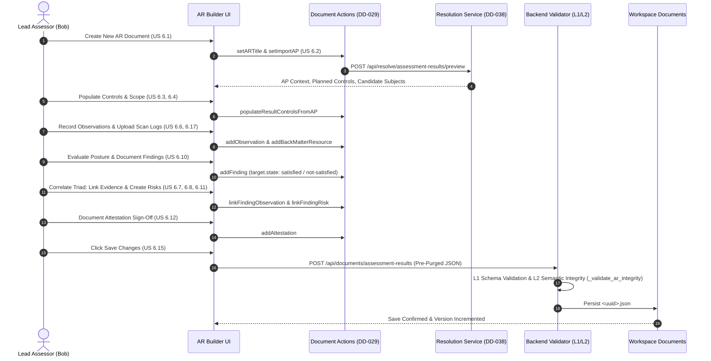

# Step 6: Detailed User Stories – Assessment Results Reporter

* **Persona:** Bob (Lead Assessor / Security Auditor / Compliance Officer) & automated testing tools
* **Goal:** Document the findings, objective observations, collected evidence, and security risks identified during an assessment into an authoritative, schema-compliant NIST OSCAL Assessment Results (`assessment-results`) document (v1.2.2). The document links back to the governing Assessment Plan via `import-ap`, establishes clear evidence traceability across the Observation-Finding-Risk Triad, tracks remediation lifecycles, and provides formal assessor attestations.

---

## 1. Architectural Overview & Modular Layout

Conforming to [DD-038](../design_decisions/DD-038_assessment_results_scoping_and_correlation.md), the Assessment Results Reporter is structured into a 7-tab modular interface designed to eliminate monolithic code, eliminate non-operational stubbed event handlers, and strictly adhere to the NIST OSCAL Assessment Results v1.2.2 JSON Schema:

```
┌────────────────────────────────────────────────────────────────────────────────────────┐
│ Top Bar: Title, Target AP Import Selector, Active Result Set Picker, View/Edit Mode   │
├────────────────────────────────────────────────────────────────────────────────────────┤
│ Modular AR Navigation Tabs:                                                            │
│ 1. Overview & Metadata (AROverviewMetadataTab.tsx)                                     │
│    • Document Title, Version, Parties, Roles, Remarks, Target AP Resolution Summary    │
│ 2. Result Sets & Scoping (ARResultSetsTab.tsx)                                         │
│    • Result Set Manager, Start/End Timestamps, Reviewed Controls Scoping Editor        │
│ 3. Findings & Compliance (ARFindingsTab.tsx)                                           │
│    • Findings Data Table, Status (Satisfied/Not), Objective/Statement Selector,        │
│      Linked Observations Multi-select, Linked Risks Multi-select                       │
│ 4. Observations & Evidence (ARObservationsTab.tsx)                                     │
│    • Observations Data Table, Methods (EXAMINE/INTERVIEW/TEST), Origin & Actors,        │
│      Collected Timestamp, Relevant Evidence Links (Back-Matter Fragments)              │
│ 5. Identified Risks (ARRisksTab.tsx)                                                   │
│    • Risk Inventory, Mandatory Statement Editor, Status State Machine, CVSS Facets,   │
│      Threat IDs (CVE), Mitigating Factors, Remediations, Risk Log Timeline             │
│ 6. Assessment Log & Attestations (ARAssessmentLogTab.tsx)                             │
│    • Chronological Event Timeline, Logged-By Roles, Formal Assessor Sign-Off Parts     │
│ 7. Local Definitions & Attachments (ARLocalDefinitionsTab.tsx)                         │
│    • Root Objectives/Activities, Result Components/Users, Base64 Back-Matter Attachments│
└────────────────────────────────────────────────────────────────────────────────────────┘
```

---

## 2. Comprehensive User Stories & Acceptance Criteria

### US 6.1: Document Metadata & AR Document Creation
> Implements [US 0.14](step0_global_requirements.md) and [DD-002](../design_decisions/DD-002_oscal_validation_strategy.md).  
> **As a** Lead Assessor (Bob)  
> **I want to** create a new Assessment Results document with required metadata and a valid initial result set,  
> **so that** I have an authoritative, schema-compliant workspace ready to capture assessment determinations.

* **Acceptance Criteria:**
  * **Given** Bob is on the Assessment Results document overview table (`/assessment-results`),
  * **When** Bob clicks the "New Assessment Results" button:
    * A creation modal dialog opens requesting the document `title` (required, non-empty string) and an optional initial `import-ap` target.
  * **When** Bob submits the creation modal with a valid title:
    * The system generates a new NIST OSCAL Assessment Results v1.2.2 JSON document.
    * The root assembly contains:
      * `assessment-results.uuid`: Auto-generated RFC 4122 v4 UUID.
      * `metadata`: Required assembly containing `title`, `last-modified` (ISO 8601 UTC timestamp), `version: "1.0.0"`, `oscal-version: "1.2.2"`, empty `roles: []`, and empty `parties: []`.
      * `import-ap`: Required assembly with `{ "href": "" }`.
      * `results`: Required array (`minItems: 1`) initialized with exactly one default `result` object containing:
        * `uuid`: Auto-generated UUID.
        * `title`: Initial result set title matching `"Initial Assessment Result"`.
        * `description`: Initial result set description.
        * `start`: Current ISO 8601 UTC timestamp with timezone.
        * `reviewed-controls`: Valid assembly containing `control-selections: [{ "include-all": {} }]` to satisfy schema `minItems: 1`.
    * Bob is immediately redirected to the editor route (`/assessment-results/{uuid}?edit=true`) with the Overview & Metadata tab active.
  * **When** Bob edits document metadata in the Overview tab:
    * Bob can modify `metadata.title` and semantic `metadata.version`.
    * Bob can define assessment team parties (`metadata.parties[]`) with `uuid`, `type: "person" | "organization"`, `name`, and contact information.
    * Bob can define auditor roles (`metadata.roles[]`) and assign responsible parties (`metadata.responsible-parties[]`).
    * Bob can add key-value properties (`metadata.props[]`) and general document `remarks`.
  * **Then** the initialized and modified document passes NIST OSCAL AR JSON Schema v1.2.2 validation (`oscal_assessment-results_schema.json`) with zero validation errors.

---

### US 6.2: Assessment Plan Import & Scope Resolution
> Implements [DD-016](../design_decisions/DD-016_cross_document_import_resolution.md) and [DD-038](../design_decisions/DD-038_assessment_results_scoping_and_correlation.md).  
> **As a** Lead Assessor (Bob)  
> **I want to** link the Assessment Results document to a governing Assessment Plan via `import-ap.href` and inspect its resolved context,  
> **so that** my assessment findings are evaluated against the authoritative audit plan and control objectives.

* **Acceptance Criteria:**
  * **Given** Bob is on the Overview & Metadata tab of the Assessment Results editor,
  * **When** Bob interacts with the "Governing Assessment Plan" selector:
    * The UI opens a **Workspace Document Browser Modal** listing all available Assessment Plans (`/api/documents/assessment-plans`) with title, version, target SSP link, and planned control count.
    * Bob can select an AP from the workspace (setting `href: "../assessment-plans/{ap_uuid}.json"`), enter a direct UUID/fragment (`#{ap_uuid}`), or specify an external HTTPS URI.
    * Bob can optionally provide `remarks` detailing the assessment authorization mandate.
  * **When** a valid Assessment Plan reference is selected:
    * The backend resolution service (`POST /api/resolve/assessment-results/preview`) resolves the target AP.
    * The UI displays a **Live Target AP Summary Card** presenting:
      * Assessment Plan Title and Version.
      * Target System Security Plan (SSP) name and categorization referenced by the AP.
      * Total Planned Controls count declared in the AP's `reviewed-controls`.
      * Assessment subjects and assessment assets candidate counts.
      * A visual indicator showing whether the AP resolution succeeded or failed.
  * **When** the referenced AP file does not exist in workspace storage and is not a valid fragment/external URI:
    * Backend semantic integrity validation (`_validate_ar_integrity`) rejects the payload with an informative error (`Referenced Assessment Plan does not exist in workspace: {href}`).
  * **Then** `import-ap` is saved with required `href` (URI reference) and passes validation.

---

### US 6.3: Result Sets Creation, Title, & Timeframe Management
> Implements [DD-038](../design_decisions/DD-038_assessment_results_scoping_and_correlation.md).  
> **As a** Lead Assessor (Bob)  
> **I want to** create, title, and manage multiple result sets with start and end timestamps,  
> **so that** I can capture findings across distinct testing phases, quarterly audits, or re-assessment cycles in a single document.

* **Acceptance Criteria:**
  * **Given** Bob is in the Result Sets & Scoping tab (`ARResultSetsTab`),
  * **When** Bob views the result set management panel:
    * The UI displays a list of all result sets defined in `assessment-results.results[]` (enforcing `minItems: 1`).
    * An "Active Result Set" selector allows switching between result sets. Selecting a result set dynamically updates all downstream tabs (Findings, Observations, Risks, Assessment Log) to scope to that active result set.
  * **When** Bob clicks "Add Result Set":
    * A modal prompts for Result Title (required, markup-line), Description (required, markup-multiline), Start Date-Time (required, ISO 8601 with timezone), and optional End Date-Time.
    * The system appends a new `result` object to `results[]` initialized with a unique UUID, the specified title/description/dates, and an empty `reviewed-controls` assembly populated with `{ "control-selections": [{ "include-all": {} }] }`.
  * **When** Bob edits an existing result set:
    * Bob can update `result.title` and `result.description`.
    * Bob can update `result.start` and set or clear `result.end` (`date-time-with-timezone`).
    * If `end` is set, the system validates that `end` is equal to or later than `start`.
  * **When** Bob attempts to delete a result set:
    * If only one result set remains in `results[]`, the delete button is disabled with a tooltip explaining that NIST OSCAL AR v1.2.2 requires at least one result set (`minItems: 1`).
    * If more than one result set exists, the system prompts for confirmation and removes the result set upon confirmation.
  * **Then** every `result` in `results[]` maintains valid `uuid`, `title`, `description`, `start`, and `reviewed-controls`.

---

### US 6.4: Reviewed Controls Scoping & Tailoring
> Implements [DD-037](../design_decisions/DD-037_assessment_plan_architecture_and_scoping_model.md) and [DD-038](../design_decisions/DD-038_assessment_results_scoping_and_correlation.md).  
> **As a** Lead Assessor (Bob)  
> **I want to** configure and tailor the `reviewed-controls` assembly within each result set,  
> **so that** the document accurately records the exact controls and statement parts evaluated during that assessment run.

* **Acceptance Criteria:**
  * **Given** Bob is in the Result Sets & Scoping tab with an active result set selected,
  * **When** Bob navigates to the Reviewed Controls editor:
    * The UI renders the control selection matrix for `result.reviewed-controls`.
    * Bob can edit `reviewed-controls.description` and optional `remarks`.
  * **When** a governing Assessment Plan is linked:
    * The UI displays a "Populate Controls from Assessment Plan" button.
    * Clicking the button dispatches `populateResultControlsFromAP(activeResultIndex)`:
      * The action reads the planned controls and statement IDs from the resolved AP.
      * It initializes `result.reviewed-controls.control-selections` with `include-controls` matching the planned scope.
      * A success notification informs Bob of the number of controls imported.
  * **When** Bob manually tailors the reviewed controls:
    * Bob can toggle between "Include All Baseline Controls" (`include-all: {}`) and "Explicit Control List" (`include-controls: [...]`).
    * When using `include-controls`, Bob can add individual control IDs (e.g. `ac-2`, `ia-5`) and specify tailored `statement-ids` (e.g. `ac-2_smt_a`, `ac-2_smt_c`).
    * Bob can specify `exclude-controls` for baseline controls deliberately omitted from this assessment run, providing rationale in `remarks`.
    * Bob can configure `control-objective-selections` with `include-all` or explicit `include-objectives`.
  * **When** saving or validating:
    * Backend validation verifies that `reviewed-controls` is present on each result set and contains at least one non-empty item in `control-selections`.
  * **Then** the tailored `reviewed-controls` assembly conforms to `oscal-assessment-common:reviewed-controls`.

---

### US 6.5: Assessment Log & Execution Timeline
> Implements [DD-038](../design_decisions/DD-038_assessment_results_scoping_and_correlation.md).  
> **As a** Lead Assessor (Bob)  
> **I want to** record chronological assessment events in the `assessment-log`,  
> **so that** the exact timeline of audit actions, test executions, and responsible assessors is transparent and auditable.

* **Acceptance Criteria:**
  * **Given** Bob is in the Assessment Log & Attestations tab (`ARAssessmentLogTab`),
  * **When** Bob views the Assessment Log section:
    * If `result.assessment-log` does not exist, an "Initialize Assessment Log" button is displayed.
    * If `assessment-log` exists, the UI renders an interactive chronological timeline of `entries[]`.
  * **When** Bob clicks "Add Log Entry":
    * A drawer/modal opens requesting `title` (optional string), `description` (optional string), `start` timestamp (required, ISO 8601 with timezone), and optional `end` timestamp.
    * Bob can attribute the log entry to one or more assessors via `logged-by[]` by selecting a defined party (`party-uuid`) and entering an optional `role-id` (e.g. `lead-auditor`, `penetration-tester`).
    * Bob can associate the log entry with one or more AP or local tasks via `related-tasks[]`.
  * **When** Bob submits the log entry:
    * The system generates a unique UUID and appends the entry to `result.assessment-log.entries[]`.
    * The timeline immediately updates, displaying the new entry chronologically sorted by `start` date.
  * **When** Bob clicks on a log entry in the timeline:
    * A detail drawer opens with fully functional inputs allowing Bob to update the entry's title, description, timestamps, and linkages.
    * Deleting an entry prompts for confirmation and removes it from `entries[]`.
    * If all entries are deleted, the parent `assessment-log` container is cleanly purged per DD-014.
  * **Then** each log entry satisfies schema requirements (`uuid` and `start` required).

---

### US 6.6: Observations & Objective Evidence Collection
> Implements [DD-017](../design_decisions/DD-017_shared_assessment_entities.md) and [DD-038](../design_decisions/DD-038_assessment_results_scoping_and_correlation.md).  
> **As a** Lead Assessor (Bob)  
> **I want to** record objective `observations` with evaluation methods, timestamps, evidence attachments, and origin actors,  
> **so that** all empirical assessment data gathered during testing is systematically documented and verifiable.

* **Acceptance Criteria:**
  * **Given** Bob is in the Observations & Evidence tab (`ARObservationsTab`),
  * **When** Bob views the Observations table:
    * The table displays all observations in `result.observations[]` with columns: Title/Description, Methods (badges for `EXAMINE`, `INTERVIEW`, `TEST`), Types, Collected Timestamp, and Evidence Count.
    * Search and filter controls allow filtering observations by evaluation method, observation type, and text keyword.
  * **When** Bob clicks "Add Observation":
    * A detail drawer opens initialized with an auto-generated UUID and the current timestamp for `collected`.
    * Form fields include:
      * **Title** (optional, markup-line).
      * **Description** (required, markup-multiline).
      * **Methods** (required, multi-select checkboxes for `EXAMINE`, `INTERVIEW`, `TEST`, `UNKNOWN` with allow-other). The UI mandates selecting at least one method to satisfy schema `minItems: 1`.
      * **Types** (optional, multi-select for `ssp-statement-issue`, `control-objective`, `mitigation`, `finding`, `discovery`, `historic`).
      * **Collected Date-Time** (required, ISO 8601 with timezone picker).
      * **Expires Date-Time** (optional, ISO 8601 with timezone picker).
      * **Origin & Actors (`origins[]`)**: Allows adding actors (`tool`, `assessment-platform`, `party`) with `actor-uuid` and optional `role-id`.
      * **Subjects (`subjects[]`)**: Allows linking tested components, inventory items, locations, or users.
      * **Relevant Evidence (`relevant-evidence[]`)**: Allows adding evidence items with required `description` and optional `href` (selecting from `#resource-uuid` in `back-matter` or entering external URLs).
  * **When** Bob edits an existing observation in the detail drawer:
    * All input fields feature active two-way data binding dispatching granular actions (`updateObservation`, `toggleObservationMethod`, `addObservationRelevantEvidence`, etc.). Zero non-operational stubbed handlers exist.
    * Toggling a method checkbox immediately updates `observation.methods`. If Bob unchecks the last remaining method, an inline validation warning prevents removing it.
  * **When** Bob deletes an observation:
    * The system checks if any finding or risk references this observation UUID. If references exist, a warning modal lists the referencing findings/risks and confirms cascading disassociation.
  * **Then** every observation in `result.observations[]` satisfies required fields (`uuid`, `description`, `methods` with minItems: 1, `collected`).

---

### US 6.7: Risk Identification, Statement, & Status Lifecycle
> Implements [DD-017](../design_decisions/DD-017_shared_assessment_entities.md), [DD-020](../design_decisions/DD-020_status_badge_design_system.md), and [DD-038](../design_decisions/DD-038_assessment_results_scoping_and_correlation.md).  
> **As a** Lead Assessor (Bob)  
> **I want to** identify and document security `risks` with mandatory impact statements and track them through a validated lifecycle state machine,  
> **so that** system stakeholders understand the security posture impact and operational risk exposure.

* **Acceptance Criteria:**
  * **Given** Bob is in the Identified Risks tab (`ARRisksTab`),
  * **When** Bob views the Risks data table:
    * The table lists all risks in `result.risks[]` with columns: Title, Status (color-coded badge per DD-020), Severity, Statement excerpt, Threats count, and Remediations count.
  * **When** Bob clicks "Add Risk":
    * A risk editor drawer opens initialized with an auto-generated UUID and default status `"open"`.
    * Form inputs include:
      * **Title** (required, markup-line).
      * **Description** (required, markup-multiline).
      * **Statement** (required, markup-multiline). An explicit label and validation indicator mandate the statement: *"Failure to enforce password complexity increases risk of account compromise."*
      * **Status** (required dropdown restricted to: `open`, `investigating`, `remediating`, `deviation-requested`, `deviation-approved`, `closed`).
      * **Deadline** (optional date-time picker).
      * **Threat IDs (`threat-ids[]`)**: Add external threat identifiers with required `system` URI (e.g. `http://cve.mitre.org`), required `id` (e.g. `CVE-2024-12345`), and optional `href`.
      * **Mitigating Factors (`mitigating-factors[]`)**: Add compensating controls or factors with `uuid` and required `description`.
      * **Special Risk Props**: Toggles for `false-positive`, `accepted`, `risk-adjusted`, and integer `priority` ranking.
  * **When** Bob modifies a risk's `status`:
    * The UI enforces valid state machine transitions (e.g. `open` ➔ `investigating` | `remediating` | `closed` if false-positive).
    * Selecting `false-positive` automatically transitions `status` to `closed` and sets `props[name="false-positive"]=true`.
    * The status transition automatically appends a new entry to `risk.risk-log.entries[]` recording `status-change`, timestamp, and the acting user's party UUID.
  * **When** Bob attempts to save a risk without a `statement`:
    * The UI displays an inline validation error: *"The risk statement field is strictly mandatory in NIST OSCAL v1.2.2"*, and prevents save.
  * **Then** all risks in `result.risks[]` strictly contain `uuid`, `title`, `description`, `statement`, and `status`.

---

### US 6.8: Risk Characterization & Scoring Facets
> Implements [DD-018](../design_decisions/DD-018_risk_scoring_characterization_ui.md) and [DD-038](../design_decisions/DD-038_assessment_results_scoping_and_correlation.md).  
> **As a** Lead Assessor (Bob)  
> **I want to** configure multi-system risk characterization facets (CVSS v3/v4, FedRAMP, CVE) with visual score bars,  
> **so that** risks are quantitatively characterized according to industry-standard scoring frameworks.

* **Acceptance Criteria:**
  * **Given** Bob is editing a risk in the Identified Risks tab,
  * **When** Bob navigates to the "Characterizations & Scoring" section:
    * The UI renders existing characterizations from `risk.characterizations[]`.
    * A "Add Characterization" button allows adding a new scoring assessment with an `origin` (actor attribution: tool name or auditor party) and `facets[]`.
  * **When** Bob configures scoring facets within a characterization:
    * The facet editor allows selecting standard scoring systems:
      * **CVSS v3.1** (`http://www.first.org/cvss/v3.1`) or **CVSS v4.0** (`https://www.first.org/cvss/v4-0`).
      * **FedRAMP** (`http://fedramp.gov/ns/oscal`).
      * **Custom System** (user-defined URI).
    * When CVSS is selected:
      * Bob can enter the numeric `score` (0.0 to 10.0) and the CVSS `vector-string` (e.g. `CVSS:3.1/AV:N/AC:L/PR:N/UI:N/S:U/C:H/I:H/A:H`).
      * The UI renders a color-coded visual score bar matching DD-018:
        * 0.0: Gray (None)
        * 0.1–3.9: Green (Low)
        * 4.0–6.9: Yellow (Medium)
        * 7.0–8.9: Orange (High)
        * 9.0–10.0: Red (Critical)
    * When FedRAMP is selected:
      * Bob selects `severity` from a dropdown (`high`, `moderate`, `low`), rendered with an authoritative severity badge.
  * **When** Bob saves the characterization:
    * The system stores `characterizations: [{ origin: {...}, facets: [{ name: "score", system: "...", value: "8.8" }, ...] }]`.
  * **Then** each characterization conforms to schema requirements (`origin` and `facets` required, each facet requiring `name`, `system`, and `value`).

---

### US 6.9: Risk Remediation Planning & Risk Log Lifecycle
> Implements [DD-017](../design_decisions/DD-017_shared_assessment_entities.md) and [DD-018](../design_decisions/DD-018_risk_scoring_characterization_ui.md).  
> **As a** Lead Assessor (Bob)  
> **I want to** define risk remediations (responses) and track remediation history in the `risk-log`,  
> **so that** actionable remediation strategies are recorded and resolution progress is fully auditable over time.

* **Acceptance Criteria:**
  * **Given** Bob is editing a risk in the Identified Risks tab,
  * **When** Bob navigates to the "Remediations & Responses" section:
    * The UI lists all responses in `risk.remediations[]` (represented as OSCAL `response` objects).
  * **When** Bob clicks "Add Remediation":
    * A form requests:
      * `title` (required, markup-line).
      * `description` (required, markup-multiline).
      * `lifecycle` (required dropdown: `recommendation`, `planned`, `completed`).
      * Strategy Type via `props` (dropdown: `avoid`, `mitigate`, `transfer`, `accept`, `share`, `contingency`, `none`).
      * Optional `required-assets` and remediation `tasks`.
    * Submitting the form generates a unique UUID and appends the remediation to `risk.remediations[]`.
  * **When** Bob views the "Risk Log & Audit Trail" section:
    * The UI displays a chronological timeline of all entries in `risk.risk-log.entries[]`.
    * Entries display the timestamp (`start`), title, description, `status-change` badge, acting party (`logged-by`), and linked remediations (`related-responses`).
  * **When** Bob manually adds a risk log entry (e.g. documenting a vendor check-in or mitigation update):
    * Bob can specify `title`, `description`, `start` timestamp, and link specific remediations from `risk.remediations[]`.
  * **Then** the risk remediations and risk log entries conform strictly to the OSCAL assessment common schema.

---

### US 6.10: Findings Determination & Compliance Posture
> Implements [DD-038](../design_decisions/DD-038_assessment_results_scoping_and_correlation.md).  
> **As a** Lead Assessor (Bob)  
> **I want to** record compliance `findings` evaluating specific control statements or objectives with pass/fail determinations,  
> **so that** the official compliance posture of the assessed system is unambiguously established.

* **Acceptance Criteria:**
  * **Given** Bob is in the Findings & Compliance tab (`ARFindingsTab`),
  * **When** Bob views the Findings data table:
    * The table lists all findings in `result.findings[]` with columns: Title, Target ID, Target Type (`statement-id` / `objective-id`), Compliance State (`satisfied` / `not-satisfied` badge), Status Reason (`pass` / `fail` / `other`), Linked Observations count, and Linked Risks count.
    * A summary metrics banner displays: Total Findings, Satisfied Count, Not-Satisfied Count, and Compliance Percentage.
    * Filter buttons allow filtering findings by status (`all`, `satisfied`, `not-satisfied`).
  * **When** Bob clicks "Add Finding":
    * A finding detail drawer opens requesting:
      * `title` (required, markup-line).
      * `description` (required, markup-multiline).
      * **Target Specification (`target`)**:
        * `type` (required dropdown: `statement-id` | `objective-id`).
        * `target-id` (required token: autocomplete populated from the result set's `reviewed-controls` control IDs, statement IDs, and objectives).
        * `status.state` (required toggle/dropdown: `satisfied` | `not-satisfied`).
        * `status.reason` (optional dropdown: `pass`, `fail`, `other` with remarks).
        * `implementation-status.state` (optional dropdown: `implemented`, `partial`, `planned`, `alternative`, `not-applicable`).
      * `implementation-statement-uuid` (optional UUID reference linking to the target SSP's statement implementation).
  * **When** Bob edits an existing finding in the drawer:
    * All fields update state via live action dispatches (`setFindingTarget`, `updateFinding`). Zero stubbed event handlers exist.
    * Toggling `status.state` between `satisfied` and `not-satisfied` immediately updates the finding's badge and the top metrics summary banner.
  * **Then** each finding contains valid `uuid`, `title`, `description`, and `target` (`type`, `target-id`, `status.state` required).

---

### US 6.11: Finding Triad Linking & Traceability
> Implements [DD-017](../design_decisions/DD-017_shared_assessment_entities.md) and [DD-038](../design_decisions/DD-038_assessment_results_scoping_and_correlation.md).  
> **As a** Lead Assessor (Bob)  
> **I want to** link findings to supporting observations and associated risks,  
> **so that** compliance determinations are backed by empirical evidence and non-compliant findings are tied to quantified security risks.

* **Acceptance Criteria:**
  * **Given** Bob is editing a finding in the Findings detail drawer,
  * **When** Bob navigates to the "Supporting Observations (Evidence)" section:
    * The UI displays a multi-select selector listing all observations defined in the active result set (`result.observations[]`) with title, methods, and collected dates.
    * Bob can select one or more observations to link to the finding (dispatching `linkFindingObservation`).
    * Each linked observation displays in a card with an optional `remarks` input for noting why this observation supports the determination, and an "Unlink" button.
  * **When** Bob navigates to the "Associated Risks (Impact)" section:
    * The UI displays a multi-select selector listing all risks defined in the active result set (`result.risks[]`) with title, status, and severity.
    * If the finding is `not-satisfied`, the UI highlights a recommendation to link or create a risk.
    * Bob can link existing risks (dispatching `linkFindingRisk`) or click "Create & Link New Risk" to open the risk creation drawer pre-populated with context from the finding.
  * **When** Bob views the "Traceability Matrix" view:
    * A dedicated interactive table displays the complete Triad relationship:
      `Control / Statement ➔ Finding ➔ Supporting Observations ➔ Associated Risks`
    * Any finding without supporting observations is flagged with an informational badge: *"No evidence linked"*.
    * Any `not-satisfied` finding without an associated risk is flagged: *"Unmitigated deficiency"*.
  * **When** validating the document (`_validate_ar_integrity`):
    * The backend verifies that every `observation-uuid` in `finding.related-observations` resolves to a valid observation in the result set.
    * The backend verifies that every `risk-uuid` in `finding.related-risks` resolves to a valid risk in the result set.
    * Dangling UUID references produce Level 2 validation errors.
  * **Then** full bi-directional traceability is maintained across findings, observations, and risks without broken references.

---

### US 6.12: Attestations & Assessor Sign-Offs
> Implements [DD-038](../design_decisions/DD-038_assessment_results_scoping_and_correlation.md).  
> **As a** Lead Assessor (Bob)  
> **I want to** record formal attestation statements and sign off with responsible assessment roles,  
> **so that** there is official accountability, audit integrity, and regulatory sign-off for the assessment results.

* **Acceptance Criteria:**
  * **Given** Bob is in the Assessment Log & Attestations tab (`ARAssessmentLogTab`),
  * **When** Bob views the Attestations section:
    * The UI displays existing attestation statements defined in `result.attestations[]`.
  * **When** Bob clicks "Add Attestation":
    * A drawer/modal opens requesting:
      * **Sign-off Parts (`parts[]`)**: At least one `assessment-part` is required (`minItems: 1`). Bob can select part types: `assessor-statement`, `compliance-opinion`, `scope-confirmation`, `independence-statement`, providing `prose` text.
      * **Responsible Parties (`responsible-parties[]`)**: Bob can select signatory parties from `metadata.parties[]` and assign their role (`lead-assessor`, `authorizing-official`, `independent-auditor`).
    * Bob can configure multiple distinct attestation sign-offs (e.g. one for the Lead Assessor, one for the Authorizing Official).
  * **When** Bob submits the attestation:
    * The system validates that `parts` contains at least one assessment-part with non-empty `name` and `prose`.
    * The attestation is added to `result.attestations[]`.
    * An "Official Attestation Complete" badge displays on the result set overview.
  * **Then** all attestations strictly satisfy the OSCAL schema (`parts` required with minItems: 1).

---

### US 6.13: Navigation, Filtering, & Multi-Result Overview
> Implements [US 0.18](step0_global_requirements.md).  
> **As a** Lead Assessor (Bob)  
> **I want to** navigate, filter, and compare Assessment Results documents and result sets,  
> **so that** I can easily monitor audit progress, track historical trends, and switch between assessment campaigns.

* **Acceptance Criteria:**
  * **Given** Bob is on the Assessment Results index page (`/assessment-results`),
  * **When** the page loads:
    * The system renders a data table listing all Assessment Results documents in the workspace.
    * Columns include: Document Title, Target AP, Result Sets count, Total Findings, Satisfied/Not-Satisfied counts, Open Risks count, and Last Modified timestamp.
    * Filter options allow searching by document title, filtering by target AP, and filtering by compliance status (e.g. "Has Open Risks").
    * Quick actions allow: Edit (pencil icon), View (eye icon), Export (download icon), and Delete (trash icon).
  * **When** Bob opens an Assessment Results document with multiple result sets:
    * The editor top bar includes an "Active Result Set" switcher with start/end dates for each period.
    * A "Comparison View" toggle allows side-by-side comparison of two result sets:
      * Displays findings status delta: which findings changed from `not-satisfied` to `satisfied` (remediated) or `satisfied` to `not-satisfied` (regression).
      * Displays risk delta: new risks identified, closed risks, and unchanged risks.
  * **Then** navigation and comparison across documents and result sets operate smoothly and intuitively.

---

### US 6.14: Modular UI & In-Card Entity Editing
> Implements [DD-004](../design_decisions/DD-004_editor_ux_patterns.md), [DD-021](../design_decisions/DD-021_entity_list_detail_editor_pattern.md), and [DD-029](../design_decisions/DD-029_document_actions_pattern.md).  
> **As a** Lead Assessor (Bob)  
> **I want to** edit observations, findings, and risks directly in modular tabs and slide-out detail drawers with live state updates,  
> **so that** all form interactions are immediate, responsive, and free of broken or stubbed controls.

* **Acceptance Criteria:**
  * **Given** Bob is editing an Assessment Results document in the visual editor,
  * **When** Bob interacts with any entity in the 7 tabs:
    * Every click handler (`onRowClick`, `onClick`, `onToggle`) opens the corresponding entity detail drawer or executes an active action.
    * **Zero stubbed handlers exist**: All legacy `onChange={() => {}}` handlers in `ARPage.tsx` are completely replaced with live dispatches to `assessment-results-actions.ts`.
    * Modifying an input field immediately updates the application state via Immer `produce()`.
  * **When** Bob makes modifications:
    * The editor top bar indicates the dirty state (`isDirty = true`) with an active "Save Changes" button.
    * Undo (`Ctrl+Z`) and Redo (`Ctrl+Y`) buttons in the top bar allow stepping back and forward through the mutation history snapshots managed by `useDocumentActions`.
  * **When** Bob switches between [👁️ View] and [✏️ Edit] modes:
    * View mode renders clean, read-only cards, status badges, and expandable details without form inputs.
    * Edit mode activates editable form controls, action buttons, and drawer editors.
  * **Then** the interface provides a modern, seamless, and fully interactive editing experience.

---

### US 6.15: Draft Persistence, Versioning, & Format Export
> Implements [US 0.4](step0_global_requirements.md), [US 0.15](step0_global_requirements.md), [US 0.17](step0_global_requirements.md), [DD-004](../design_decisions/DD-004_editor_ux_patterns.md), and [DD-014](../design_decisions/DD-014_live_ui_form_validation.md).  
> **As a** Lead Assessor (Bob)  
> **I want to** rely on automatic background draft persistence and export the validated Assessment Results to JSON, XML, or YAML,  
> **so that** my work is protected against browser crashes and I can export standard-compliant artifacts for stakeholders.

* **Acceptance Criteria:**
  * **Given** Bob is editing an Assessment Results document,
  * **When** Bob makes changes:
    * The `useDocumentLifecycle` hook automatically persists an in-progress draft to `<uuid>_draft.json` at 30-second intervals when `isDirty` is true.
    * If the browser window is closed or refreshed, navigating back to `/assessment-results/{uuid}` detects the draft file and prompts: *"Unsaved draft changes found. Restore draft or discard?"*
  * **When** Bob clicks "Save":
    * The system executes pre-serialization empty array purging via `remove_empty_arrays()` per DD-014, stripping empty optional arrays (`props: []`, `links: []`, `relevant-evidence: []`, etc.) that would violate schema `minItems: 1`.
    * The backend increments the document version or prompts with a Version Remarks modal.
    * The draft file is deleted, and `isDirty` resets to false.
  * **When** Bob clicks "Export":
    * The `ExportModal` opens offering download options in JSON, XML, and YAML formats.
    * The downloaded document strictly validates against NIST OSCAL AR v1.2.2.
  * **Then** data persistence is continuous and exported artifacts strictly conform to official standards.

---

### US 6.16: Local Definitions & Two-Tier Separation
> Implements [DD-038](../design_decisions/DD-038_assessment_results_scoping_and_correlation.md).  
> **As a** Lead Assessor (Bob)  
> **I want to** define assessment methodology at the root level and execution assets at the result set level,  
> **so that** procedural definitions and runtime assets are organized according to the NIST OSCAL schema architecture.

* **Acceptance Criteria:**
  * **Given** Bob is in the Local Definitions & Attachments tab (`ARLocalDefinitionsTab`),
  * **When** Bob inspects the Local Definitions architecture:
    * The UI clearly distinguishes between **Root-Level Local Definitions** (procedural methodology) and **Result-Level Local Definitions** (execution runtime assets).
  * **When** Bob configures Root-Level Local Definitions (`assessment-results.local-definitions`):
    * Bob can define reusable `objectives-and-methods` (`local-objective[]`) specifying evaluation objectives with `control-id` and assessment parts.
    * Bob can define reusable `activities` (`activity[]`) with `uuid`, `description`, sequential `steps[]`, and evaluation method properties (`INTERVIEW`, `EXAMINE`, `TEST`).
    * The UI forbids adding components, inventory, or users at the root level, preventing `additionalProperties: false` schema errors.
  * **When** Bob configures Result-Level Local Definitions (`result.local-definitions`):
    * Bob can define execution-specific `components` (`0..*`), `inventory-items` (`0..*`), `users` (`0..*`), `assessment-assets` (`0..1`), and `tasks` (`0..*`).
    * Bob can add temporary testing accounts or assessment scanner components utilized specifically during that result set's audit window.
  * **Then** the two-tier local definitions structure conforms strictly to the schema specification.

---

### US 6.17: Back-Matter & Embedded Evidence Attachments
> Implements [US 0.16](step0_global_requirements.md), [DD-007](../design_decisions/DD-007_base64_embedded_attachments_strategy.md), and [DD-038](../design_decisions/DD-038_assessment_results_scoping_and_correlation.md).  
> **As a** Lead Assessor (Bob)  
> **I want to** attach raw scan files, penetration test logs, and audit evidence into `back-matter.resources[]` as Base64 strings,  
> **so that** the Assessment Results document is self-contained and provides immediate evidence verification.

* **Acceptance Criteria:**
  * **Given** Bob is in the Local Definitions & Attachments tab (`ARLocalDefinitionsTab`),
  * **When** Bob navigates to the "Back-Matter & Attachments" section:
    * The UI renders a file upload drop-zone and a list of existing resources in `assessment-results.back-matter.resources[]`.
  * **When** Bob drops or selects an evidence file (e.g. `nmap_scan.xml`, `penetration_test_report.pdf`, `burp_log.json`):
    * The browser reads the file client-side via `FileReader.readAsDataURL()`.
    * The binary payload is encoded as a Base64 string and stored in a new `resource` object:
      ```json
      {
        "uuid": "auto-generated-uuid",
        "title": "nmap_scan.xml",
        "rlinks": [{ "href": "#auto-generated-uuid", "media-type": "application/xml" }],
        "base64": {
          "filename": "nmap_scan.xml",
          "media-type": "application/xml",
          "value": "PD94bWwgdmVyc2lvbj0..."
        }
      }
      ```
  * **When** Bob configures evidence references in observations (`observation.relevant-evidence[]`):
    * The `href` input provides a dropdown of all embedded resources in `back-matter`.
    * Selecting an attachment sets `href: "#resource-uuid"`.
    * In the observation card or detail drawer, clicking the evidence link triggers an in-browser preview or immediate download of the decoded Base64 artifact.
  * **Then** all attachments are fully embedded within the portable OSCAL JSON document without relying on external file servers.

---

## 3. Workflow & Lifecycle Integration



---

## 4. Requirement Verification Traceability Matrix

| User Story | Primary Capability | Schema Assemblies & Constraints | Verification Strategy |
|---|---|---|---|
| **US 6.1** | AR Document Creation & Metadata | `assessment-results.uuid`, `metadata`, `results` (`minItems: 1`) | Unit test: Document factory; E2E test: New AR dialog |
| **US 6.2** | Assessment Plan Import & Resolution | `import-ap.href` (URI reference), live resolution card | Pytest: Resolution preview endpoint; E2E: AP selector |
| **US 6.3** | Result Sets Creation & Timeframes | `results[]`, `uuid`, `title`, `description`, `start`, optional `end` | Vitest: `addResultSet`, `updateResultSet`; E2E: Result set switcher |
| **US 6.4** | Reviewed Controls Scoping & Tailoring | `reviewed-controls.control-selections` (`include-all` / `include-controls`) | Vitest: Control tailoring actions; Pytest: Scoping integrity |
| **US 6.5** | Assessment Log & Timeline | `assessment-log.entries[]` (`uuid`, `start`, `logged-by`, `related-tasks`) | Vitest: `addAssessmentLogEntry`; E2E: Timeline drawer |
| **US 6.6** | Observations & Evidence Collection | `observations[]` (`uuid`, `description`, `methods` minItems: 1, `collected`) | Vitest: Method toggling actions; E2E: Observation drawer |
| **US 6.7** | Risk Identification & Statement Lifecycle | `risks[]` (`uuid`, `title`, `description`, `statement`, `status`) | Vitest: Risk actions & state machine; Pytest: Statement check |
| **US 6.8** | Risk Characterization & Scoring Facets | `characterizations[].facets[]` (`name`, `system`, `value`, CVSS bars) | Vitest: `addRiskCharacterizationFacet`; E2E: Scoring editor |
| **US 6.9** | Risk Remediation & Risk Log | `remediations[]`, `risk-log.entries[]` (`status-change`) | Vitest: Auto risk-log generator on status transition |
| **US 6.10** | Findings Determination & Status | `findings[].target` (`type`, `target-id`, `status.state`, `reason`) | Vitest: `setFindingTarget`; E2E: Status toggle & summary |
| **US 6.11** | Finding Triad Linking & Traceability | `related-observations[]`, `related-risks[]`, referential checks | Pytest: `_validate_ar_integrity` dangling UUID rejection |
| **US 6.12** | Attestations & Assessor Sign-Off | `attestations[].parts[]` (`assessment-part`, `responsible-parties`) | Vitest: `addAttestation`; E2E: Attestation signing form |
| **US 6.13** | Navigation & Multi-Result Overview | AR table, filtering, sorting, multi-result comparison | E2E: Table navigation, filtering, and comparison view |
| **US 6.14** | Modular UI & In-Card Editing | 7-tab layout, elimination of stubbed handlers, detail drawers | Frontend build: Zero TypeScript errors; E2E: Drawer interactions |
| **US 6.15** | Draft Persistence & Format Export | Draft auto-saving (`<uuid>_draft.json`), JSON/XML/YAML export | Vitest: Empty array purging; E2E: Export modal download |
| **US 6.16** | Local Definitions Two-Tier Division | Root objectives/activities vs Result components/users | Pytest: Schema additionalProperties check on local definitions |
| **US 6.17** | Back-Matter & Embedded Attachments | `back-matter.resources[]`, Base64 encoding, `#resource-uuid` links | E2E: File upload and download verification |
